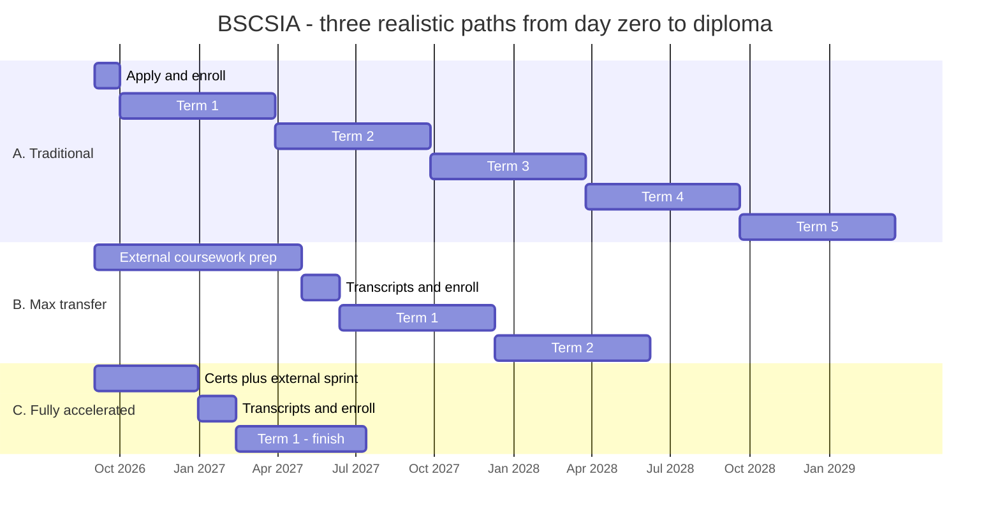

# The Complete WGU BSCSIA Field Guide

**B.S. Cybersecurity and Information Assurance — everything the community knows, everything WGU gives you, and every CEU you can squeeze out of it.**

*Community-sourced from r/WGU, r/WGUCyberSecurity, r/WGU_Accelerators, and official WGU + cert-body documentation. Compiled August 2026; updated October 2026 for Catalog 202610.*

☕ **[Buy me a coffee](https://buymeacoffee.com/grand1llusion)** — this guide is free and always will be; coffee funds the updates when WGU changes the catalog again.

---

> ## ⚠️ Read this first — what this guide is, and what it isn't
>
> **This is an independent, privately created and maintained guide.** It is not produced, reviewed, endorsed, or authorized by Western Governors University in any way.
>
> A large portion of it is **community-derived** — real students' posts, course writeups, completion reports, and screenshots of their own degree plans — combined with publicly available official documentation. Community reports can be out of date, specific to one student's catalog version, or simply wrong. And WGU changes things *constantly*: this program's catalog changed in September 2025 and again with Catalog 202610 (program guide published June 2026), transfer-credit articulations changed in March 2026, tuition changes annually, and cert rosters shift with vendor relationships.
>
> **Treat everything here as a starting point for a better conversation with WGU — not as an authoritative answer.** Before you make any decision that costs money or time (enrolling, buying external coursework, transferring credit, sitting an exam, planning a term), confirm it directly with:
>
> - **WGU Admissions / your Enrollment Counselor** — [wgu.edu/admissions](https://www.wgu.edu/admissions.html) (use the contact options on that page) — for anything about admission, transfer credit, or cost.
> - **Your Program Mentor** — the authority on *your* degree plan, your catalog version, and which courses you personally need.
> - **The official program guide** — [BSCSIA program guide](https://www.wgu.edu/online-it-degrees/cybersecurity-information-assurance-bachelors-program/program-guide.html) — for the current course list.
>
> Every section below links its sources so you can verify anything yourself. Where something is community-reported rather than officially confirmed, it's labeled as such. If you find something wrong, please say so — corrections make this better for everyone behind you.

---

> **⚠️ Catalog note:** This guide covers **Catalog 202610** — the current [BSCSIA program guide](https://www.wgu.edu/content/dam/wgu-65-assets/western-governors/documents/program-guides/information-technology/BSCSIA.pdf) (published June 2, 2026). It's still **37 courses / 122 CUs**, but it changed a few things from the September 2025 revision most online writeups describe: **Discrete Math is one 3-CU course again** (Applied Discrete Mathematics, E071 — the D420/D421/D422 split is gone), several gen-eds were renamed, and WGU now publishes an official **prerequisite chain** ([Section 2](#the-prerequisite-chain-official)). Existing students move to a new catalog version through their Program Mentor — ask which version you're on before trusting any course list, including this one. Companion guides: **[BSIT Field Guide](./WGU-BSIT-Complete-Guide.md)** · **[MSCSIA Field Guide](./WGU-MSCSIA-Complete-Guide.md)**.

---

## Table of Contents

1. [TL;DR — The Ten Rules](#1-tldr--the-ten-rules)
2. [The Program at a Glance](#2-the-program-at-a-glance)
3. [Three Paths, Visualized](#3-three-paths-visualized)
4. [Before You Enroll — The Pre-Enrollment Playbook](#4-before-you-enroll--the-pre-enrollment-playbook)
5. [Your Day-One Mentor Roadmap (copy-paste)](#5-your-day-one-mentor-roadmap-copy-paste)
6. [How WGU Actually Works](#6-how-wgu-actually-works)
7. [Course-by-Course Playbook](#7-course-by-course-playbook)
8. [Acceleration Meta-Strategies](#8-acceleration-meta-strategies)
9. [Certs WGU Doesn't Pay For (But Your Coursework Covers)](#9-certs-wgu-doesnt-pay-for-but-your-coursework-covers)
10. [Use Everything WGU Gives You — The Linked Vault](#10-use-everything-wgu-gives-you--the-linked-vault)
11. [Managing Your Learning Platforms Without Drowning](#11-managing-your-learning-platforms-without-drowning)
12. [The CEU/CPE Maximizer](#12-the-ceucpe-maximizer)
13. [After Graduation](#13-after-graduation)
14. [Sources & Further Reading](#14-sources--further-reading)

---

## 1. TL;DR — The Ten Rules

1. **Do your gen-ed and non-cert-bearing courses on Sophia Learning or Study.com *before* you enroll.** This is the single biggest bachelor's-only lever — it doesn't exist for the master's degree. See the [full mapping tables in Section 4](#43-the-sophia--studycom-mapping-tables). One BSCSIA grad transferred ~24 credits this way with zero prior tech background and finished all 122 CUs in 12 months.
2. **WGU does not accept transfer credit after you enroll. Ever.** Official policy: *"WGU does not award transfer credit after the student's initial term start date."* ([WGU Undergraduate Transfer Credit policy](https://cm.wgu.edu/t5/WGU-Student-Policy-Handbook/Undergraduate-Transfer-Credit/ta-p/49140)). All external coursework must be finished *and transcripted* before your start date.
3. **Never use Sophia/Study.com for a course that carries a cert voucher you want.** Skip the course, skip the free cert. Route around courses whose certs you don't value; keep the ones you do.
4. **The transfer cap is still 75% of the program, and only two courses can't transfer at all:** Python for IT Automation and the Capstone. That's per WGU's own transfer guidelines (updated October 2026), which override the earlier reports that Cyber Defense and Countermeasures had become WGU-only. Official transcripts must arrive by the **5th of the month before your start**. Use WGU's official tables in [Section 4.3](#43-the-sophia--studycom-mapping-tables), or plug everything into the [planner](./planner.html).
5. **SSCP and CCSP are optional vouchers, not required exams.** Both courses are assessed by WGU's own exam. WGU offers a free ISC2 voucher afterward, which you should absolutely take — but you don't need to pass ISC2's proctored exam to pass the course or graduate.
6. **Book ISC2 exams early.** In-person testing center required (some use palm/vein scanners), and slots fill up. Don't leave it for the last week of a term.
7. **CompTIA enforces a mandatory 14-day wait after two failed attempts** on the same exam. Don't gamble a cert exam near a term boundary.
8. **Bring a written roadmap to your first mentor call.** [Section 5](#5-your-day-one-mentor-roadmap-copy-paste) has a copy-paste template. Mentors control which courses get opened; showing up with a plan changes that relationship immediately.
9. **Respect the prerequisite chain.** WGU's program guide locks the program into seven prerequisite groups (A+ courses → Networks → Security+ → core cyber courses, with programming running in parallel → CySA+/CCSP → PenTest+ → capstone). You can't skip ahead, so plan which courses run side by side — see [Section 2](#the-prerequisite-chain-official).
10. **Spend a little of your own money on the right adjacent certs.** Your coursework already covers most of the material for several certs WGU doesn't pay for — some cost as little as $0–$100. See [Section 9](#9-certs-wgu-doesnt-pay-for-but-your-coursework-covers).

---

## 2. The Program at a Glance

**Official pages:** [Program page](https://www.wgu.edu/online-it-degrees/cybersecurity-information-assurance-bachelors-program.html) · [Program guide](https://www.wgu.edu/online-it-degrees/cybersecurity-information-assurance-bachelors-program/program-guide.html) · [Program guide PDF](https://www.wgu.edu/content/dam/wgu-65-assets/western-governors/documents/program-guides/information-technology/BSCSIA.pdf)

**The shape of it:** 37 courses, **122 competency units (CUs)**, recommended across 10 terms. 6-month flat-rate terms, competency-based (pass = demonstrated mastery; no GPA). ABET-accredited; NSA/DHS **CAE-CD** designated (WGU's program page lists the designation as running *through 2026* — worth checking whether it's been renewed if that matters to you or your employer). Minimum full-time pace is 12 CU/term. **60% of graduates finish within 29 months** — roughly 5 terms.

**Cost:** **$4,425 tuition + $200 resource fee = $4,625 per 6-month term** (rate effective Jan 1, 2026; confirmed unchanged in the Oct 1, 2026 tuition table — [always check the current table](https://www.wgu.edu/financial-aid-tuition/tuition-it-degrees.html)). At ~5 terms that's **≈$23,125**. You pay per term, not per course — which is exactly why pre-clearing courses before you start is the highest-leverage cost lever available.

### Current course sequence (Catalog 202610 — program guide published June 2, 2026)

Course names below match WGU's [official program guide](https://www.wgu.edu/content/dam/wgu-65-assets/western-governors/documents/program-guides/information-technology/BSCSIA.pdf) exactly — useful when you're matching courses against a transfer table.

| # | Code | Course | CU | Term | Built-in cert | Prereq group |
|---|---|---|---|---|---|---|
| 1 | C458 | Health, Fitness, and Wellness | 4 | 1 | — | — |
| 2 | D685 | Practical Applications of Prompt | 2 | 1 | — | — |
| 3 | D270 | Composition: Successful Self-Expression | 3 | 1 | — | — |
| 4 | E004 | Introduction to IT | 3 | 1 | — | — |
| 5 | D333 | Ethics in Technology | 3 | 2 | — | — |
| 6 | D316 | IT Foundations | 4 | 2 | → **CompTIA A+ (Core 1)** | 1 |
| 7 | C955 | Applied Probability and Statistics | 3 | 2 | — | — |
| 8 | C683 | Natural Science Lab | 2 | 2 | — | — |
| 9 | D317 | IT Applications | 4 | 3 | → **CompTIA A+ (Core 2)** | 1 |
| 10 | C957 | Applied Algebra | 3 | 3 | — | — |
| 11 | D827 | Fundamentals of Information Security | 3 | 3 | — | — |
| 12 | D315 | Network and Security – Foundations | 3 | 3 | — | 1 |
| 13 | D265 | Critical Thinking: Reason and Evidence | 3 | 4 | — | — |
| 14 | D325 | Networks | 4 | 4 | → **CompTIA Network+** | 2 |
| 15 | D268 | Introduction to Communication: Connecting with Others | 3 | 4 | — | — |
| 16 | D336 | Business of IT – Applications | 4 | 4 | → **ITIL 4 Foundation** | — |
| 17 | C963 | American Politics and the US Constitution | 3 | 5 | — | — |
| 18 | D329 | Network and Security – Applications | 4 | 5 | → **CompTIA Security+** | 3 |
| 19 | D828 | Legal Issues in Information Security | 4 | 5 | — | — |
| 20 | E071 | Applied Discrete Mathematics | 3 | 5 | — | — |
| 21 | D830 | Introduction to Cryptography | 4 | 6 | — | 4 |
| 22 | D829 | Digital Forensics in Cybersecurity | 4 | 6 | — | 4 |
| 23 | C845 | Information Systems Security | 4 | 6 | → **ISC2 SSCP (optional voucher)** | 4 |
| 24 | E010 | Foundations of Programming (Python) | 3 | 7 | — | 5 |
| 25 | D197 | Version Control | 1 | 7 | — | 5 |
| 26 | D522 | Python for IT Automation | 3 | 7 | — | 5 |
| 27 | D831 | Introduction to AI and Security | 2 | 7 | — | 4 |
| 28 | D385 | Software Security and Testing | 3 | 7 | — | 4 |
| 29 | D281 | Linux Foundations | 3 | 8 | → **LPI Linux Essentials** | — |
| 30 | D426 | Data Management – Foundations | 3 | 8 | — | — |
| 31 | D492 | Data Analytics – Applications | 4 | 8 | → **CompTIA Data+** | — |
| 32 | D832 | Managing Information Security | 3 | 8 | — | 4 |
| 33 | D324 | Business of IT – Project Management | 4 | 9 | → **CompTIA Project+** | — |
| 34 | D340 | Cyber Defense and Countermeasures | 4 | 9 | → **CompTIA CySA+** | 6 |
| 35 | D320 | Managing Cloud Security | 4 | 9 | → **ISC2 CCSP (optional voucher)** | 6 |
| 36 | D332 | Penetration Testing and Vulnerability Analysis | 4 | 10 | → **CompTIA PenTest+** | 7 |
| 37 | D833 | Cybersecurity and Information Assurance Capstone | 4 | 10 | — | last |
| | | **Total** | **122** | | | |

**What changed in Catalog 202610** (compared against WGU's [June 2026 program guide](https://www.wgu.edu/content/dam/wgu-65-assets/western-governors/documents/program-guides/information-technology/BSCSIA.pdf)):

- **Discrete Math consolidated:** the three 1-CU courses (D420 Logic / D421 Functions and Relations / D422 Algorithms and Cryptography) are replaced by one 3-CU **Applied Discrete Mathematics (E071)**. WGU's own description says it's applied rather than proof-heavy, covering logic, Boolean algebra, sets, graphs, combinatorics, and modular arithmetic in technology contexts ([catalog [p. 328](https://www.wgu.edu/content/dam/wgu-65-assets/western-governors/documents/institutional-catalog/2026/catalog-august-2026.pdf#page=328)]).
- **Gen-ed renames:** Health, Fitness, and Wellness · Ethics in Technology · Critical Thinking: Reason and Evidence · Introduction to Communication: Connecting with Others · American Politics and the US Constitution.
- **Official prerequisite groups** are now published in the program guide (below).
- **Unchanged:** 37 courses, 122 CUs, the same 16 certifications, and the same term-by-term standard path.

**What changed in Sept 2025** (the bigger revision; from an official WGU migration email quoted verbatim in a [student thread](https://old.reddit.com/r/WGUCyberSecurity/comments/1lwe1jf/changes_to_bscsia/)):

- **Removed:** D372 Intro to Systems Thinking (3), D427 Data Management-Applications (4), D335 Intro to Programming Python (3), C844 Emerging Technologies in Cybersecurity (4), and the 6-CU C843 Managing Information Security.
- **Added:** D420/D421/D422 (Discrete Math, split into three 1-CU courses — *since reversed in Catalog 202610*), D522 Python for IT Automation (3), D831 Introduction to AI and Security (2), D385 Software Security and Testing (3), D685 Practical Applications of Prompt Engineering (2), D492 Data Analytics – Applications (4, → CompTIA Data+).
- **Changed:** Managing Information Security 6 CU → 3 CU (C843 → D832).
- **Total CU unchanged at 122**; ~70% of the program identical. WGU's framing: "16 certifications built in," curriculum "aligned with NSA/DHS guidelines."

### The prerequisite chain (official)

WGU's [Catalog 202610 program guide](https://www.wgu.edu/content/dam/wgu-65-assets/western-governors/documents/program-guides/information-technology/BSCSIA.pdf) (p. 8) requires these groups in order. Any exception needs faculty-management approval, so plan around them rather than hoping for a waiver:

| Group | Courses | Rule |
|---|---|---|
| **1. IT Fundamentals** | IT Foundations → IT Applications → Network and Security – Foundations | In this order, before Group 2 |
| **2. Networks** | Networks | Before Group 3 |
| **3. Network & Security Applications** | Network and Security – Applications | Before Group 4 |
| **4. Core Cybersecurity Principles** | Introduction to Cryptography · Digital Forensics in Cybersecurity · Information Systems Security · Introduction to AI and Security · Software Security and Testing · Managing Information Security | All before Group 6 (any order within the group) |
| **5. Programming** | Foundations of Programming (Python) → Version Control → Python for IT Automation | In this order, before Group 6 |
| **6. Cyber Defense and Cloud Security** | Cyber Defense and Countermeasures · Managing Cloud Security | Before Group 7 |
| **7. Penetration Testing** | Penetration Testing and Vulnerability Analysis | Before the capstone |

**What this means for planning:**

- **The A+ → Network+ → Security+ spine is a hard gate.** Nothing in the core cyber block opens until all three cert courses are done, so they decide your pace through the first half of the degree.
- **Groups 4 and 5 don't depend on each other.** The programming chain (including the notoriously hard Python for IT Automation) can run alongside the core cyber courses, which is the one real chance for parallel work in the back half.
- **CySA+ → PenTest+ → Capstone is strictly sequential at the end.** Put a realistic exam date on each one early, because a slip here pushes graduation back directly.
- Gen-eds and courses outside the groups (Intro to IT, Fundamentals of Information Security, Business of IT courses, Linux, Data courses, Legal Issues, Applied Discrete Mathematics, etc.) aren't in the chain. They're good filler around a stalled gate, and they're also the ones you can most often clear before enrolling.

**Certs (16 built in):** CompTIA A+, Network+, Security+, CySA+, Project+, PenTest+, Data+; five free CompTIA *stacked* credentials (IT Operations Specialist, Secure Infrastructure Specialist, Security Analytics Professional, Network Vulnerability Assessment Professional, Network Security Professional); LPI Linux Essentials; ITIL 4 Foundation; ISC2 SSCP; ISC2 CCSP. Remember: **SSCP and CCSP are optional vouchers**, not graduation requirements.

---

## 3. Three Paths, Visualized

Same degree, three very different journeys. The variable that matters most isn't how fast you study — it's **how much you clear before you ever start paying WGU tuition.**



| Path | Who it fits | Pre-enrollment work | Terms paid | Wall-clock time | Approx. tuition |
|---|---|---|---|---|---|
| **A. Traditional** | New to IT, working full-time, no transfer credit | None | ~5 | ~30 months | **≈$23,125** |
| **B. Max transfer** | Willing to spend 6–9 months on Sophia/Study.com first, or holds an associate degree | 8 months external coursework (~$800–1,200 in subscriptions) | ~2 | ~22 months | **≈$9,250** + subs |
| **C. Fully accelerated** | Already holds several CompTIA certs, or has real IT experience + hard discipline | 4-month sprint: certs + external courses | 1 | ~11 months | **≈$4,625** + subs |

**The honest read on this chart:** Path C's total *wall-clock* time isn't dramatically shorter than Path B — but it costs a quarter as much, because WGU bills by the term. The pre-enrollment months are the cheapest months of your degree. That's the whole game.

**Real reported outcomes** (community, not official): 12 months start-to-finish with ~24 Sophia credits and zero prior tech background; the WGU-published figure of 60% within 29 months for everyone else. Both are true. Which one you get is mostly decided before your first term starts.

---

## 4. Before You Enroll — The Pre-Enrollment Playbook

### 4.1 Admission requirements

([Program page](https://www.wgu.edu/online-it-degrees/cybersecurity-information-assurance-bachelors-program.html)) High school diploma/equivalent **plus ONE** of:

1. College transcripts with cumulative GPA ≥ 2.25, **or**
2. An existing associate or bachelor's degree, **or**
3. A transferable IT certification, **or**
4. High school transcripts with GPA ≥ 2.75, **or**
5. Prior IT coursework at the 300-level or higher.

No ACT/SAT required.

### 4.2 The hard rules, with official sources

These rules govern every planning decision you'll make. All of them come from WGU's own pages or WGU's own transfer data:

| Rule | Answer | Source |
|---|---|---|
| Can you transfer credit **after** enrolling? | **No.** *"WGU does not award transfer credit after the student's initial term start date."* | [Undergraduate Transfer Credit policy](https://cm.wgu.edu/t5/WGU-Student-Policy-Handbook/Undergraduate-Transfer-Credit/ta-p/49140) |
| Maximum transfer? | **75% of the program.** You must complete ≥25% of CUs at WGU (residency requirement). | Same policy page; also stated on WGU's partner transfer tools |
| Minimum transfer grade? | **C- or better** in most cases | Same policy page |
| Certification/coursework recency? | **Within the past 5 years** — *"For transfer, certifications must have been earned within the last five years."* | [WGU transferable certifications page](https://www.wgu.edu/admissions/transfers/wgu-transcript-request/transferable-certifications.html) (revised 8/18/2025); also the [BSCSIA partner transfer tool](https://partners.wgu.edu/transfer-pathway-agreement?uniqueId=BSCSIA4424&collegeCode=IT&instId=678&programId=253) |
| Transcript deadline? | **Official transcripts received by the 5th of the month before your start date.** WGU aims to finish the evaluation within about two weeks of your last transcript arriving. | [WGU Transfers FAQ](https://www.wgu.edu/admissions/transfers.html) |
| Courses that must be taken at WGU? | **Python for IT Automation** and the **Cybersecurity and Information Assurance Capstone**. Every other course has an official transfer path (a course, a cert, or both). | WGU's transfer guidelines on its [Transfer Pathways](https://partners.wgu.edu/home) site (pulled October 2, 2026) |

**Plan around rule #1 above everything else.** It converts "I'll knock out some Sophia courses once I'm settled in" into a mistake that costs a full $4,625 term.

### 4.3 The Sophia / Study.com mapping tables

Sophia Learning and Study.com are third-party, self-paced, ACE-accredited course platforms sold as flat monthly subscriptions. Complete their courses, send the transcript to WGU **before you enroll**, and they land on your WGU degree plan as "Requirement Satisfied."

**The platforms:**

| Platform | Cost | Concurrency | WGU-specific page |
|---|---|---|---|
| **Sophia Learning** | **$99/mo**, $299/4mo, or $799/yr ([pricing](https://www.sophia.org/plans-and-pricing/)) | No published cap on courses at once | **[WGU College of IT portal](https://wgucollegeofinformationtechnology.sophia.org/)** — WGU-branded marketing view. **WGU's official table (below) is authoritative where they differ.** |
| **Study.com** | **College Saver $95/mo** (2 courses at a time); Pro $235/mo (3 at a time) ([pricing](https://study.com/college/pricing.html)) | 2–3 concurrent | **[Study.com → WGU transfer page](https://study.com/college/school/western-governors-university/studycom-courses-that-transfer-to-wgu.html)** · [BSCSIA-specific page](https://study.com/college/western-governors-university/degrees/cybersecurity-information-assurance-degree-plan-transfer-credits.html) |
| **StraighterLine** | $99/mo + per-course fee | Varies | [WGU School of Technology partner page](https://www.straighterline.com/colleges/wgu-school-of-technology/) |

#### Sophia & Study.com → BSCSIA: WGU's official tables

This comes straight from **WGU's own Transfer Pathways data**, the agreements WGU publishes with each platform, pulled October 2, 2026. It is the authoritative source; the platforms' own marketing pages lag behind it. Official pages: [Sophia → BSCSIA](https://partners.wgu.edu/transfer-pathway-agreement?uniqueId=BSCSIA7110&collegeCode=IT&instId=796&programId=253) · [Study.com → BSCSIA](https://partners.wgu.edu/transfer-pathway-agreement?uniqueId=BSCSIA4424&collegeCode=IT&instId=678&programId=253). Re-check them before you buy, because WGU updates these agreements every few weeks.

**WGU will apply up to 37 CU from Sophia and up to 47 CU from Study.com** for this program (WGU's own figures). Each WGU course can only be cleared once, so mixing platforms doesn't stack past what the courses are worth.

| WGU course (CU) | Sophia course(s) | Study.com course(s) |
|---|---|---|
| Health, Fitness, and Wellness (4) | Introduction to Nutrition (SOPH-0063) · Health, Fitness, and Wellness (SOPH-0080) | Health 101 · Nutrition 101 |
| Composition: Successful Self-Expression (3) | English Composition I (SOPH-0015) · English Composition II (SOPH-0030) · Workplace Writing I (SOPH-0050) · Workplace Writing II (SOPH-0049) | English 104 · English 105 |
| Introduction to IT (3) | Introduction to Information Technology (SOPH-0023) | Computer Science 102 · Business 109 |
| Ethics in Technology (3) | — | Philosophy 104 |
| Applied Probability and Statistics (3) | Introduction to Statistics (SOPH-0005) | Statistics 101 · Business 212 |
| Natural Science Lab (2) | Human Biology Lab (SOPH-0067) · Introduction to Chemistry Lab (SOPH-0070) · Microbiology Lab (SOPH-0075) · Anatomy and Physiology I Lab (SOPH-0072) · Anatomy and Physiology II Lab (SOPH-0082) | Biology 101L · Chemistry 111L · Chemistry 112L · Biology 107L · Biology 201L · Biology 202L · Physics 111L · Science 101L · Physics 112L |
| Applied Algebra (3) | College Algebra (SOPH-0001) · Calculus I (SOPH-0060) · Precalculus (SOPH-0069) | Math 101 · Math 103 · Math 104 · Math 105 · Math 301 |
| Fundamentals of Information Security (3) | — | Computer Science 202 · Computer Science 110 |
| Network and Security – Foundations (3) | Introduction to Networking (SOPH-0068) | Computer Science 108 · Computer Science 304 |
| Critical Thinking: Reason and Evidence (3) | Critical Thinking (SOPH-0065) | Humanities 201 |
| Introduction to Communication: Connecting with Others (3) | Public Speaking (SOPH-0024) · Workplace Communication (SOPH-0034) · Business Communication (SOPH-0059) | Communications 101 · Business 113 · Business 324 |
| American Politics and the US Constitution (3) | U.S. Government (SOPH-0071) | Political Science 102 |
| Digital Forensics in Cybersecurity (4) | — | Computer Science 336 |
| Data Management – Foundations (3) | Introduction to Relational Databases (SOPH-0047) | Analytics 103 · Computer Science 107 |
| Business of IT – Project Management (4) ⚠️ *carries CompTIA Project+* | Project Management (SOPH-0013) | Business 311 · Business 112 |

**⚠️ Must be taken at WGU (no transfer source at all):** Python for IT Automation (3), Cybersecurity and Information Assurance Capstone (4).

**Not offered on either platform** (take at WGU, or clear with a certification or prior college credit; see the next section): Practical Applications of Prompt, IT Foundations, IT Applications, Networks, Business of IT – Applications, Network and Security – Applications, Legal Issues in Information Security, Applied Discrete Mathematics, Introduction to Cryptography, Information Systems Security, Foundations of Programming (Python), Version Control, Introduction to AI and Security, Software Security and Testing, Linux Foundations, Data Analytics – Applications, Managing Information Security, Cyber Defense and Countermeasures, Managing Cloud Security, Penetration Testing and Vulnerability Analysis.

> **Two things worth knowing.** Sophia's *Introduction to Python Programming* does **not** clear Foundations of Programming (Python). WGU's agreement notes that course can't take Sophia or other ACE credit (Jan 2026), though a regular college Python course still can. And the ⚠️ rows carry a built-in certification voucher, so clearing them on a platform means giving up that free exam.

**Want to see it all at once?** The [WGU Degree Blueprint planner](./planner.html) uses this same data. Tick what you have and what you plan to take, and it totals your transfer CUs, flags the cap, and writes your mentor roadmap.

> **Corrections to earlier versions of this guide.** Earlier drafts were built from Sophia's marketing portal and Study.com's own pages, and WGU's data disagrees with them on four points. **Sophia's own *Health, Fitness, and Wellness* (SOPH-0080) does transfer.** So does **Sophia's *U.S. Government*** (it clears American Politics and the US Constitution) and **Sophia's *Introduction to Networking*** (it clears Network and Security – Foundations). And **Cyber Defense and Countermeasures is not WGU-only.** Go by WGU's tables above.

#### The March 2026 rule change — what actually happened

This is the most important recent development, and it's confirmed by both platforms in their own words:

- **Sophia's statement:** *"WGU has updated certain transfer articulations, including removing some Sophia Learning articulations. Official Sophia Learning transcripts must have been received by WGU during March 2026 to be considered under the prior articulation guidelines. After March 2026, WGU can accept general education and lower-division courses for transfer, but upper-division courses must be completed at WGU."* ([source](https://wgucollegeofinformationtechnology.sophia.org/))
- **Study.com's explainer** ([Understanding WGU 2026 Transfer Credit Updates](https://study.com/college/credit-transfer/understanding-wgu-2026-transfer-credit-updates.html), updated Sept 15, 2026): the 75% cap is **unchanged**; the change affects Technology, Education, and Health/Nursing programs; "for most programs, the number of affected courses is one or two per degree." For BSCSIA it named *Cyber Defense and Countermeasures* as WGU-only. **WGU's own transfer guidelines no longer say that**: as of October 2026 that course transfers from a cyber defense / incident response course or from CySA+, GCIH, or ECIH. The only WGU-only BSCSIA courses are Python for IT Automation and the Capstone.
- **Grandfathering window (now closed):** Study.com's ambassador announced in February 2026 that courses completed by Feb 28 *and* transcripts received by WGU by Mar 31, 2026 would be evaluated under the old rules ([DegreeForum](https://www.degreeforum.net/mybb/Thread-WGU-2026-transfer-credit-updates-planning-notes-for-Study-com-users)). Anything sent after that falls under the new rules.
- **Practical takeaway:** general education and lower-division courses still transfer from Sophia and Study.com. Upper-division cyber courses mostly clear through **certifications** or a regular college course rather than ACE platforms (see the next section). This mostly doesn't change the strategy, since you were never going to want to skip the cert-bearing courses anyway.

#### Exam-based credit (cheaper than a subscription for one-off gen-eds)

| Path | Cost | Best for | Link |
|---|---|---|---|
| **CLEP** | **$97/exam** + test-center fee | College Composition, College Algebra, American Government, Humanities, Natural Sciences | [clep.collegeboard.org/clep-exams](https://clep.collegeboard.org/clep-exams) |
| **DSST/DANTES** | **$100/exam** | **Principles of Statistics** (CLEP has no statistics exam), Ethics in Technology, Technical Writing, Fundamentals of Cybersecurity | [getcollegecredit.com/dsst-exams](https://getcollegecredit.com/dsst-exams/) |
| **JST (military)** | Free | WGU accepts Joint Services Transcripts as official transcripts for CLEP/DANTES | [WGU policy](https://cm.wgu.edu/t5/WGU-Student-Policy-Handbook/Transfer-Credit-for-CLEP-DANTES-AP-and-IB-Examinations/ta-p/28) |

> ⚠️ **ACE-recommended military credit is dicey for onward transfer** (community-reported). Get an actual evaluation rather than assuming a listed equivalency holds.

### 4.4 The cert-transfer strategy

Beyond external coursework, certifications you already hold — **earned within the last 5 years** — can clear their matching WGU course. Verifiable CompTIA, Microsoft, Cisco, and Credly-badged certs are all candidates. An existing **AA/AS degree** typically clears upper-division standing and a meaningful chunk of the program (WGU's marketing estimate is ~14 of 37 courses; treat that as a planning number, not a promise).

**Experience alone, without a transcript or certificate, does not clear a course.** You need documentary evidence.

**Went to a community college, or trained with a national partner** (ACI Learning, Per Scholas, Microsoft Software & Systems Academy, IBM, and others)? Look your school up on WGU's [Transfer Pathways site](https://partners.wgu.edu/home): pick your state or *National Agreements*, then your school → School of Technology → BSCSIA. The table there tells you exactly which of your credits transfer.

**WGU's official cert → course mapping for BSCSIA** (from WGU's transfer guidelines, pulled October 2, 2026). A cert has to have been earned within the last 5 years. Several certs are listed for more than one course; confirm the final result with your Enrollment Counselor.

| Certification | WGU course(s) it's listed for |
|---|---|
| CompTIA A+ | IT Foundations, IT Applications |
| CompTIA Tech+ | Introduction to IT |
| CompTIA Network+ | Networks, Network and Security – Foundations |
| CompTIA Security+ | Network and Security – Applications, Network and Security – Foundations, Fundamentals of Information Security |
| CompTIA CySA+ | Cyber Defense and Countermeasures, Network and Security – Applications, Network and Security – Foundations |
| CompTIA PenTest+ | Penetration Testing and Vulnerability Analysis, Network and Security – Applications, Network and Security – Foundations |
| CompTIA SecurityX (CASP+) | Network and Security – Applications, Network and Security – Foundations, Fundamentals of Information Security |
| CompTIA Linux+ | Linux Foundations |
| CompTIA Project+ | Business of IT – Project Management |
| CompTIA Data+ | Data Analytics – Applications |
| Google IT Support Professional | Introduction to IT |
| LPI Linux Essentials / LPIC | Linux Foundations |
| Red Hat RHCSA / RHCE / RHCA | Linux Foundations |
| ITIL 4 Foundation (active) | Business of IT – Applications |
| PMI PMP or CAPM | Business of IT – Project Management |
| Cisco CCNA | Networks, Network and Security – Applications, Network and Security – Foundations |
| Microsoft SC-900, SC-200, or SC-300 | Fundamentals of Information Security |
| Database: CIW DB Design, Azure DP-300, or Oracle DB Foundations | Data Management – Foundations |
| CSA CCSK | Managing Cloud Security |
| OffSec OSCP+ / OSCE3 | Penetration Testing and Vulnerability Analysis |
| ISC2 CC | Fundamentals of Information Security |
| ISC2 SSCP | Information Systems Security |
| ISC2 CISSP (or Associate of ISC2) | Fundamentals of Information Security, Legal Issues in Information Security, Information Systems Security, Managing Information Security |
| ISC2 CCSP | Managing Cloud Security |
| ISACA CISM | Fundamentals of Information Security, Legal Issues in Information Security, Information Systems Security, Managing Information Security |
| ISACA CISA | Fundamentals of Information Security, Information Systems Security, Managing Information Security |
| ISACA CRISC | Fundamentals of Information Security, Information Systems Security |
| ISACA CGEIT | Information Systems Security, Managing Information Security |
| EC-Council CEH | Penetration Testing and Vulnerability Analysis, Network and Security – Applications, Network and Security – Foundations, Fundamentals of Information Security |
| EC-Council ECIH | Cyber Defense and Countermeasures |
| EC-Council CHFI | Digital Forensics in Cybersecurity |
| EC-Council CCISO | Fundamentals of Information Security, Managing Information Security |
| GIAC GSEC | Fundamentals of Information Security, Network and Security – Applications, Network and Security – Foundations |
| GIAC GCED | Fundamentals of Information Security, Network and Security – Applications, Network and Security – Foundations |
| GIAC GCIA | Network and Security – Applications, Network and Security – Foundations |
| GIAC GCIH | Cyber Defense and Countermeasures |
| GIAC GPEN | Penetration Testing and Vulnerability Analysis |
| GIAC GCFA or GCFE | Digital Forensics in Cybersecurity |
| GIAC GISF | Fundamentals of Information Security |
| GIAC GLEG | Legal Issues in Information Security |
| GIAC GSTRT | Information Systems Security |

**The standout:** a current **Security+** is listed for three courses (Network and Security – Foundations, Network and Security – Applications, and Fundamentals of Information Security). **CISSP or CISM** is listed for four (Fundamentals of Information Security, Legal Issues, Information Systems Security, and Managing Information Security). WGU's general list is at [Transferable certifications](https://www.wgu.edu/admissions/transfers/wgu-transcript-request/transferable-certifications.html), but the table above is the program-specific mapping.

Full mechanics: [wgu.edu/admissions/transfers](https://www.wgu.edu/admissions/transfers/transfer-to-wgu.html).

### 4.5 Military pathways

- **USNCC partnership**: the ASCSIA associate degree (64 CU) embeds A+/Network+/Security+/CySA+ and shares course titles with BSCSIA's early terms — strong transfer synergy, though confirm your specific case.
- **AU-ABC pathway**: CCAF associate credit into WGU IT bachelor's programs; confirm current BSCSIA eligibility with an enrollment counselor.
- **Tuition Assistance**: capped at $4,500/fiscal year across all branches — won't fully cover $4,625/term, so stack scholarships.
- **GI Bill Ch. 33**: covers tuition/fees per WGU's military page. Military Support: va@wgu.edu, 1-877-435-7948 x3127. [Military hub](https://www.wgu.edu/student-experience/military.html).

### 4.6 Money

- **Tuition:** $4,625/term all-in.
- **Application fee:** typically waivable — ask your Enrollment Counselor for a code.
- **Scholarships:** apply 90 days before to 30 days after your start. [Scholarships hub](https://www.wgu.edu/financial-aid-tuition/scholarships.html). Amounts and names change — verify current offerings rather than trusting an older writeup.
- **Federal aid:** FAFSA code **033394**. Undergraduate full-time = 12 CU/term.
- **Employer reimbursement:** [details here](https://www.wgu.edu/financial-aid-tuition/corporate-reimbursement.html).

### 4.7 The enrollment timeline

Starts are the **1st of every month**. Work backwards:

| When | Do |
|------|-----|
| **6–9 months out** | Start Sophia/Study.com. This is the cheapest phase of your degree — don't rush it. |
| **~90 days out** | Scholarship window opens. Apply. Request all transcripts (WGU has a free transcript-gathering service). |
| **60 days out** | Finish external coursework. Order transcripts to be sent to WGU. |
| **5th of month before start** | **Official transcripts must be received** ([WGU Transfers FAQ](https://www.wgu.edu/admissions/transfers.html)). Evaluation takes ~2 weeks after the last one arrives, so aim earlier. |
| **15th of month before** | Admission requirements finalized. |
| **22nd of month before** | Payment/financial aid finalized. |
| **Before start** | "Commit to Start" → orientation → first Program Mentor call ([bring your roadmap](#5-your-day-one-mentor-roadmap-copy-paste)). |

---

## 5. Your Day-One Mentor Roadmap (copy-paste)

Your Program Mentor controls which courses get opened, how fast, and whether extra courses get added mid-term (which are **free** — you already paid the flat term rate). Students who show up to that first call with a written plan consistently report a different relationship than students who show up with questions.

**Copy the block below, fill in the blanks, and email it to your mentor before your first call.** Then use it as the standing agenda for weekly check-ins.

```
WGU BSCSIA — Student Roadmap
Name:                          Student ID:
Program start date:            Target graduation:
Program Mentor:                Prepared:

────────────────────────────────────────────────
1. MY SITUATION
────────────────────────────────────────────────
Hours/week I can realistically commit:        hrs
Work schedule / constraints:
Prior IT experience:
Certifications I already hold (+ date earned):
Credits transferred in:            CU of 122
Courses remaining:                 of 37

────────────────────────────────────────────────
2. MY TARGET PACE
────────────────────────────────────────────────
I am aiming for the ______________ path:
  [ ] Traditional  — ~5 terms, steady, low burnout risk
  [ ] Max transfer — ~2 terms after heavy pre-clearing
  [ ] Accelerated  — 1 term, requires prior certs/experience

CUs I intend to complete this term:          CU
(WGU minimum full-time is 12 CU/term)

Courses I want opened THIS TERM, in order:
  1. ______________________  target complete: ____
  2. ______________________  target complete: ____
  3. ______________________  target complete: ____
  4. ______________________  target complete: ____
  5. ______________________  target complete: ____

────────────────────────────────────────────────
3. WHAT I'M ASKING YOU FOR
────────────────────────────────────────────────
[ ] Open my next course as soon as I pass the current one
    — I understand added courses cost nothing extra.
[ ] Tell me now which courses in my plan have the longest
    average completion times, so I can front-load them.
[ ] Flag any course where my catalog version differs from
    what I'll read about online.
[ ] Confirm which of my optional cert vouchers (SSCP, CCSP)
    I qualify for and when I can claim them.
[ ] Map my plan against the 7 prerequisite groups so I'm
    never waiting on a locked course (Groups 4 and 5 can
    run side by side).
[ ] Hold me accountable: if I miss two weekly targets in a
    row, tell me directly rather than letting it slide.

────────────────────────────────────────────────
4. WEEKLY CHECK-IN FORMAT (5 minutes)
────────────────────────────────────────────────
  • Last week's target:              Hit? Y / N
  • This week's target:
  • Blocked on:
  • Next course to open:
  • Exam scheduled:

────────────────────────────────────────────────
5. CERT EXAM CALENDAR (schedule EARLY — seats fill)
────────────────────────────────────────────────
  A+ Core 1        target date: ______
  A+ Core 2        target date: ______
  Network+         target date: ______
  Security+        target date: ______
  ITIL 4           target date: ______
  Linux Essentials target date: ______
  Data+            target date: ______
  Project+         target date: ______
  CySA+            target date: ______
  PenTest+         target date: ______
  SSCP (optional)  target date: ______
  CCSP (optional)  target date: ______

  NOTE: CompTIA enforces a 14-day wait after two failed
  attempts. ISC2 exams require an in-person test center.
  Never schedule a first attempt in the final 3 weeks of
  a term.

────────────────────────────────────────────────
6. RISKS I'M FLAGGING NOW
────────────────────────────────────────────────
Courses I expect to be hardest for me:
Weeks I'll be unavailable (travel, work crunch, family):
My personal early-warning sign that I'm falling behind:
```

**Why this works:** it converts the mentor relationship from reactive ("how's it going?") to operational. It also makes the two things that actually gate your speed — course activation and exam scheduling — explicit and dated from week one.

---

## 6. How WGU Actually Works

Skip this if you're a WGU alum; read it twice if you're new.

**Competency-based, flat-rate terms.** You pass courses by demonstrating competency — pass/not-yet, no GPA. A term is 6 months and costs the same whether you finish 8 CUs or 40+. Courses added mid-term after you clear your scheduled ones are **free**. No lectures, no seat time.

**Three kinds of faculty:**

- **Program Mentor** — assigned at enrollment, stays to graduation. Controls your degree plan and course activation. See [Section 5](#5-your-day-one-mentor-roadmap-copy-paste).
- **Course Instructors** — subject-matter experts who run live cohorts and **record them**. Cohort recordings, task guides, FAQ docs, and pacing guides are consistently rated above the official textbooks by graduates. Check the course announcements/community tab for *every* course before opening a textbook.
- **Evaluators** — anonymous, rubric-driven PA graders.

**Two kinds of assessment:**

- **OA (Objective Assessment)** — proctored exam, either WGU-authored or the actual vendor cert exam. The workflow the community swears by: take the pre-assessment **cold** on day one → read the coaching report → study only your weak domains → retake the pre-assessment until comfortably passing → sit the OA within 24–48 hours.
- **PA (Performance Assessment)** — paper/project against a public rubric, revise-and-resubmit until you pass. **The rubric is the assignment.** Two monitors: rubric on one, draft on the other. Answer every bullet explicitly. Run the built-in similarity/AI checker before submitting.

**Academic integrity — know exactly where the line is.** ([Official policy](https://cm.wgu.edu/t5/WGU-Student-Policy-Handbook/Academic-Integrity/ta-p/128))

- ✅ **Fine:** Sybex/Chapple books, Professor Messer, Jason Dion, PocketPrep, TryHackMe, YouTube walkthroughs, Anki decks built from *published vendor exam objectives*, ChatGPT used to quiz yourself on public objectives.
- ❌ **Violation:** using or sharing actual WGU assessment content — real PA task instructions, real OA questions, "answer keys." This includes Quizlet decks, Chegg/Course Hero uploads, and the cluster of commercial sites marketing themselves as "WGU accelerator" answer services. Sanctions go up to expulsion.

The distinction is simple: **study materials, yes. Assessment materials, no.**

---

## 7. Course-by-Course Playbook

37 courses is too many for a deep dive on each. Community writeup energy concentrates on the cert-bearing and historically-hard courses, so that's the focus. Treat the non-cert gen-eds and foundations courses as generally straightforward unless a thread says otherwise.

**Each course below links its official catalog description** — the page in WGU's public [Institutional Catalog PDF (August 2026)](https://www.wgu.edu/content/dam/wgu-65-assets/western-governors/documents/institutional-catalog/2026/catalog-august-2026.pdf) where that course's real WGU-authored description lives (pp. 265–330 is the full course-description index, alphabetized by code). Catalogs reissue every few months and codes/pages shift — if a link or page doesn't match what you see, WGU has published a newer edition; check [wgu.edu/about/institutional-catalog.html](https://www.wgu.edu/about/institutional-catalog.html) for the current one.

### The cert-bearing courses

**IT Foundations / IT Applications → CompTIA A+ (Core 1 & 2).** *(WGU Catalog: D316 & D317, [p. 285](https://www.wgu.edu/content/dam/wgu-65-assets/western-governors/documents/institutional-catalog/2026/catalog-august-2026.pdf#page=285))* The first real cert wall. Free prep that works: [Professor Messer's A+ 220-1201](https://www.professormesser.com/free-a-plus-training/220-1201/220-1201-video/220-1201-training-course/) and [220-1202](https://www.professormesser.com/free-a-plus-training/220-1202/220-1202-video/220-1202-training-course/) courses are complete, free, and current. Pair with a practice-question bank rather than relying solely on bundled CertMaster.

**Networks (D325) → CompTIA Network+.** *(WGU Catalog: [p. 285](https://www.wgu.edu/content/dam/wgu-65-assets/western-governors/documents/institutional-catalog/2026/catalog-august-2026.pdf#page=285))* Free prep: [Professor Messer N10-009](https://www.professormesser.com/network-plus/n10-009/n10-009-video/n10-009-training-course/). Foundational — later security courses assume you know this cold.

**Network and Security – Applications (D329) → CompTIA Security+.** *(WGU Catalog: [p. 285](https://www.wgu.edu/content/dam/wgu-65-assets/western-governors/documents/institutional-catalog/2026/catalog-august-2026.pdf#page=285))* One of the genuine bottlenecks. Free prep: [Professor Messer SY0-701](https://www.professormesser.com/security-plus/sy0-701/sy0-701-video/sy0-701-comptia-security-plus-course/).

**Information Systems Security (C845) → ISC2 SSCP (optional).** *(WGU Catalog: [p. 270](https://www.wgu.edu/content/dam/wgu-65-assets/western-governors/documents/institutional-catalog/2026/catalog-august-2026.pdf#page=270))* **OA-based against WGU's own exam** — passing WGU's OA passes the course. WGU then offers a free SSCP voucher, which the community strongly recommends taking (it's a respected credential and it's free), but **you don't have to sit ISC2's exam to pass the course or graduate.** One student reported this course recently shifted from OA to PA — check the current format with your instructor.

**Managing Cloud Security (D320) → ISC2 CCSP (optional).** *(WGU Catalog: [p. 285](https://www.wgu.edu/content/dam/wgu-65-assets/western-governors/documents/institutional-catalog/2026/catalog-august-2026.pdf#page=285))* Same structure: OA-based, optional CCSP voucher afterward.

**Cyber Defense and Countermeasures (D340) → CompTIA CySA+.** *(WGU Catalog: [p. 286](https://www.wgu.edu/content/dam/wgu-65-assets/western-governors/documents/institutional-catalog/2026/catalog-august-2026.pdf#page=286))* Unlike the ISC2-adjacent courses, this one **is** the vendor exam. Budget real prep time. *(Per WGU's transfer guidelines this course is transferable: an existing CySA+, GCIH, or ECIH clears it. That corrects earlier reports that it had become WGU-only; see [Section 4.4](#44-the-cert-transfer-strategy).)*

**Penetration Testing and Vulnerability Analysis (D332) → CompTIA PenTest+.** *(WGU Catalog: [p. 286](https://www.wgu.edu/content/dam/wgu-65-assets/western-governors/documents/institutional-catalog/2026/catalog-august-2026.pdf#page=286))* The other major bottleneck and the best-documented course in current threads. From two independent 2026 completion posts — both scored in the low 700s out of 900, so **expect a squeaker, not a cruise**:

| Resource | Verdict |
|---|---|
| CertMaster Perform | Read it fully; many labs are buggy — skippable |
| [Sybex PT0-003 Study Guide (Chapple)](https://www.wiley.com/) | Core text |
| Jason Dion video course + practice exams | [Udemy](https://www.udemy.com/user/jason-dion/) or [Dion Training](https://www.diontraining.com/) |
| [PocketPrep](https://www.pocketprep.com/) premium | ~1,000-question bank |
| **[TryHackMe](https://tryhackme.com/) premium PenTest+ path** | **The standout recommendation** — explicitly better than CertMaster's labs. [20% student discount](https://tryhackme.com/students) |
| WGU Panopto course videos | The scripting one specifically called out as useful |
| ChatGPT + [official PT0-003 objectives](https://www.comptia.org/certifications/pentest) | Custom quizzing on tools, flags, script recognition |

Retake note: mentors have granted a second voucher over the phone without much friction when a fail was close.

**Business of IT – Applications (D336) → ITIL 4 Foundation.** *(WGU Catalog: [p. 286](https://www.wgu.edu/content/dam/wgu-65-assets/western-governors/documents/institutional-catalog/2026/catalog-august-2026.pdf#page=286))* One of the lighter cert courses.

**Business of IT – Project Management (D324) → CompTIA Project+.** *(WGU Catalog: [p. 285](https://www.wgu.edu/content/dam/wgu-65-assets/western-governors/documents/institutional-catalog/2026/catalog-august-2026.pdf#page=285))* Some accelerators route around this via Sophia if they don't value Project+ — just make sure you still take the *other* Business of IT course for ITIL.

**Data Analytics – Applications (D492) → CompTIA Data+.** *(WGU Catalog: [p. 295](https://www.wgu.edu/content/dam/wgu-65-assets/western-governors/documents/institutional-catalog/2026/catalog-august-2026.pdf#page=295))* New to the post-2025 catalog; thin community coverage. Post yours.

**Linux Foundations (D281) → LPI Linux Essentials.** *(WGU Catalog: [p. 283](https://www.wgu.edu/content/dam/wgu-65-assets/western-governors/documents/institutional-catalog/2026/catalog-august-2026.pdf#page=283))* Approachable, especially with prior command-line exposure. Build the [home lab](#104-build-a-home-lab-before-you-need-one) before this course, not during it.

### The programming/data cluster (new to the current catalog)

**Foundations of Programming (Python) [E010], Python for IT Automation (D522), Version Control [D197], Introduction to AI and Security (D831), Software Security and Testing (D385).** *(WGU Catalog: E010 [p. 325](https://www.wgu.edu/content/dam/wgu-65-assets/western-governors/documents/institutional-catalog/2026/catalog-august-2026.pdf#page=325) · D522 [p. 296](https://www.wgu.edu/content/dam/wgu-65-assets/western-governors/documents/institutional-catalog/2026/catalog-august-2026.pdf#page=296) · D197 [p. 280](https://www.wgu.edu/content/dam/wgu-65-assets/western-governors/documents/institutional-catalog/2026/catalog-august-2026.pdf#page=280) · D831 [p. 317](https://www.wgu.edu/content/dam/wgu-65-assets/western-governors/documents/institutional-catalog/2026/catalog-august-2026.pdf#page=317) · D385 [p. 290](https://www.wgu.edu/content/dam/wgu-65-assets/western-governors/documents/institutional-catalog/2026/catalog-august-2026.pdf#page=290))* New or restructured as of Sept 2025. Thin BSCSIA-specific coverage so far — but note that **D522 has a rough reputation in the BSIT community**, where it's described as the hardest course in that program ("spent an entire term on it and still failed"). Budget accordingly; don't assume it's easy because it's early-numbered.

### Applied Discrete Mathematics (E071)

*Official course description: [p. 328](https://www.wgu.edu/content/dam/wgu-65-assets/western-governors/documents/institutional-catalog/2026/catalog-august-2026.pdf#page=328)*

Catalog 202610 merged the old three-part split (D420/D421/D422) back into **one 3-CU course**. WGU's own description says the focus is applied rather than proof-based: logic, Boolean algebra, sets, functions, relations, graphs, combinatorics, and modular arithmetic, applied to things like password complexity, access-control models, network topologies, and cryptography. It's outside the prerequisite chain, so it works as filler while you wait on a gated course. If your degree plan still shows D420/D421/D422, you're on the older catalog — ask your mentor.

### The capstone

*(WGU Catalog: D833, [p. 317](https://www.wgu.edu/content/dam/wgu-65-assets/western-governors/documents/institutional-catalog/2026/catalog-august-2026.pdf#page=317))* **What WGU says it is:** per the [official program guide](https://www.wgu.edu/content/dam/wgu-65-assets/western-governors/documents/program-guides/information-technology/BSCSIA.pdf), you respond to an information-security scenario, research and write a proposal, write an executive summary, and produce a technical report for a working security solution, using peer feedback along the way. It's the last course in the prerequisite chain, after Penetration Testing. **Practical advice:** don't over-scope the topic, start talking to your Course Instructor early, and use the cohort materials.

---

## 8. Acceleration Meta-Strategies

1. **Front-load Sophia/Study.com before you apply** ([Section 4.3](#43-the-sophia--studycom-mapping-tables)). Highest-leverage move available; bachelor's-only.
2. **Get old certs evaluated.** Anything under 5 years old is a candidate to clear a course. Every cleared course is tuition you don't pay.
3. **Never burn external coursework on a cert-bearing course** unless you genuinely don't want that cert.
4. **PA-first triage on every OA course.** Pre-assessment cold, study only weak domains, retake, then sit the OA.
5. **Bring the roadmap to your mentor** ([Section 5](#5-your-day-one-mentor-roadmap-copy-paste)) and ask explicitly for same-day course activation.
6. **Schedule cert exams the moment you start the course**, not when you feel ready. Seats fill; CompTIA's 14-day post-double-fail lockout is a term-killer if it lands in month six.
7. **Sequence the bottlenecks with runway.** Security+, CySA+, and PenTest+ each deserve real prep time — going in cold is how a term becomes two.
8. **Cap concurrent courses and use fixed calendar blocks.** The single most-repeated anti-burnout tip across every completion-time thread reviewed for this guide.
9. **Run Groups 4 and 5 in parallel.** The prerequisite chain ([Section 2](#the-prerequisite-chain-official)) only lets you work on two streams at once in the back half: the core cyber courses and the programming chain. Start Python early so it never becomes the thing holding up CySA+.
10. **Watch D522's format.** BSIT-side chatter (unconfirmed) suggests Python for IT Automation may move OA → PA. Confirm current format with your instructor before planning around it.

**Reality check on pace:** the community range runs from ~12 months (heavy pre-clearing, zero prior background) through WGU's own 29-month/5-term typical figure, and well beyond for students juggling full-time work, military transitions, or family. All of these people graduated. Don't let a fast outlier post talk you into burning out.

---

## 9. Certs WGU Doesn't Pay For (But Your Coursework Covers)

WGU includes 16 certifications. But several *more* certs test material your coursework already covers — and if you're taking the program slowly and learning properly along the way, adding one or two of these for $0–$150 is the highest resume-value-per-dollar move available.

> **⚠️ Verify prices before you pay.** Cert prices move — CompTIA raised most exam prices on June 1, 2026, and promos expire. Every price below is linked to its official source; check it yourself.

### The free ones (do these — they cost nothing)

| Cert | Issuer | Cost | Pairs with | Link |
|---|---|---|---|---|
| **Fortinet NSE 1, 2, 3 / FCF** | Fortinet | **Free** — training *and* certificate | Network and Security – Foundations | [fortinet.com/training-certification](https://www.fortinet.com/training-certification) |
| Google Cloud skill badges | Google | Free via Skills Boost | Managing Cloud Security | [cloudskillsboost.google/arcade](https://go.cloudskillsboost.google/arcade) |

> **❌ Correction on a widely-repeated tip:** ISC2's "One Million Certified in Cybersecurity" program — which gave a **free** CC exam and training — **closed to new enrollments on May 20, 2026** ([official announcement](https://www.isc2.org/Insights/2026/04/one-million-certified-cyber-conclusion)). If you already have an exam code from it, you can test through Dec 31, 2026. New students now pay **$199 + $50/yr maintenance**. Older guides and Reddit posts still call it free — they're out of date.

### The AWS chain (worth real money, but the mechanics aren't what most people think)

Your **Managing Cloud Security** course covers enough cloud fundamentals to make AWS's foundational certs very reachable. Here's how the economics actually work:

**The permanent benefit:** pass **any** AWS certification and you get access to a **50%-off voucher toward your next AWS exam**, plus a Credly badge and exam-lounge perks. ([Official AWS Certification benefits](https://aws.amazon.com/certification/benefits)) That's the evergreen mechanism.

**The live promo (expires soon — verify before relying on it):** AWS/Pearson VUE's **AIF2CLOUD** promotion lets you register for **AWS Certified AI Practitioner (AIF-C01) at 50% off (~$50)** using that code; pass it by **Sept 30, 2026**, and you receive a **complimentary AWS Certified Cloud Practitioner (CLF-C02) attempt**, to be passed by **Nov 30, 2026**. ([Pearson VUE promo page](https://www.pearsonvue.com/us/en/aws/aif2cloud.html))

**So the cheapest route to two AWS certs, if the promo is still live when you read this:** AI Practitioner first (~$50) → Cloud Practitioner free. **≈$50 for two certifications instead of $200.** BSCSIA does *not* include AWS Cloud Practitioner (that's the BSIT program), so this is genuinely additive for you.

> **Note:** this reverses the intuition most people have (that you do Cloud Practitioner first and it unlocks the AI one). The promo runs the other direction. **Check the promo page before planning around it — if it's expired, fall back to the permanent 50%-off-next-exam benefit above.**

| AWS cert | Code | List price | Link |
|---|---|---|---|
| Certified Cloud Practitioner | CLF-C02 | $100 | [aws.amazon.com](https://aws.amazon.com/certification/certified-cloud-practitioner/) |
| Certified AI Practitioner | AIF-C01 | $100 | [aws.amazon.com](https://aws.amazon.com/certification/certified-ai-practitioner/) |
| Solutions Architect – Associate | SAA-C03 | $150 | [aws.amazon.com](https://aws.amazon.com/certification/certified-solutions-architect-associate/) |

### Adjacent certs by course area

| Your WGU course | Adjacent cert | Cost | Why it's worth it | Link |
|---|---|---|---|---|
| Managing Cloud Security | **Microsoft AZ-900** (Azure Fundamentals) | ~$99 *(verify)* | Cloud service models transfer almost directly; cheapest multi-cloud signal | [learn.microsoft.com](https://learn.microsoft.com/en-us/credentials/certifications/azure-fundamentals/) · [free study guide](https://aka.ms/AZ900-StudyGuide) |
| Managing Cloud Security | **Google Cloud Digital Leader** | **$99** | Completes the "all three hyperscalers" line for ~$300 total | [cloud.google.com](https://cloud.google.com/learn/certification/cloud-digital-leader) |
| Networks (Network+) | **Cisco CCNA** (200-301) | ~$300 *(verify — could not confirm on Cisco's own page)* | Network+ is vendor-neutral; CCNA tests the same fundamentals against real IOS syntax, which is what job postings screen for | [cisco.com](https://www.cisco.com/site/us/en/learn/training-certifications/index.html) · free training at [netacad.com](https://www.netacad.com/) |
| Linux Foundations | **LPIC-1** (101+102) | $200/exam ($400 total; reduced tiers to $132) | The direct next rung above Linux Essentials in LPI's own ladder | [lpi.org/exam-pricing](https://www.lpi.org/exam-pricing/) |
| Linux Foundations | **CompTIA Linux+** | $399 | Same voucher ecosystem you already know | [comptia.org](https://www.comptia.org/certifications/linux) |
| Network and Security – Applications | **Microsoft SC-900** | ~$99 *(verify)* | Security+ governance/identity domains, framed in the Microsoft stack most SOCs actually run | [learn.microsoft.com](https://learn.microsoft.com/en-us/credentials/certifications/security-compliance-and-identity-fundamentals/) · [free study guide](https://aka.ms/sc900-StudyGuide) |
| CySA+ / PenTest+ | **Blue Team Level 1 (BTL1)** | £399 (~$500–530) | Purely practical SOC-analyst exam; recruiters read it as "not just multiple choice" | [securityblue.team](https://www.securityblue.team/) |
| Foundations of Programming (Python) | **PCEP** | from $69 | Cheap, fast, low-risk first programming credential | [pythoninstitute.org/pcep](https://pythoninstitute.org/pcep) |
| Python for IT Automation | **PCAP** | from $295 | OOP/exceptions/modules — sequence *after* PCEP, not instead of | [pythoninstitute.org/pcap](https://pythoninstitute.org/pcap) |
| Introduction to AI and Security | **AWS AI Practitioner** | $100 (~$50 via promo/voucher) | See the AWS chain above | [aws.amazon.com](https://aws.amazon.com/certification/certified-ai-practitioner/) |
| Business of IT – Project Management | **PMI CAPM** | ~$225 member / ~$300 non-member *(verify)*; **PMI student membership ~$32/yr** | Project+ and ITIL cover the lifecycle material; CAPM is what PM-track employers actually screen for | [pmi.org](https://www.pmi.org/certifications/certified-associate-capm) |

### Discount mechanisms that actually exist

- **CompTIA student pricing** — verify enrollment via SheerID in the [CompTIA Academic Store](https://academic-store.comptia.org/) to unlock student pricing. The discount percentage isn't published; you see your price after verification. ([How it works](https://help.comptia.org/hc/en-us/articles/13934022730772-How-Can-My-Students-Purchase-CompTIA-Products-at-a-Discount))
- **Authorized resellers** typically sell the same CompTIA vouchers 10–20% under retail.
- **CompTIA prices rose June 1, 2026:** A+ $274, Network+/Cloud+/Linux+ $399, Security+/CySA+/PenTest+ $439. (Relevant only for certs you buy yourself — the ones in your program are covered by tuition.)
- **ISACA student membership: $25/year → 30% off exam registration** plus free fundamental certificates. ([ISACA Student Hub](https://www.isaca.org/membership/student-hub)) Worth it the moment you consider any ISACA cert.
- **ISC2 Candidate program:** free year one, $50/yr after. Note it discounts *study materials and events* — not confirmed to discount the exam fee itself.

### The smart stacking order for a slow-lane student

1. **Fortinet NSE 1–3** — free, do it early, costs nothing but an afternoon.
2. **AWS AI Practitioner → Cloud Practitioner** via the promo *if it's still live* — time-limited money on the table.
3. **PCEP** (~$69) alongside your Python course.
4. **SC-900** (~$99) while Security+ is fresh, if you're headed toward a Microsoft-stack SOC role.
5. **CCNA** (~$300) alongside or just after Networks — big spend, so time it when the material is hottest.
6. **LPIC-1 or Linux+** later, budget permitting.
7. **BTL1 / CAPM** near graduation, when certs are closest to being used in interviews.

**The governing principle:** never let a time-limited promo expire unused, but otherwise sequence paid certs to follow *directly behind* the WGU course that taught the material — knowledge is freshest and the spend is justified by near-term hireability.

---

## 10. Use Everything WGU Gives You — The Linked Vault

You're paying $4,625 a term. Every link below is direct — no searching required.

### 10.1 Included with tuition

| Resource | What it is | Link |
|---|---|---|
| **Udemy Business** | Full catalog while enrolled — **gone at graduation**, so binge accordingly. Community tip for the Python courses: Angela Yu's "100 Days of Code: Python Pro Bootcamp." | Via your WGU student portal |
| **LinkedIn Learning** | Included | Via your WGU student portal |
| **Skillsoft Percipio**, **MindEdge** | Included | Via your WGU student portal |
| **CompTIA CertMaster** Learn/Labs/Practice | Embedded in cert courses | [Product overview](https://www.comptia.org/en-us/resources/certmaster-training/) |
| **WGU Library** | Databases, journals, 24/7 Ask-a-Librarian | [Student resources hub](https://www.wgu.edu/student-experience/student-resources.html) |
| **Writing Center / Academic Coaching** | APA help, live events, 24/7 chat | Via student portal |
| **WellConnect** | Free confidential 24/7 counseling + legal and financial consultations | Via student portal — **use it, you already paid for it** |
| **Handshake + Career Services for Life** | Job board, advisors, résumé/interview prep — continues after graduation | [wgu.edu careers](https://www.wgu.edu/student-experience/career-services.html) |

**The quiet gold:** cohort recordings, task guides, FAQ docs, and pacing guides posted by course instructors consistently rate above the official textbooks. Check the announcements/community tab in **every** course.

### 10.2 Your @wgu.edu email is a discount engine

| Program | What you get | Eligibility | Direct link |
|---|---|---|---|
| **GitHub Student Developer Pack** | JetBrains all-products (free/yr), GitHub Pro + Copilot, **1Password 1yr free**, Datadog Pro 2yr, Namecheap domain + SSL, DigitalOcean credit, Azure $100 | School email **or** dated proof of enrollment | **[education.github.com/pack](https://education.github.com/pack)** |
| **Microsoft Azure for Students** | **$100 credit**, no credit card required, 12mo free services + 65 always-free, dev licenses **including Visio** | Student email verification | **[azure.microsoft.com/free/students](https://azure.microsoft.com/en-us/free/students/)** |
| **Microsoft 365 Education (A1)** | Free web versions of Word/Excel/PowerPoint/Outlook/OneNote. *(Desktop apps require paid A3/A5 — A1 is web-only.)* | Verified education email; verification can take weeks | **[microsoft.com/education/products/office](https://www.microsoft.com/en-us/education/products/office)** |
| **AWS Educate** | Free training, labs, digital badges, job board. **⚠️ No AWS credits** — that's a common misconception | Any email, 13+ | **[aws.amazon.com/education/awseducate](https://aws.amazon.com/education/awseducate/)** |
| **AWS Skill Builder** | 600+ free courses incl. cert prep; paid tier adds labs/practice exams | Free tier: none | **[skillbuilder.aws](https://skillbuilder.aws/)** |
| **Google Cloud for Students** | **200 Skills Boost credits**, 1-year expiry | Application-based | **[cloud.google.com/edu/students](https://cloud.google.com/edu/students)** |
| **TryHackMe student** | **20% off annual Premium** (annual only — not monthly/MAX) | Set Occupation = Student in account settings | **[tryhackme.com/students](https://tryhackme.com/students)** · [how-to](https://help.tryhackme.com/en/articles/6494960-student-discount) |
| **Hack The Box Academy student** | Discounted Academy subscription (price shown only after verification; Academy only, not Labs) | Institutional email, or upload student ID/enrollment letter | **[HTB student sub guide](https://help.hackthebox.com/en/articles/13465244-getting-the-student-subscription)** |
| **LetsDefend** | **50% off VIP tiers with a .edu email** (~$8.50/mo effective) | .edu registration | **[letsdefend.io](https://letsdefend.io/)** |
| **CompTIA Academic Store** | Student pricing on vouchers/bundles via SheerID | SheerID enrollment verification | **[academic-store.comptia.org](https://academic-store.comptia.org/)** |

### 10.3 Free training worth bookmarking

| Resource | What | Link |
|---|---|---|
| **Professor Messer** | Complete free video courses for current exams: [A+ 220-1201](https://www.professormesser.com/free-a-plus-training/220-1201/220-1201-video/220-1201-training-course/) · [A+ 220-1202](https://www.professormesser.com/free-a-plus-training/220-1202/220-1202-video/220-1202-training-course/) · [Network+ N10-009](https://www.professormesser.com/network-plus/n10-009/n10-009-video/n10-009-training-course/) · [Security+ SY0-701](https://www.professormesser.com/security-plus/sy0-701/sy0-701-video/sy0-701-comptia-security-plus-course/) | [professormesser.com](https://www.professormesser.com/) |
| **Splunk free courses** | Free self-paced SIEM training — great context for CySA+ | [splunk.com/training/free-courses](https://www.splunk.com/en_us/training/free-courses/overview.html) *(note: "Splunk Fundamentals" is now legacy — use the modular courses)* |
| **Cisco Networking Academy** | Free networking courses. ⚠️ **skillsforall.com now redirects here** — Cisco consolidated the brands | [netacad.com](https://www.netacad.com/) |
| **Microsoft Learn** | Free paths for [AZ-900](https://learn.microsoft.com/en-us/credentials/certifications/azure-fundamentals/), [SC-900](https://learn.microsoft.com/en-us/credentials/certifications/security-compliance-and-identity-fundamentals/). ⚠️ **AI-900 was renamed AI-901 in April 2026** — confirm the code before registering | [learn.microsoft.com](https://learn.microsoft.com/) |
| **OverTheWire** | Free SSH wargames, no signup — the classic Linux/security on-ramp | [overthewire.org/wargames](https://overthewire.org/wargames/) |
| **CyLab Security Academy** | ⚠️ **picoCTF rebranded here in May 2026.** 500+ free CTF challenges, always free | [learn.cylabacademy.org/challenge-library](https://learn.cylabacademy.org/challenge-library) |
| **Blue Team Labs Online** | Free tier: security challenges + downloadable PCAPs, memory dumps, phishing samples | [blueteamlabs.online](https://blueteamlabs.online/) |
| **Google Cybersecurity Certificate** | $49/mo on Coursera, financial aid available | [coursera.org](https://www.coursera.org/professional-certificates/google-cybersecurity) |

### 10.4 Build a home lab before you need one

Community-standard setup for the security-heavy back half: install **Kali Linux** in **VMware Workstation Pro** (free for personal use via Broadcom) or **Proxmox** (free hypervisor) on a spare machine. Pays off directly for Linux Foundations, Digital Forensics, PenTest+, and Managing Cloud Security. Your Azure for Students credit covers cloud-side labs.

### 10.5 Community wikis and aggregators

| Resource | What's in it | Link |
|---|---|---|
| **AWS Certifications Wiki** | Community-maintained: certification pathways, **vouchers & discounts**, programs & initiatives, study resources, badges & rewards | **[awscertifications.github.io/AWSCertificationsWiki](https://awscertifications.github.io/AWSCertificationsWiki/)** |
| **Paul Jerimy's Security Certification Roadmap** | The canonical visual map of every security cert by specialization and level — use it to decide what comes *after* BSCSIA | **[pauljerimy.com/security-certification-roadmap](https://pauljerimy.com/security-certification-roadmap/)** |
| **r/WGU wiki** | Community-maintained WGU knowledge base | [old.reddit.com/r/WGU/wiki/index](https://old.reddit.com/r/WGU/wiki/index) |
| **r/WGUCyberSecurity wiki** | Program-specific | [old.reddit.com/r/WGUCyberSecurity/wiki/index](https://old.reddit.com/r/WGUCyberSecurity/wiki/index) |
| **Subreddits** | [r/WGU](https://old.reddit.com/r/WGU/) · [r/WGUCyberSecurity](https://old.reddit.com/r/WGUCyberSecurity/) · [r/WGUIT](https://old.reddit.com/r/WGUIT/) · [r/WGU_Accelerators](https://old.reddit.com/r/WGU_Accelerators/) | — |

> ⚠️ **Avoid commercial "WGU accelerator" answer sites.** Several sites market themselves as WGU course "solutions." They sell assessment content, which is an academic-integrity violation that can get you expelled. The genuine community lives on Reddit and in WGU's own cohorts.

### 10.6 Study aids

| Tool | Cost | Link |
|---|---|---|
| **PocketPrep** | Freemium; premium ~$15–20/mo. Covers 14 CompTIA exams + AWS CCP | [pocketprep.com](https://www.pocketprep.com/) |
| **Anki** | Free on desktop + Android; **paid one-time on iOS** | [apps.ankiweb.net](https://apps.ankiweb.net/) · [shared decks](https://ankiweb.net/shared/decks/) |
| **Jason Dion** | Prices fluctuate | [Udemy profile](https://www.udemy.com/user/jason-dion/) · [Dion Training](https://www.diontraining.com/) (also sells discounted CompTIA vouchers) |

---

## 11. Managing Your Learning Platforms Without Drowning

Here's the trap: between Udemy, LinkedIn Learning, Skillsoft, CertMaster, Professor Messer, TryHackMe, Hack The Box, AWS Skill Builder, Microsoft Learn, PocketPrep, Anki, Coursera, and YouTube, you have access to more high-quality training than you could finish in a decade. **Variety is genuinely valuable — different platforms teach differently, and hands-on labs cement what video can't. But unmanaged variety is just a very sophisticated form of procrastination.**

The failure mode is specific and common: you start a course on Udemy, hit a hard chapter, and instead of pushing through, you "supplement" with a different course on LinkedIn Learning, then a YouTube playlist, then a TryHackMe room. Four platforms, four partial completions, one unpassed exam. It *feels* like studying. It isn't progress.

### The rule: one platform per job, not one platform per topic

For each course you're taking, assign exactly **one** resource to each of these five roles, write them down, and don't add a sixth:

| Role | What it does | Pick exactly one |
|---|---|---|
| **1. Primary instruction** | Teaches you the material start to finish | Professor Messer, a Dion course, or the WGU course material |
| **2. Question bank** | Tells you what you don't know | PocketPrep, Dion practice exams, or CertMaster Practice |
| **3. Hands-on** | Makes it stick | TryHackMe, HTB Academy, your home lab, or an Azure/AWS sandbox |
| **4. Spaced repetition** | Retains it | Anki (built from published exam objectives only) |
| **5. Authoritative reference** | Settles disputes | The vendor's official exam objectives PDF |

Five slots. Fill them before you start the course. If a resource isn't in a slot, you don't open it until the course is passed.

### Sequencing beats stacking

Run them in a fixed order, not simultaneously:

```
Week 1      Primary instruction, first pass, 1.5x speed, no notes
Week 1 end  Question bank COLD -> find your weak domains
Week 2      Re-watch ONLY weak domains + hands-on labs for those
Week 2      Anki deck built from your actual misses
Week 3      Question bank again -> target 85%+ consistently
Week 3      Schedule the exam. Then sit it.
```

The single most important line there is "question bank cold." Most people study everything evenly and waste 60% of their hours on material they already knew. WGU's own pre-assessment does the same job for OA courses — take it on day one, before studying, always.

### Match the platform to the assessment type

- **Cert exam courses** (A+, Network+, Security+, CySA+, PenTest+, Data+, Project+): video course + question bank + labs. This is where TryHackMe and PocketPrep earn their money.
- **WGU OA courses** (the ISC2-adjacent ones, cryptography, forensics): WGU's own course material + pre-assessment loop. External platforms help less here because the OA is written to WGU's material, not a vendor blueprint.
- **PA courses** (capstone, papers): no platform helps. The rubric plus the course instructor's cohort recording is the entire toolkit. Don't go looking for a course to watch.

### Three practical guardrails

1. **Cancel subscriptions you're not using this month.** TryHackMe, PocketPrep, Sophia, and Study.com are all month-to-month. A paused subscription during a paper-heavy term is free money back. Set a calendar reminder to review them monthly.
2. **Timebox exploration to one hour, once, per course.** Pick your five slots, then stop shopping. The hour you spend comparing three Security+ courses is an hour you didn't spend learning Security+.
3. **Put the roadmap in your mentor check-in.** Section 5's template has a slot for "this week's target." Naming the *platform* and the *chapter* — not just "study Security+" — is what makes the weekly check-in actually functional.

---

## 12. The CEU/CPE Maximizer

The bachelor's cert roster skews foundational, but that still adds up to real CEU/CPE value if you already hold any of these certs — especially through **CompTIA's auto-renewal chain** and **ISACA's university-coursework rate**, both of which use the same formula regardless of degree level.

> **Golden habit:** the day you pass any WGU course, save three things: (1) unofficial transcript showing the course + completion date, (2) the course description/syllabus, (3) the completion date. That bundle satisfies CompTIA, ISC2, ISACA, and GIAC documentation rules simultaneously.
>
> **Golden rule:** an activity only counts toward the renewal cycle that's **open when you complete it**.

### 12.1 CompTIA CE — the highest-leverage engine

**Portal:** [login.comptia.org](https://login.comptia.org) → Manage Certifications → Continuing Education → Add CEUs. **[Submission how-to](https://www.comptia.org/en-us/resources/ce/submit/)**

**Requirements per 3-year cycle:** A+ 20 CEUs · Network+ 30 · Security+ 50 · CySA+ 60 · PenTest+ 60.

**Engine 1 — auto-renewal, zero paperwork:** earning **CySA+ or PenTest+** in this program automatically renews **Security+, Network+, and A+** beneath it, fee-free. Simply progressing through BSCSIA resets your whole lower CompTIA stack.

**Engine 2 — courses as CEUs:** each completed college course = **10 CEUs** (3–4 credit hours, ≥50% content mapped to the target cert's objectives). Upload transcript + course description. ([Higher-education CEU page](https://www.comptia.org/en-us/resources/ce/choose/renewing-with-multiple-activities/training-and-higher-education/))

### 12.2 ISC2 (SSCP, CCSP, CISSP, CC)

**Portal:** [cpe.isc2.org](https://cpe.isc2.org). **Requirements:** SSCP 60 CPEs/3yr · CC 45 · CISSP 120 (min 60 Group A). AMF $135/yr for all your ISC2 certs ($50 CC-only).

Undergraduate cybersecurity coursework counts as a **Group A education activity at 1 CPE per hour**, max 40 CPEs per activity. Submit each course separately with actual hours — a 3–4 CU course legitimately runs 20–40+ hours even accelerated.

### 12.3 ISACA — the most generous rate anywhere

**Portal:** [isaca.org/myisaca](https://www.isaca.org/myisaca) → Report and Manage CPE. **Headline rate: 15 CPE per semester credit hour of university coursework.** A 3-CU course ≈ **45 CPE**; a 4-CU course ≈ **60**. A single BSCSIA course covers a full year's CPE minimum. ([CPE policy PDF](https://www.isaca.org/credentialing/-/media/204a258e93f54cf4814460f6bf5ef85e.ashx))

### 12.4 GIAC

**Portal:** [giac.org/account](https://www.giac.org/account) → Log My CPEs. **36 CPEs per 4-year cycle.** Each undergraduate course (3–5 credit hours) = **12 CPEs** under Career Development. **Three courses = a complete renewal.** ([GIAC CPE info](https://www.giac.org/renewal/cpe-information))

### 12.5 EC-Council ECE

**Portal:** [aspen.eccouncil.org](https://aspen.eccouncil.org). 120 credits/3yr + $80/yr membership. Higher-ed coursework = 15 credits/course; passing any non-EC-Council cert = 40 credits — CySA+ and PenTest+ plus a couple of logged courses covers a full cycle. ([ECE policy](https://cert.eccouncil.org/ece-policy.html))

### 12.6 The full harvest

| You hold | The program gives you |
|----------|----------------------|
| A+/Network+/Security+ (prior) | Auto-renewed fee-free the moment you earn CySA+ or PenTest+ |
| CySA+ or PenTest+ (prior) | 10 CEUs per qualifying course toward renewal |
| SSCP/CCSP/CISSP/CC | Each course = Group A CPEs at 1/hr (≤40/activity) |
| CISA/CISM/CRISC | **45–60 CPEs per course** (15/credit-hour) |
| Any GIAC cert | 12 CPEs/course — 3 courses covers a renewal |
| CEH | 15 credits/course + 40 per new cert earned in-program |

---

## 13. After Graduation

- **Alumni benefits:** Career Services for Life, the **Alumni Master's Scholarship** toward a WGU graduate degree (a natural on-ramp into [the MSCSIA](./WGU-MSCSIA-Complete-Guide.md)), discounts on select WGU certificates, alumni library access, and the alumni cyber community. ([Benefits hub](https://www.wgu.edu/alumni/alumni-support/benefits.html))
- **You lose access** to Udemy, LinkedIn Learning, and the full library at graduation. Finish or download what you need *before* your final term ends. If you banked an SSCP or CCSP voucher, schedule the exam before it expires.
- **Cash the degree in for CPEs one last time:** final courses count toward whatever renewal cycles are open at completion ([Section 12](#12-the-ceucpe-maximizer)).
- **The natural next step:** chain straight into the [MSCSIA](./WGU-MSCSIA-Complete-Guide.md). CySA+ and PenTest+ transfer directly into the master's equivalent courses, momentum is on your side, and the Alumni Master's Scholarship makes it cheaper.
- **Plan your next cert with the map:** [Paul Jerimy's roadmap](https://pauljerimy.com/security-certification-roadmap/) is the best free tool for deciding what comes after the BSCSIA stack.
- **Pay it forward:** post your course-by-course writeup, especially for the newer courses (D492 Data Analytics, D831 AI and Security, D385 Software Security and Testing) that have almost no community coverage yet.

---

## 14. Sources & Further Reading

### Official WGU
[Program page](https://www.wgu.edu/online-it-degrees/cybersecurity-information-assurance-bachelors-program.html) · [Program guide PDF (Catalog 202610, June 2026)](https://www.wgu.edu/content/dam/wgu-65-assets/western-governors/documents/program-guides/information-technology/BSCSIA.pdf) · [Institutional Catalog (Aug 2026)](https://www.wgu.edu/content/dam/wgu-65-assets/western-governors/documents/institutional-catalog/2026/catalog-august-2026.pdf) · [Transferable certifications](https://www.wgu.edu/admissions/transfers/wgu-transcript-request/transferable-certifications.html) · [Transfers FAQ (transcript deadline)](https://www.wgu.edu/admissions/transfers.html) · [Live transfer-pathway tool](https://partners.wgu.edu/transfer-pathway-agreement?uniqueId=BSCSIA4424&collegeCode=IT&instId=678&programId=253) · [All program catalog versions](https://partners.wgu.edu/general-transfer-guidelines) · [Undergraduate Transfer Credit policy](https://cm.wgu.edu/t5/WGU-Student-Policy-Handbook/Undergraduate-Transfer-Credit/ta-p/49140) · [CLEP/DANTES/AP/IB policy](https://cm.wgu.edu/t5/WGU-Student-Policy-Handbook/Transfer-Credit-for-CLEP-DANTES-AP-and-IB-Examinations/ta-p/28) · [Academic Integrity policy](https://cm.wgu.edu/t5/WGU-Student-Policy-Handbook/Academic-Integrity/ta-p/128) · [Curriculum change policy](https://cm.wgu.edu/t5/WGU-Student-Policy-Handbook/Changes-to-the-Curriculum-and-Performance-Standards/ta-p/92) · [Third-party cert exam policy](https://cm.wgu.edu/t5/Information-Technology-Student/Third-Party-IT-Certification-Exam-Expectations-and-Proctored/ta-p/11978) · [IT tuition](https://www.wgu.edu/financial-aid-tuition/tuition-it-degrees.html) · [Admissions](https://www.wgu.edu/admissions.html) · [Transfers](https://www.wgu.edu/admissions/transfers/transfer-to-wgu.html) · [Scholarships](https://www.wgu.edu/financial-aid-tuition/scholarships.html) · [Military](https://www.wgu.edu/student-experience/military.html) · [Student resources](https://www.wgu.edu/student-experience/student-resources.html)

### Transfer-credit platforms
[WGU Transfer Pathways (all partners)](https://partners.wgu.edu/home) · [WGU official Sophia → BSCSIA table](https://partners.wgu.edu/transfer-pathway-agreement?uniqueId=BSCSIA7110&collegeCode=IT&instId=796&programId=253) · [WGU official Study.com → BSCSIA table](https://partners.wgu.edu/transfer-pathway-agreement?uniqueId=BSCSIA4424&collegeCode=IT&instId=678&programId=253) · [Sophia — WGU College of IT portal](https://wgucollegeofinformationtechnology.sophia.org/) · [Sophia pricing](https://www.sophia.org/plans-and-pricing/) · [Study.com → WGU](https://study.com/college/school/western-governors-university/studycom-courses-that-transfer-to-wgu.html) · [Study.com BSCSIA page](https://study.com/college/western-governors-university/degrees/cybersecurity-information-assurance-degree-plan-transfer-credits.html) · [Study.com pricing](https://study.com/college/pricing.html) · [Study.com's 2026 WGU transfer-change explainer](https://study.com/college/credit-transfer/understanding-wgu-2026-transfer-credit-updates.html) · [DegreeForum — 2026 transfer updates & grandfathering dates](https://www.degreeforum.net/mybb/Thread-WGU-2026-transfer-credit-updates-planning-notes-for-Study-com-users) · [StraighterLine — WGU School of Technology](https://www.straighterline.com/colleges/wgu-school-of-technology/) · [CLEP exams](https://clep.collegeboard.org/clep-exams) · [DSST exams](https://getcollegecredit.com/dsst-exams/)

### Community threads (r/WGUCyberSecurity)
[New BSCSIA curriculum launching Sept 2025](https://old.reddit.com/r/WGUCyberSecurity/comments/1lel58s/new_bscsia_curriculum_launching_september_2025/) · [Changes to BSCSIA — official migration email](https://old.reddit.com/r/WGUCyberSecurity/comments/1lwe1jf/changes_to_bscsia/) · [BSCSIA tips thread](https://old.reddit.com/r/WGUCyberSecurity/comments/1ude1o8/tips_for_bscia_cybersecurity_information/) · [BSCSIA Confetti](https://old.reddit.com/r/WGUCyberSecurity/comments/1phku7k/bscsia_confetti_for_this_sub/) · [Clarification on Sophia/Study.com](https://old.reddit.com/r/WGUCyberSecurity/comments/1663den/clarification_on_sophia_study/) · [Transferable credits from Sophia/Study.com — 2026 update](https://old.reddit.com/r/WGUCyberSecurity/comments/1us0dlc/tranferable_credits_from_sophia_studycom/) · [Just Passed PenTest+ — full writeup](https://old.reddit.com/r/WGUCyberSecurity/comments/1r1kw26/just_passed_pentest_by_3_points_study_tips_what/)

### Cert bodies & CEU/CPE references
[CompTIA CE FAQ](https://www.comptia.org/en-us/resources/ce/learn/comptia-continuing-education-program-faq/) · [CompTIA higher-ed CEUs](https://www.comptia.org/en-us/resources/ce/choose/renewing-with-multiple-activities/training-and-higher-education/) · [CompTIA Academic Store](https://academic-store.comptia.org/) · [ISC2 CC](https://www.isc2.org/Certifications/CC) · [ISC2 "One Million" program conclusion](https://www.isc2.org/Insights/2026/04/one-million-certified-cyber-conclusion) · [ISACA Student Hub](https://www.isaca.org/membership/student-hub) · [ISACA CPE policy](https://www.isaca.org/credentialing/-/media/204a258e93f54cf4814460f6bf5ef85e.ashx) · [GIAC pricing](https://www.giac.org/pricing) · [GIAC CPE info](https://www.giac.org/renewal/cpe-information) · [EC-Council ECE policy](https://cert.eccouncil.org/ece-policy.html) · [AWS Certification benefits](https://aws.amazon.com/certification/benefits) · [AWS AIF2CLOUD promo](https://www.pearsonvue.com/us/en/aws/aif2cloud.html) · [Fortinet training](https://www.fortinet.com/training-certification) · [LPI exam pricing](https://www.lpi.org/exam-pricing/) · [Python Institute PCEP](https://pythoninstitute.org/pcep) · [PMI CAPM](https://www.pmi.org/certifications/certified-associate-capm)

---

*Built by and for the WGU cyber community. Companion guides: [MSCSIA Field Guide](./WGU-MSCSIA-Complete-Guide.md) · [BSIT Field Guide](./WGU-BSIT-Complete-Guide.md).*

**Reminder: this guide is independent and unofficial.** It is not affiliated with, endorsed by, or reviewed by Western Governors University. Community-derived information can be outdated or wrong, and WGU changes catalogs, tuition, transfer rules, and cert rosters regularly. **Always confirm with WGU Admissions, your Enrollment Counselor, or your Program Mentor before making a decision that costs money or time.** Corrections and updated intel are genuinely welcome.

*Found this useful? ☕ [Buy me a coffee](https://buymeacoffee.com/grand1llusion) — it funds the updates when WGU changes the catalog again.*