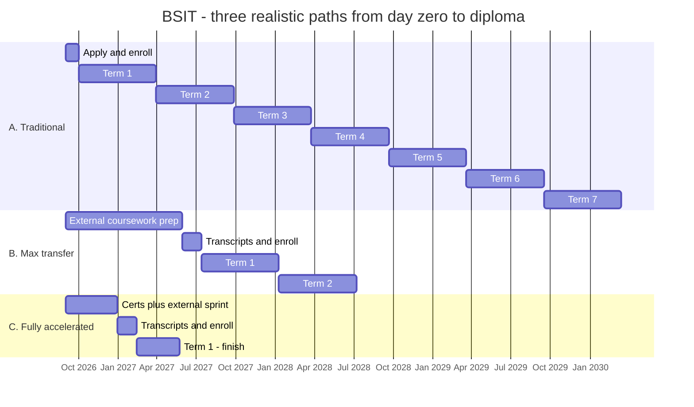

# The Complete WGU BSIT Field Guide

**B.S. Information Technology — everything the community knows, everything WGU gives you, and every CEU you can squeeze out of it.**

*Community-sourced from r/WGU, r/WGUIT, r/WGU_Accelerators, and official WGU + cert-body documentation. Compiled August 2026.*

☕ **[Buy me a coffee](https://buymeacoffee.com/grand1llusion)** — this guide is free and always will be; coffee funds the updates when WGU changes the catalog again.

---

> ## ⚠️ Read this first — what this guide is, and what it isn't
>
> **This is an independent, privately created and maintained guide.** It is not produced, reviewed, endorsed, or authorized by Western Governors University in any way.
>
> A large portion of it is **community-derived** — real students' posts, course writeups, completion reports, and screenshots of their own degree plans — combined with publicly available official documentation. Community reports can be out of date, specific to one student's catalog version, or simply wrong. And this program in particular is a moving target: **BSIT is mid-way through a major curriculum overhaul that is still rolling out through 2026**, transfer-credit articulations changed in March 2026, and tuition changes annually.
>
> **Treat everything here as a starting point for a better conversation with WGU — not as an authoritative answer.** Before you make any decision that costs money or time (enrolling, buying external coursework, transferring credit, sitting an exam, planning a term), confirm it directly with:
>
> - **WGU Admissions / your Enrollment Counselor** — [wgu.edu/admissions](https://www.wgu.edu/admissions.html) (use the contact options on that page) — for anything about admission, transfer credit, or cost.
> - **Your Program Mentor** — the authority on *your* degree plan, *your* catalog version, and which courses you personally need. This matters more than usual right now, because two BSIT students can be on genuinely different course lists this year.
> - **The official program guide** — [BSIT program guide](https://www.wgu.edu/online-it-degrees/information-technology-bachelors-program/program-guide.html).
>
> Every section below links its sources so you can verify anything yourself. Where something is community-reported rather than officially confirmed, it's labeled as such. If you find something wrong, please say so — corrections make this better for everyone behind you.

---

> **⚠️ Catalog note — the single most important thing on this page:** BSIT is in the middle of a **major curriculum overhaul**, and **the capstone has been removed entirely**. Rollout is staggered and mentor-mediated — some students got the new plan around April 2026, others as late as August 2026. If a writeup you find online mentions **C777 (Web Development Applications)** or a required **IT Capstone Written Project**, it's describing the **old** plan. This guide reconstructs the current structure from real students' transfer-eval printouts and WGU's own live transfer tool. Companion guides: **[BSCSIA Field Guide](./WGU-BSCSIA-Complete-Guide.md)** · **[MSCSIA Field Guide](./WGU-MSCSIA-Complete-Guide.md)**.

---

## Table of Contents

1. [TL;DR — The Ten Rules](#1-tldr--the-ten-rules)
2. [The Program at a Glance](#2-the-program-at-a-glance)
3. [Three Paths, Visualized](#3-three-paths-visualized)
4. [Before You Enroll — The Pre-Enrollment Playbook](#4-before-you-enroll--the-pre-enrollment-playbook)
5. [Your Day-One Mentor Roadmap (copy-paste)](#5-your-day-one-mentor-roadmap-copy-paste)
6. [How WGU Actually Works](#6-how-wgu-actually-works)
7. [Course-by-Course Playbook](#7-course-by-course-playbook)
8. [Acceleration Meta-Strategies](#8-acceleration-meta-strategies)
9. [Certs WGU Doesn't Pay For (But Your Coursework Covers)](#9-certs-wgu-doesnt-pay-for-but-your-coursework-covers)
10. [Use Everything WGU Gives You — The Linked Vault](#10-use-everything-wgu-gives-you--the-linked-vault)
11. [Managing Your Learning Platforms Without Drowning](#11-managing-your-learning-platforms-without-drowning)
12. [The CEU/CPE Maximizer](#12-the-ceucpe-maximizer)
13. [After Graduation](#13-after-graduation)
14. [Sources & Further Reading](#14-sources--further-reading)

---

## 1. TL;DR — The Ten Rules

1. **There is no capstone anymore.** Removed in the 2026 overhaul (course code C769). Community consensus across ~15 independent commenters is unanimous: no employer has ever asked about it. One lone, uncorroborated caveat — it might matter marginally for grad-school admissions.
2. **Web development is gone too.** C777, long the most-hated course in the program, was removed along with several legacy courses and replaced by two Python courses plus a business/management cluster.
3. **Do your gen-ed and non-cert courses on Sophia or Study.com *before* you enroll.** BSIT has the best real completion-time data of any WGU program: verified finishes as fast as 3 months, with ~1.5 years as the realistic working-adult benchmark. [Full mapping tables in Section 4](#43-the-sophia--studycom-mapping-tables).
4. **WGU does not accept transfer credit after you enroll. Ever.** Official policy: *"WGU does not award transfer credit after the student's initial term start date."* ([policy](https://cm.wgu.edu/t5/WGU-Student-Policy-Handbook/Undergraduate-Transfer-Credit/ta-p/49140)). Multiple students confirm this the hard way.
5. **The transfer cap is 75% of the program (~90 credits).** After that, WGU's 12 CU/term minimum sets your floor. Most working students land 3–5 courses/term once the gen-eds clear.
6. **Never use Sophia/Study.com for a course carrying a cert voucher you want.** Skip the course, skip the free cert.
7. **Check the live official transfer tool, not an old list.** WGU tightened articulations in March 2026 — upper-division courses now generally must be completed at WGU. [BSIT tool here](https://partners.wgu.edu/transfer-pathway-agreement?uniqueId=BSIT4424&collegeCode=IT&instId=678&programId=250).
8. **Python for IT Automation (D522) is the hardest course post-overhaul.** OA-based; multiple students report failing after a full term. Don't schedule it into a rushed term.
9. **Bring a written roadmap to your first mentor call.** [Section 5](#5-your-day-one-mentor-roadmap-copy-paste) has a copy-paste template. Mentors control course activation; a plan changes that conversation.
10. **Security+ is the cornerstone of your post-graduation CEU strategy.** One Security+ renewal auto-renews A+, Network+, and both CompTIA stackables for free. See [Section 12](#12-the-ceucpe-maximizer).

---

## 2. The Program at a Glance

**Official pages:** [Program page](https://www.wgu.edu/online-it-degrees/information-technology-bachelors-program.html) · [Program guide](https://www.wgu.edu/online-it-degrees/information-technology-bachelors-program/program-guide.html) · [Program guide PDF](https://www.wgu.edu/content/dam/wgu-65-assets/western-governors/documents/program-guides/information-technology/BSIT.pdf) · [IT bachelor's comparison](https://www.wgu.edu/resources/degree-comparisons/it-bachelors-degrees.html)

**The shape of it:** roughly 35 courses, **110 competency units (CUs)** in the pre-overhaul structure — the exact count is still settling as the remodel finishes rolling out. 6-month flat-rate terms, competency-based. Minimum full-time pace 12 CU/term. WGU's own stat: **61% of graduates finish within 39 months** — the longest typical completion among WGU's IT bachelor's degrees, though that figure predates the overhaul, and community numbers suggest the redesign is compressing it meaningfully.

**Cost:** **$3,925 tuition + $200 resource fee = $4,125 per 6-month term** (Jan 1 2026 rate, confirmed unchanged in the Oct 1 2026 tuition table — [always check current](https://www.wgu.edu/financial-aid-tuition/tuition-it-degrees.html)). At the 39-month pace (~7 terms) that's **≈$28,875**. You pay per term, not per course.

### The 2026 overhaul — what's changing

Rollout is staggered by student/mentor through 2026 — **not a single hard cutover date**. It's opt-in at a term boundary for current students; new enrollments increasingly land in the new plan by default. From a student's own transfer-evaluation printout (the most current data available):

**Removed:**

| Code | Course |
|---|---|
| C777 | Web Development Applications |
| C268 | Spreadsheets |
| C948 | Technical Communication |
| C954 | Information Technology Management |
| C962 | Current and Emerging Technology |
| C783 | Project Management |
| **C769** | **IT Capstone Written Project — the capstone itself** |

**Added / replaced:**

| Code | Course | Notes |
|---|---|---|
| E005 | Business Productivity Software | |
| D685 | Practical Applications of Prompt Engineering | |
| D388 | Fundamentals of Spreadsheets and Data Presentations | replaces C268 |
| E006 | Digital Transformation in the Enterprise | |
| E012 | Information Technology Management and Leadership | replaces C954 |
| D318 | Cloud Applications | → **CompTIA Cloud+** |
| E011 | Technical Communication | replaces C948 |
| E015 | Project Management | → **CompTIA Project+**, replaces C783 |
| E010 | Foundations of Programming (Python) | |
| D522 | Python for IT Automation | **the hard one — see [Section 7](#python-for-it-automation-d522--the-course-to-plan-around)** |

One student's read on the "why": the program is "moving away from web dev" toward Python, cloud, and AI content — mirroring the same shift in BSCSIA's catalog.

**Net effect on pace:** a student who went from 16 old-plan courses remaining to 18 new-plan courses remaining still reported a clear win, because average per-course completion time dropped enough that the larger course count finishes faster — *"the new plan just cut my potential graduation time by 6+ months."*

### Representative current course list

Confirmed codes, cross-checked across two independent 2026 sources plus WGU's own live transfer tool (Catalog 08-2026):

| Course | CU | Cert |
|---|---|---|
| Introduction to IT | 3 | — |
| Business Productivity Software (E005) | 3 | — |
| Health, Fitness, and Wellness for Life | 4 | — |
| Technology and Ethics | 3 | — |
| Critical Thinking: Reason and Evidence | 3 | — |
| Business of IT – Applications | 4 | → ITIL 4 Foundation |
| Composition: Successful Self-Expression | 3 | — |
| Fundamentals of Spreadsheets and Data Presentations (D388) | 3 | — |
| Applied Probability and Statistics | 3 | — |
| Practical Applications of Prompt Engineering (D685) | 2 | — |
| Linux Foundations | 3 | → LPI Linux Essentials |
| IT Foundations | 4 | → **CompTIA A+** (Core 1) |
| American Politics/US Constitution | 3 | — |
| Digital Transformation in the Enterprise (E006) | 2 | — |
| Agile Methodology (E007) | 3 | — |
| IT Applications | 4 | → **CompTIA A+** (Core 2) |
| Information Technology Management and Leadership (E012) | 3 | — |
| Network and Security – Foundations | 3 | — |
| Applied Algebra | 3 | — |
| Cloud Applications (D318) | 3 | → **CompTIA Cloud+** |
| Data Management – Applications (D427) | 4 | — |
| Networks (D325) | 4 | → **CompTIA Network+** |
| Technical Communication (E011) | 3 | — |
| Natural Science Lab | 2 | — |
| Global Arts and Humanities | 3 | — |
| Network and Security – Applications (D329) | 4 | → **CompTIA Security+** |
| Foundations of Programming – Python (E010) | 3 | — |
| Technology Governance (D822) | 3 | — |
| Python for IT Automation (D522) | 3 | — |
| Cloud Foundations | 3 | → **AWS Certified Cloud Practitioner** |
| Project Management (E015) | 4 | → **CompTIA Project+** |

*Treat this as "confirmed codes seen in real 2026 transfer evaluations," not a guaranteed final catalog. Confirm your own plan with your mentor.*

**Certs (8 built in):** CompTIA A+, Network+, Security+, Project+, Cloud+; LPI Linux Essentials; ITIL 4 Foundation; AWS Certified Cloud Practitioner. Plus four free CompTIA **stacked** credentials once you hold the prerequisites: IT Operations Specialist (A+ + Net+), Cloud Administration Professional (Net+ + Cloud+), Secure Infrastructure Specialist (A+ + Net+ + Sec+), Secure Cloud Professional (Sec+ + Cloud+).

---

## 3. Three Paths, Visualized

Same degree, three very different journeys. The variable that matters most isn't how fast you study — it's **how much you clear before you ever start paying WGU tuition.**



| Path | Who it fits | Pre-enrollment work | Terms paid | Wall-clock | Approx. tuition |
|---|---|---|---|---|---|
| **A. Traditional** | New to IT, working full-time, no transfer credit | None | ~7 | ~42 months | **≈$28,875** |
| **B. Max transfer** | Willing to spend 9 months on Sophia/Study.com first, or holds an associate degree | ~9 months external (~$900–1,300 in subscriptions) | ~2 | ~22 months | **≈$8,250** + subs |
| **C. Fully accelerated** | Already holds most CompTIA certs, or real IT experience + hard discipline | 4-month sprint: certs + external courses | 1 | ~9 months | **≈$4,125** + subs |

**The honest read:** Path C isn't dramatically shorter in wall-clock time than Path B — but it costs a seventh of Path A, because WGU bills by the term. The pre-enrollment months are the cheapest months of your degree.

### Real reported completion times (community, not official)

This is the richest data set in any WGU program, from a thread with 36 detailed replies:

| Time | Circumstances |
|---|---|
| **3 months** (May 1 – Jul 31) | Heavy Sophia/Study.com prep; only 16 WGU courses left under the new plan |
| **4 months** | ~75% pre-cleared via Study.com + Sophia + StraighterLine; held every relevant cert except ITIL |
| **7 months** | Full-time job, minimal days off — *"buckle up and go hard"* |
| **2 terms, relaxed** | 11 years IT experience, all CompTIA certs already held, pre-cleared everything possible on Sophia |
| **~1.5 years** | ⭐ **The realistic working-adult benchmark**, appearing repeatedly |
| **9 mo + 13 days** | 80 credits (66%) via Study.com over 9 months, then the remaining 40 CU at WGU in 13 days |
| **3.5 years** | Zero prior experience, full life outside school |
| **4 years** (×2 reports) | Military transitions + multiple jobs + kids; or repeating Python and a networking cert |
| **6 years** | Retook the Python course and CCNA twice |

The most-quotable pacing comment in the thread:

> *"Study.com saves money more than time since it caps around 75%/90 credits. WGU floor is 12 CU/term so 10 terms at minimum pace. Once gen-eds clear, most working students land 3 to 5 courses a term, sometimes 2 on rough terms, 6+ when transfer credit carries you."*

**All of these people graduated.** Every one is a legitimate finish.

---

## 4. Before You Enroll — The Pre-Enrollment Playbook

### 4.1 Admission requirements

([Program page](https://www.wgu.edu/online-it-degrees/information-technology-bachelors-program.html)) High school diploma/equivalent **plus ONE** of:

1. College transcripts with cumulative GPA ≥ 2.25, **or**
2. An existing associate or bachelor's degree, **or**
3. A transferable IT certification (not accepted if older than 5 years), **or**
4. High school transcripts with GPA ≥ 2.75, **or**
5. Prior IT coursework at the 300-level or higher.

No ACT/SAT required.

### 4.2 The hard rules, with official sources

| Rule | Answer | Source |
|---|---|---|
| Can you transfer credit **after** enrolling? | **No.** *"WGU does not award transfer credit after the student's initial term start date."* | [Undergraduate Transfer Credit policy](https://cm.wgu.edu/t5/WGU-Student-Policy-Handbook/Undergraduate-Transfer-Credit/ta-p/49140) |
| Maximum transfer? | **75% of the program** (~90 credits). You must complete ≥25% at WGU. | Same policy; also stated on WGU's partner transfer tools |
| Minimum transfer grade? | **C- or better** in most cases | Same policy page |
| Certification/coursework recency? | **Within the past 5 years** | Stated on the [BSIT partner transfer tool](https://partners.wgu.edu/transfer-pathway-agreement?uniqueId=BSIT4424&collegeCode=IT&instId=678&programId=250) |

**Plan around rule #1 above all others.** It turns "I'll knock out some Sophia courses once I'm settled" into a $4,125 mistake. Independent students confirm it plainly: *"I'm pretty sure WGU won't let you transfer in credits once you're already enrolled"* → *"Yes, they don't."*

### 4.3 The Sophia / Study.com mapping tables

Sophia Learning and Study.com are third-party, self-paced, ACE-accredited platforms sold as flat monthly subscriptions. Complete their courses, send transcripts to WGU **before you enroll**, and they land on your degree plan as "Requirement Satisfied."

**The platforms:**

| Platform | Cost | Concurrency | WGU-specific page |
|---|---|---|---|
| **Sophia Learning** | **$99/mo**, $299/4mo, or $799/yr ([pricing](https://www.sophia.org/plans-and-pricing/)) | No published cap | **[WGU College of IT portal](https://wgucollegeofinformationtechnology.sophia.org/)** — WGU-branded, live course map |
| **Study.com** | **College Saver $95/mo** (2 courses at a time); Pro $235/mo (3 at a time) ([pricing](https://study.com/college/pricing.html)) | 2–3 concurrent | **[Study.com → WGU](https://study.com/college/school/western-governors-university/studycom-courses-that-transfer-to-wgu.html)** · [BSIT-specific page](https://study.com/college/western-governors-university/degrees/wgu-bachelor-of-science-in-information-technology.html) |
| **StraighterLine** | $99/mo + per-course fee | Varies | [WGU School of Technology page](https://www.straighterline.com/colleges/wgu-school-of-technology/) |

#### Study.com → BSIT — from WGU's OWN live tool (highest confidence)

This is the best transfer data available for any WGU IT program: WGU's own [BSIT transfer-pathway tool](https://partners.wgu.edu/transfer-pathway-agreement?uniqueId=BSIT4424&collegeCode=IT&instId=678&programId=250) renders a fully populated table against **Catalog 08-2026** — the current one.

| WGU course (CU) | Study.com course |
|---|---|
| Composition: Successful Self-Expression (3) | English 104, English 204, **or** English 105 |
| Technical Communication (3) | English 305 |
| American Politics and the US Constitution (3) | Political Science 102 |
| Global Arts and Humanities (3) | Any one of: Art 103/104, English 101/102/103/301/310, Humanities 101, Philosophy 101/102/103/301, Social Science 108, Business 108/310/318 |
| Critical Thinking: Reason and Evidence (3) | Humanities 201 |
| Applied Algebra (3) | Math 101, 103, 104, 105, **or** 301 |
| Applied Probability and Statistics (3) | Statistics 101 **or** Business 212 |
| Health, Fitness, and Wellness (4) | Health 101 **or** Nutrition 101 |
| Natural Science Lab (2) | Biology 101L/107L/201L/202L, Chemistry 111L/112L, Physics 111L/112L, **or** Science 101L |
| Introduction to IT (3) | Computer Science 102 |
| Network and Security – Foundations (3) | Computer Science 108 **or** 304 |
| Web Design Fundamentals (3) | Computer Science 104 |
| Data Management – Applications (4) | Computer Science 204 |
| Business of IT – Project Management (4) | Business 311 **or** Business 112 |

**⚠️ Explicitly NON-transferable — must be completed at WGU:** Python for IT Automation (3), Business Productivity Software (3), Digital Transformation in the Enterprise (2).

**Not currently mapped** (blank in WGU's tool — no Study.com equivalent, take these at WGU): Influential Communication, Introduction to Systems Thinking, Business of IT – Applications, Fundamentals of Spreadsheets, Foundations of Programming, Linux Foundations, Cloud Foundations, Agile Methodology, Technology Management, Technology Governance, Prompt Engineering, Cloud Applications, Networks, Network and Security – Applications, IT Foundations, IT Applications.

> **Read that second list carefully — it's good news.** Almost everything unmapped is a cert-bearing course you *want* to take at WGU anyway (A+, Network+, Security+, Cloud+, Linux Essentials, AWS CCP). The transfer strategy and the cert strategy don't actually conflict much.

> ⚠️ **A caveat on Study.com's own BSIT page:** its published table uses older WGU course names (Integrated Physical Sciences, Human Growth and Development, Finite Mathematics) that don't appear in the current catalog. It appears not to have been refreshed. **Trust WGU's own tool above over Study.com's marketing table.**

#### Sophia → WGU (College of IT) — verified mappings

From Sophia's **WGU-branded** portal at [wgucollegeofinformationtechnology.sophia.org](https://wgucollegeofinformationtechnology.sophia.org/). College-of-IT-wide, so these apply to BSIT and BSCSIA alike.

| WGU course | Sophia course | ACE ID | Credits |
|---|---|---|---|
| Composition: Successful Self-Expression | English Composition I | SOPH-0015 | 3 |
| Composition: Successful Self-Expression *(alt)* | Workplace Writing II | SOPH-0049 | 3 |
| Global Arts and Humanities | Ancient Greek Philosophers / Art History I & II / Approaches to Studying Religions / Intro to Ethics / Visual Communications | — | 3 |
| Critical Thinking: Reason and Evidence | Critical Thinking | SOPH-0065 | 3 |
| Applied Algebra | College Algebra / Precalculus / Calculus I | SOPH-0001 / -0069 / -0060 | 3–4 |
| Applied Probability and Statistics | Introduction to Statistics | SOPH-0005 | 3 |
| Health, Fitness and Wellness | Introduction to Nutrition | SOPH-0063 | 3 |
| Natural Science Lab | Human Biology Lab / Intro to Chemistry Lab | SOPH-0067 / -0070 | 1 |
| Integrated Physical Sciences | Environmental Science / Human Biology / Intro to Chemistry | SOPH-0016 / -0002 / -0056 | 3 |
| Introduction to IT | Introduction to Information Technology | SOPH-0023 | 3 |
| Foundations of Programming (Python) | Introduction to Python Programming | SOPH-0058 | 3 |
| Scripting and Programming – Foundations | Introduction to Java Programming | SOPH-0062 | 3 |
| Data Management – Foundations | Introduction to Relational Databases | SOPH-0047 | 3 |
| Web Development Foundations | Introduction to Web Development | SOPH-0043 | 3 |
| Business of IT – Project Management | Project Management | SOPH-0013 | 3 |
| IT Leadership Foundations / Principles of Management | Principles of Management | SOPH-0054 | 3 |
| Introduction to Communication | Business Communication / Public Speaking / Workplace Communication | SOPH-0059 / -0024 / -0034 | 3 |

**⚠️ Sophia courses that do NOT transfer to WGU IT programs** — don't waste a month on these: Introduction to Psychology, Introduction to Sociology, Macroeconomics, Microeconomics, U.S. History I & II, **U.S. Government**, Introduction to Networking, Business Ethics, Business Law, Financial Accounting.

> **Note the U.S. Government gap.** BSIT requires *American Politics and the US Constitution*. Sophia's U.S. Government course doesn't transfer — but **Study.com's Political Science 102 does** (confirmed in WGU's own tool above). Use Study.com for that one, or [CLEP American Government](https://clep.collegeboard.org/clep-exams) at $97.

#### The March 2026 rule change

- **Sophia's own statement:** *"WGU has updated certain transfer articulations, including removing some Sophia Learning articulations. Official Sophia Learning transcripts must have been received by WGU during March 2026 to be considered under the prior articulation guidelines. After March 2026, WGU can accept general education and lower-division courses for transfer, but upper-division courses must be completed at WGU."* ([source](https://wgucollegeofinformationtechnology.sophia.org/))
- **Study.com's explainer** ([Understanding WGU 2026 Transfer Credit Updates](https://study.com/college/credit-transfer/understanding-wgu-2026-transfer-credit-updates.html)): 75% cap **unchanged**; affects Technology, Education, and Health/Nursing programs; "one or two [courses] per degree." For **BSIT it names *Information Systems Management***.
- **⚠️ A real discrepancy to be aware of:** WGU's own live tool instead lists **Python for IT Automation, Business Productivity Software, and Digital Transformation in the Enterprise** as BSIT's non-transferable courses. Both are official sources and they disagree. **Trust WGU's own tool — it's primary data, not a secondary summary — and confirm with an enrollment counselor before spending money.**

#### Exam-based credit (cheaper than a subscription for one-off gen-eds)

| Path | Cost | Best for | Link |
|---|---|---|---|
| **CLEP** | **$97/exam** + test-center fee | College Composition, College Algebra, American Government, Humanities, Natural Sciences | [clep.collegeboard.org/clep-exams](https://clep.collegeboard.org/clep-exams) |
| **DSST/DANTES** | **$100/exam** | **Principles of Statistics** (CLEP has no statistics exam), Ethics in Technology, Technical Writing, Computing and IT | [getcollegecredit.com/dsst-exams](https://getcollegecredit.com/dsst-exams/) |
| **JST (military)** | Free | WGU accepts Joint Services Transcripts as official transcripts for CLEP/DANTES | [WGU policy](https://cm.wgu.edu/t5/WGU-Student-Policy-Handbook/Transfer-Credit-for-CLEP-DANTES-AP-and-IB-Examinations/ta-p/28) |

> ⚠️ **ACE-recommended military credit is dicey for onward transfer** (community-reported). Get an actual evaluation rather than assuming a listed equivalency holds.

### 4.4 Cert-transfer strategy

BSIT publishes an unusually **long explicit list of transferable certifications** ([official list](https://www.wgu.edu/admissions/transfers/transcript-request/transferable-certifications.html)):

- **AWS** Certified Cloud Practitioner
- **Cisco** CCNA / CCNP (all tracks) / CCIE (all tracks)
- **CIW** HTML5 & CSS3, Database Design, UI Designer, Site Development Associate
- **CompTIA** SecurityX, A+ Core 1, A+ CE, Cloud Essentials+, CySA+, Linux+, Network+, PenTest+, Project+, Security+, Tech+
- **Google** IT Support (Coursera)
- **EC-Council** CEH
- **GIAC** GCED, GCIA, GSE, GSEC
- **ITIL** Foundation
- **LPI / Linux Foundation** Essentials through LPIC-2, LFCS
- **Microsoft** Azure DP-300
- **Oracle** Linux 8 Advanced SysAdmin, Database Foundations
- **PMI** CAPM, PMP
- **Red Hat** RHCA, RHCE, RHCSA

**There's no published cert→course mapping table** — matches are evaluated case by case by WGU's Transfer Evaluation Department. Submit your certs and request a specific evaluation rather than assuming a match.

> ⚠️ **One claim to treat carefully:** a single Reddit comment claims a CCNA alone clears *both* the Network+-mapped and Security+-mapped BSIT courses. That is **not** confirmed by WGU's own list. Ask your enrollment counselor; don't plan around it.

### 4.5 Money

- **Tuition:** $4,125/term all-in.
- **Application fee:** typically waivable — ask your Enrollment Counselor for a code.
- **Scholarships:** apply 90 days before to 30 days after your start. [Scholarships hub](https://www.wgu.edu/financial-aid-tuition/scholarships.html). Verify current offerings rather than trusting an older writeup.
- **Federal aid:** FAFSA code **033394**. Undergraduate full-time = 12 CU/term.
- **Employer reimbursement:** [details](https://www.wgu.edu/financial-aid-tuition/corporate-reimbursement.html).
- **Cost anecdote:** one student transferred in a free community-college AA that cleared about half the program, finished the rest in one grinding term — total out-of-pocket ≈ **$4.6K for the whole degree**.

### 4.6 The enrollment timeline

Starts are the **1st of every month**. Work backwards:

| When | Do |
|------|-----|
| **9–12 months out** | Start Sophia/Study.com. Cheapest phase of your degree. |
| **~90 days out** | Scholarship window opens. Request all transcripts (WGU has a free transcript-gathering service). |
| **60 days out** | Finish external coursework. Order transcripts sent to WGU. |
| **1st of month before start** | All transcripts must be received. |
| **15th of month before** | Admission requirements finalized. |
| **22nd of month before** | Payment/financial aid finalized. |
| **Before start** | "Commit to Start" → orientation → first mentor call ([bring your roadmap](#5-your-day-one-mentor-roadmap-copy-paste)). |

---

## 5. Your Day-One Mentor Roadmap (copy-paste)

Your Program Mentor controls which courses get opened, how fast, and whether extra courses get added mid-term (which are **free** — you already paid the flat term rate). Students who show up to that first call with a written plan consistently report a different relationship than students who show up with questions.

**Copy the block below, fill in the blanks, and email it to your mentor before your first call.** Then use it as the standing agenda for weekly check-ins.

```
WGU BSIT — Student Roadmap
Name:                          Student ID:
Program start date:            Target graduation:
Program Mentor:                Prepared:

────────────────────────────────────────────────
1. MY SITUATION
────────────────────────────────────────────────
Hours/week I can realistically commit:        hrs
Work schedule / constraints:
Prior IT experience:
Certifications I already hold (+ date earned):
Credits transferred in:            CU of 110
Courses remaining:                 of ~35

FIRST QUESTION FOR MY MENTOR:
Am I on the OLD BSIT plan or the NEW (post-overhaul)
plan? If old, can I switch, and what changes if I do?
(The new plan removes the capstone and C777.)

────────────────────────────────────────────────
2. MY TARGET PACE
────────────────────────────────────────────────
I am aiming for the ______________ path:
  [ ] Traditional  — ~7 terms, steady, low burnout risk
  [ ] Max transfer — ~2 terms after heavy pre-clearing
  [ ] Accelerated  — 1 term, requires prior certs/experience

CUs I intend to complete this term:          CU
(WGU minimum full-time is 12 CU/term)

Courses I want opened THIS TERM, in order:
  1. ______________________  target complete: ____
  2. ______________________  target complete: ____
  3. ______________________  target complete: ____
  4. ______________________  target complete: ____
  5. ______________________  target complete: ____

────────────────────────────────────────────────
3. WHAT I'M ASKING YOU FOR
────────────────────────────────────────────────
[ ] Open my next course as soon as I pass the current one
    — I understand added courses cost nothing extra.
[ ] Confirm my catalog version and flag any course where
    what I read online won't match my actual plan.
[ ] Tell me which courses in MY plan have the longest
    average completion times so I can front-load them.
[ ] Specifically: where does D522 (Python for IT
    Automation) sit in my plan, is it currently an OA or
    a PA, and what's the current pass rate/advice?
[ ] Hold me accountable: if I miss two weekly targets in
    a row, tell me directly rather than letting it slide.

────────────────────────────────────────────────
4. WEEKLY CHECK-IN FORMAT (5 minutes)
────────────────────────────────────────────────
  • Last week's target:              Hit? Y / N
  • This week's target:
  • Blocked on:
  • Next course to open:
  • Exam scheduled:

────────────────────────────────────────────────
5. CERT EXAM CALENDAR (schedule EARLY — seats fill)
────────────────────────────────────────────────
  A+ Core 1        target date: ______
  A+ Core 2        target date: ______
  Network+         target date: ______
  Security+        target date: ______
  Cloud+           target date: ______
  Project+         target date: ______
  ITIL 4           target date: ______
  Linux Essentials target date: ______
  AWS Cloud Prac.  target date: ______

  NOTE: CompTIA enforces a 14-day wait after two failed
  attempts on the same exam. Never schedule a first
  attempt in the final 3 weeks of a term.

────────────────────────────────────────────────
6. RISKS I'M FLAGGING NOW
────────────────────────────────────────────────
Courses I expect to be hardest for me:
Weeks I'll be unavailable (travel, work crunch, family):
My personal early-warning sign that I'm falling behind:
```

**Why this works:** it converts the mentor relationship from reactive ("how's it going?") to operational. For BSIT specifically, the catalog question at the top is genuinely important right now — two students starting the same month can be on different course lists.

---

## 6. How WGU Actually Works

Skip this if you're a WGU alum; read it twice if you're new.

**Competency-based, flat-rate terms.** Pass/not-yet, no GPA. A term is 6 months and costs the same whether you finish 8 CUs or 40+. Courses added mid-term once you clear your scheduled ones are **free**.

**Three kinds of faculty:**

- **Program Mentor** — assigned at enrollment, stays to graduation. Controls your degree plan and course activation. See [Section 5](#5-your-day-one-mentor-roadmap-copy-paste).
- **Course Instructors** — run live cohorts and **record them**. Cohort recordings, task guides, FAQ docs, and pacing guides consistently rate above the official textbooks. Check the announcements/community tab for **every** course.
- **Evaluators** — anonymous, rubric-driven PA graders.

**Two kinds of assessment:**

- **OA (Objective Assessment)** — proctored exam, either WGU-authored or the actual vendor cert exam. Workflow: pre-assessment **cold** on day one → coaching report → study only weak domains → retake → sit the OA.
- **PA (Performance Assessment)** — paper/project against a public rubric, revise-and-resubmit until you pass. **The rubric is the assignment.**

**Academic integrity — know exactly where the line is.** ([Official policy](https://cm.wgu.edu/t5/WGU-Student-Policy-Handbook/Academic-Integrity/ta-p/128))

- ✅ **Fine:** Sybex books, Professor Messer, Jason Dion, PocketPrep, TryHackMe, YouTube walkthroughs, Anki decks built from *published vendor exam objectives*, using AI to quiz yourself on public objectives.
- ❌ **Violation:** using or sharing actual WGU assessment content — real PA task instructions, real OA questions, "answer keys." Includes Quizlet decks of real WGU items, Chegg/Course Hero uploads, and the cluster of commercial sites marketing themselves as "WGU accelerator" answer services. Sanctions up to expulsion.

**Study materials, yes. Assessment materials, no.**

---

## 7. Course-by-Course Playbook

With the program mid-overhaul, per-course writeups for the *new* codes are still thin. This section leans on the most recent available threads and flags where coverage doesn't exist yet.

### The cert-bearing courses

**IT Foundations / IT Applications → CompTIA A+ (Core 1 & 2).** The first cert wall. Free prep that works: [Professor Messer A+ 220-1201](https://www.professormesser.com/free-a-plus-training/220-1201/220-1201-video/220-1201-training-course/) and [220-1202](https://www.professormesser.com/free-a-plus-training/220-1202/220-1202-video/220-1202-training-course/) — complete, free, current.

**Networks (D325) → CompTIA Network+.** Free prep: [Professor Messer N10-009](https://www.professormesser.com/network-plus/n10-009/n10-009-video/n10-009-training-course/). Foundational — budget real time if you haven't touched networking.

**Network and Security – Applications (D329) → CompTIA Security+.** One of the harder stretches without a security background — and the most valuable cert to hold for CEU purposes after graduation ([Section 12](#12-the-ceucpe-maximizer)). Free prep: [Professor Messer SY0-701](https://www.professormesser.com/security-plus/sy0-701/sy0-701-video/sy0-701-comptia-security-plus-course/).

**Cloud Applications (D318) → CompTIA Cloud+.** New to the current catalog; limited deep writeups yet.

**Cloud Foundations → AWS Certified Cloud Practitioner.** Generally approachable. [AWS Skill Builder's free tier](https://skillbuilder.aws/) has solid CLF-C02 prep, and [AWS Educate](https://aws.amazon.com/education/awseducate/) gives you free hands-on labs.

**Project Management (E015) → CompTIA Project+.** Some accelerators route around this via Sophia/Study.com if they don't value Project+ — just make sure you're still taking Business of IT – Applications for ITIL.

**Linux Foundations → LPI Linux Essentials.** Approachable, especially with command-line exposure. Build the [home lab](#104-build-a-home-lab-before-you-need-one) beforehand.

**Business of IT – Applications → ITIL 4 Foundation.** One of the lighter cert courses.

### Python for IT Automation (D522) — the course to plan around

**The single most-flagged hard course in the post-overhaul catalog.** Direct community quote: *"worst class I've taken so far... spent an entire term on it and still failed miserably."* Currently OA-based, with a persistent (unconfirmed) rumor it may convert to a PA — check the current format with your instructor before building a term plan around it.

**Do not schedule this into a rushed or heavily-loaded term.** If you're aiming for a one-term finish, this is the course most likely to break that plan.

Prep that helps: your Udemy access (Angela Yu's "100 Days of Code" is the community pick), plus building something real in your home lab rather than just watching videos. Consider [PCEP](https://pythoninstitute.org/pcep) (~$69) as a forcing function — see [Section 9](#9-certs-wgu-doesnt-pay-for-but-your-coursework-covers).

### Foundations of Programming – Python (E010)

More approachable than D522 — foundational syntax and concepts rather than automation-focused, higher-stakes material.

### The business/management cluster (mostly new: E005, E006, E007, E011, E012, D388)

Business Productivity Software, Digital Transformation in the Enterprise, Agile Methodology, Technical Communication, IT Management and Leadership, and Fundamentals of Spreadsheets are largely new or renamed. **Almost no community writeups exist for these specific versions yet** — if you take one, consider being the first writeup on r/WGUIT.

### C777 (Web Development Applications) — legacy note, old catalog only

If you're still on the old catalog, this has a long-standing reputation as the most disliked course in the program (*"pure garbage," "worst class I've taken"*) — though difficulty varies wildly: one grad with a web background did it in 2 days, others took a full month. **Removed from the new catalog entirely.**

### There is no capstone

Confirmed removed (C769). For context if you're on the old plan and still facing it: former students describe two papers of roughly 20–28 pages each, walked through piece by piece — tedious rather than genuinely difficult. No replacement requirement has been reported.

---

## 8. Acceleration Meta-Strategies

1. **Front-load Sophia/Study.com before you apply** ([Section 4.3](#43-the-sophia--studycom-mapping-tables)). Highest-leverage move available; BSIT has the best data to calibrate against.
2. **Never use external coursework on a cert-bearing course** unless you don't want that cert. Cross-check against the course table in [Section 2](#2-the-program-at-a-glance) first — conveniently, most cert courses aren't transferable anyway.
3. **Cap yourself at 2 concurrent courses and use fixed calendar blocks.** The single most-repeated tip across every real BSIT completion report.
4. **PA-first triage on every OA course.** Pre-assessment cold, study only weak domains, retake, sit the OA.
5. **Budget a low-stress term for D522.** The course most likely to eat an extra term if you go in cold.
6. **Bring the roadmap to your mentor** ([Section 5](#5-your-day-one-mentor-roadmap-copy-paste)) and ask for same-day course activation.
7. **Schedule cert exams when you start the course**, not when you feel ready. CompTIA's 14-day post-double-fail lockout is a term-killer if it lands in month six.
8. **Do external prep courses properly**, not just enough to pass the transfer exam, for skills you'll actually need. One student blazed through Sophia's web-dev course without learning it, then spent a full month on the WGU equivalent because the shallow prep left gaps.
9. **Don't chase the fastest post you read.** Several of the fastest finishers had years of prior IT experience or nearly complete cert rosters walking in. Their pace isn't a fair target from zero.

---

## 9. Certs WGU Doesn't Pay For (But Your Coursework Covers)

WGU includes 8 certifications. Several *more* certs test material your coursework already covers — and if you're taking the program slowly and learning properly, adding one or two for $0–$150 is the highest resume-value-per-dollar move available.

> **⚠️ Verify prices before you pay.** CompTIA raised most exam prices June 1, 2026, and promos expire. Every price below links to its official source.

### The free ones (do these — they cost nothing)

| Cert | Issuer | Cost | Pairs with | Link |
|---|---|---|---|---|
| **Fortinet NSE 1, 2, 3 / FCF** | Fortinet | **Free** — training *and* certificate | Network and Security – Foundations | [fortinet.com/training-certification](https://www.fortinet.com/training-certification) |
| Google Cloud skill badges | Google | Free via Skills Boost | Cloud Foundations | [cloudskillsboost.google/arcade](https://go.cloudskillsboost.google/arcade) |

> **❌ Correction on a widely-repeated tip:** ISC2's "One Million Certified in Cybersecurity" program — which gave a **free** CC exam and training — **closed to new enrollments on May 20, 2026** ([official announcement](https://www.isc2.org/Insights/2026/04/one-million-certified-cyber-conclusion)). Existing code holders can test through Dec 31, 2026. New students now pay **$199 + $50/yr**. Older guides still call it free — they're out of date.

### The AWS chain — you already get one, so make the second one nearly free

**BSIT is the only one of WGU's three cyber/IT programs that includes AWS Certified Cloud Practitioner.** That's a real advantage, because of how AWS's benefits work:

**The permanent benefit:** pass **any** AWS certification — including the CLF-C02 your tuition already covers — and you get access to a **50%-off voucher toward your next AWS exam**, plus a Credly badge and exam-lounge perks. ([Official AWS Certification benefits](https://aws.amazon.com/certification/benefits))

**So for a BSIT student the math is unusually good:** finish Cloud Foundations → you hold CLF-C02 (free, via tuition) → claim the 50% voucher → **AWS Certified AI Practitioner for ~$50 instead of $100.** That pairs directly with your Prompt Engineering course (D685). Two AWS certs, one of which cost you nothing and the other half price.

**There's also a live promo running the other direction** — AWS/Pearson VUE's **AIF2CLOUD**: register for AI Practitioner at 50% off, pass by **Sept 30, 2026**, and get a complimentary Cloud Practitioner attempt (pass by Nov 30, 2026). ([promo page](https://www.pearsonvue.com/us/en/aws/aif2cloud.html)) **Less useful for BSIT students** (you're getting CLF-C02 free anyway) — but worth knowing about, and **check whether it's still live before planning around it.**

| AWS cert | Code | List price | Link |
|---|---|---|---|
| Certified Cloud Practitioner | CLF-C02 | $100 *(included in your BSIT tuition)* | [aws.amazon.com](https://aws.amazon.com/certification/certified-cloud-practitioner/) |
| Certified AI Practitioner | AIF-C01 | $100 (~$50 with your post-CLF voucher) | [aws.amazon.com](https://aws.amazon.com/certification/certified-ai-practitioner/) |
| Solutions Architect – Associate | SAA-C03 | $150 (~$75 with voucher) | [aws.amazon.com](https://aws.amazon.com/certification/certified-solutions-architect-associate/) |

### Adjacent certs by course area

| Your WGU course | Adjacent cert | Cost | Why it's worth it | Link |
|---|---|---|---|---|
| Cloud Applications (Cloud+) | **Microsoft AZ-900** | ~$99 *(verify)* | Cloud service models transfer almost directly; cheapest multi-cloud signal | [learn.microsoft.com](https://learn.microsoft.com/en-us/credentials/certifications/azure-fundamentals/) · [free study guide](https://aka.ms/AZ900-StudyGuide) |
| Cloud Foundations | **Google Cloud Digital Leader** | **$99** | Completes "all three hyperscalers" for ~$300 total | [cloud.google.com](https://cloud.google.com/learn/certification/cloud-digital-leader) |
| Cloud Applications + Cloud Foundations | **AWS Solutions Architect – Associate** | $150 (~$75 w/ voucher) | The real step up from CLF-C02; Cloud+ already covers much of the HA/design/security material | [aws.amazon.com](https://aws.amazon.com/certification/certified-solutions-architect-associate/) |
| Networks (Network+) | **Cisco CCNA** (200-301) | ~$300 *(verify — not confirmable on Cisco's own page)* | Network+ is vendor-neutral; CCNA tests the same fundamentals against real IOS syntax, which is what job postings screen for. Free training at [netacad.com](https://www.netacad.com/) | [cisco.com](https://www.cisco.com/site/us/en/learn/training-certifications/index.html) |
| Linux Foundations | **LPIC-1** (101+102) | $200/exam ($400 total; reduced tiers to $132) | The direct next rung above Linux Essentials in LPI's own ladder | [lpi.org/exam-pricing](https://www.lpi.org/exam-pricing/) |
| Linux Foundations | **CompTIA Linux+** | $399 | Same voucher ecosystem you already know | [comptia.org](https://www.comptia.org/certifications/linux) |
| Network and Security – Applications | **Microsoft SC-900** | ~$99 *(verify)* | Security+ governance/identity domains framed in the Microsoft stack most employers run | [learn.microsoft.com](https://learn.microsoft.com/en-us/credentials/certifications/security-compliance-and-identity-fundamentals/) · [free study guide](https://aka.ms/sc900-StudyGuide) |
| Foundations of Programming (E010) | **PCEP** | from $69 | Cheap, fast first programming credential — and a useful forcing function before D522 | [pythoninstitute.org/pcep](https://pythoninstitute.org/pcep) |
| Python for IT Automation (D522) | **PCAP** | from $295 | OOP/exceptions/modules — sequence *after* PCEP | [pythoninstitute.org/pcap](https://pythoninstitute.org/pcap) |
| Prompt Engineering (D685) | **AWS AI Practitioner** | $100 (~$50 w/ voucher) | See the AWS chain above — the natural pairing for a BSIT student | [aws.amazon.com](https://aws.amazon.com/certification/certified-ai-practitioner/) |
| Project Management (E015) | **PMI CAPM** | ~$225 member / ~$300 non-member *(verify)*; **PMI student membership ~$32/yr** | Project+ and ITIL cover the lifecycle; CAPM is what PM-track employers screen for | [pmi.org](https://www.pmi.org/certifications/certified-associate-capm) |
| *(for security-curious BSIT students)* | **ISC2 CC** | $199 + $50/yr | No longer free — see correction above. Only worth it if you specifically want ISC2 membership | [isc2.org](https://www.isc2.org/Certifications/CC) |

### Discount mechanisms that actually exist

- **CompTIA student pricing** — verify enrollment via SheerID in the [CompTIA Academic Store](https://academic-store.comptia.org/). The percentage isn't published; you see your price after verification. ([How it works](https://help.comptia.org/hc/en-us/articles/13934022730772-How-Can-My-Students-Purchase-CompTIA-Products-at-a-Discount))
- **Authorized resellers** typically sell the same CompTIA vouchers 10–20% under retail.
- **CompTIA prices rose June 1, 2026:** A+ $274, Network+/Cloud+/Linux+ $399, Security+/CySA+/PenTest+ $439. (Only relevant for certs you buy yourself.)
- **PMI student membership ~$32/yr + $10 application** unlocks the CAPM member rate — verify at [pmi.org](https://www.pmi.org/) before paying.
- **ISACA student membership: $25/year → 30% off exams**, if you head toward the audit/governance track later. ([Student Hub](https://www.isaca.org/membership/student-hub))

### The smart stacking order for a slow-lane student

1. **Fortinet NSE 1–3** — free, do it early, costs nothing but an afternoon.
2. **AWS AI Practitioner (~$50)** right after you pass Cloud Foundations and claim your 50% voucher. Best value on this page for a BSIT student.
3. **PCEP** (~$69) alongside E010 and *before* D522 — it forces real Python fluency at exactly the right time.
4. **SC-900** (~$99) while Security+ is fresh, if you're headed toward a Microsoft-stack role.
5. **CCNA** (~$300) alongside or just after Networks — big spend, time it when the material is hottest.
6. **AWS Solutions Architect – Associate** (~$75 with voucher) if cloud is your target track.
7. **LPIC-1 / Linux+ / CAPM** later, budget permitting and depending on your target role.

**The governing principle:** never let a time-limited promo expire unused, but otherwise sequence paid certs to follow *directly behind* the WGU course that taught the material.

---

## 10. Use Everything WGU Gives You — The Linked Vault

You're paying $4,125 a term. Every link below is direct — no searching required.

### 10.1 Included with tuition

| Resource | What it is | Link |
|---|---|---|
| **Udemy Business** | Full catalog while enrolled — **gone at graduation**. Community pick for the Python courses: Angela Yu's "100 Days of Code: Python Pro Bootcamp." | Via your WGU student portal |
| **LinkedIn Learning** | Included | Via your WGU student portal |
| **Skillsoft Percipio**, **MindEdge** | Included | Via your WGU student portal |
| **CompTIA CertMaster** Learn/Labs/Practice | Embedded in cert courses | [Product overview](https://www.comptia.org/en-us/resources/certmaster-training/) |
| **WGU Library** | Databases, journals, 24/7 Ask-a-Librarian | [Student resources hub](https://www.wgu.edu/student-experience/student-resources.html) |
| **Writing Center / Academic Coaching** | APA help, live events, 24/7 chat | Via student portal |
| **WellConnect** | Free confidential 24/7 counseling + legal and financial consultations | Via student portal — **use it, you already paid for it** |
| **Handshake + Career Services for Life** | Job board, advisors, résumé/interview prep — continues after graduation | [wgu.edu careers](https://www.wgu.edu/student-experience/career-services.html) |

**The quiet gold:** cohort recordings, task guides, FAQ docs, and pacing guides posted by course instructors consistently rate above the official textbooks. Check the announcements/community tab in **every** course — this matters double right now, since the new courses have little else written about them.

### 10.2 Your @wgu.edu email is a discount engine

| Program | What you get | Eligibility | Direct link |
|---|---|---|---|
| **GitHub Student Developer Pack** | JetBrains all-products (free/yr), GitHub Pro + Copilot, **1Password 1yr free**, Datadog Pro 2yr, Namecheap domain + SSL, DigitalOcean credit, Azure $100 | School email **or** dated proof of enrollment | **[education.github.com/pack](https://education.github.com/pack)** |
| **Microsoft Azure for Students** | **$100 credit**, no credit card required, 12mo free services + 65 always-free, dev licenses **including Visio** | Student email verification | **[azure.microsoft.com/free/students](https://azure.microsoft.com/en-us/free/students/)** |
| **Microsoft 365 Education (A1)** | Free web versions of Word/Excel/PowerPoint/Outlook/OneNote. *(Desktop apps need paid A3/A5 — A1 is web-only.)* | Verified education email; can take weeks | **[microsoft.com/education/products/office](https://www.microsoft.com/en-us/education/products/office)** |
| **AWS Educate** | Free training, labs, digital badges, job board. **⚠️ No AWS credits** — common misconception | Any email, 13+ | **[aws.amazon.com/education/awseducate](https://aws.amazon.com/education/awseducate/)** |
| **AWS Skill Builder** | 600+ free courses incl. CLF-C02 prep; paid tier adds labs/practice exams | Free tier: none | **[skillbuilder.aws](https://skillbuilder.aws/)** |
| **Google Cloud for Students** | **200 Skills Boost credits**, 1-year expiry | Application-based | **[cloud.google.com/edu/students](https://cloud.google.com/edu/students)** |
| **TryHackMe student** | **20% off annual Premium** (annual only) | Set Occupation = Student in account settings | **[tryhackme.com/students](https://tryhackme.com/students)** · [how-to](https://help.tryhackme.com/en/articles/6494960-student-discount) |
| **Hack The Box Academy student** | Discounted Academy subscription (price shown after verification; Academy only) | Institutional email or student ID upload | **[HTB student sub guide](https://help.hackthebox.com/en/articles/13465244-getting-the-student-subscription)** |
| **LetsDefend** | **50% off VIP with a .edu email** (~$8.50/mo effective) | .edu registration | **[letsdefend.io](https://letsdefend.io/)** |
| **CompTIA Academic Store** | Student pricing on vouchers/bundles via SheerID | SheerID verification | **[academic-store.comptia.org](https://academic-store.comptia.org/)** |

### 10.3 Free training worth bookmarking

| Resource | What | Link |
|---|---|---|
| **Professor Messer** | Complete free courses for current exams: [A+ 220-1201](https://www.professormesser.com/free-a-plus-training/220-1201/220-1201-video/220-1201-training-course/) · [A+ 220-1202](https://www.professormesser.com/free-a-plus-training/220-1202/220-1202-video/220-1202-training-course/) · [Network+ N10-009](https://www.professormesser.com/network-plus/n10-009/n10-009-video/n10-009-training-course/) · [Security+ SY0-701](https://www.professormesser.com/security-plus/sy0-701/sy0-701-video/sy0-701-comptia-security-plus-course/) | [professormesser.com](https://www.professormesser.com/) |
| **Cisco Networking Academy** | Free networking courses — the best free CCNA on-ramp. ⚠️ **skillsforall.com now redirects here** | [netacad.com](https://www.netacad.com/) |
| **Microsoft Learn** | Free paths for [AZ-900](https://learn.microsoft.com/en-us/credentials/certifications/azure-fundamentals/), [SC-900](https://learn.microsoft.com/en-us/credentials/certifications/security-compliance-and-identity-fundamentals/). ⚠️ **AI-900 was renamed AI-901 in April 2026** — confirm the code before registering | [learn.microsoft.com](https://learn.microsoft.com/) |
| **Splunk free courses** | Free self-paced SIEM training | [splunk.com/training/free-courses](https://www.splunk.com/en_us/training/free-courses/overview.html) |
| **OverTheWire** | Free SSH wargames, no signup — the classic Linux on-ramp | [overthewire.org/wargames](https://overthewire.org/wargames/) |
| **CyLab Security Academy** | ⚠️ **picoCTF rebranded here in May 2026.** 500+ free challenges | [learn.cylabacademy.org/challenge-library](https://learn.cylabacademy.org/challenge-library) |
| **Google IT Support Certificate** | $49/mo on Coursera, financial aid available — **also on WGU's transferable-cert list** | [coursera.org](https://www.coursera.org/professional-certificates/google-it-support) |

### 10.4 Build a home lab before you need one

**VMware Workstation Pro** (free for personal use via Broadcom) or **Proxmox** (free hypervisor) on a spare machine. Pays off directly for Linux Foundations, Networks, Cloud Applications, and — most of all — D522, where building something real beats watching videos. Your Azure for Students credit and AWS Educate labs cover the cloud side.

One community report suggests a documented home lab may support a Network+/Security+ transfer-credit case — **unconfirmed as official policy**; ask your enrollment counselor rather than assuming.

### 10.5 Community wikis and aggregators

| Resource | What's in it | Link |
|---|---|---|
| **AWS Certifications Wiki** | Community-maintained: certification pathways, **vouchers & discounts**, programs & initiatives, study resources, badges & rewards | **[awscertifications.github.io/AWSCertificationsWiki](https://awscertifications.github.io/AWSCertificationsWiki/)** |
| **Paul Jerimy's Security Certification Roadmap** | The canonical visual map of security certs by specialization and level — useful for deciding what comes after BSIT | **[pauljerimy.com/security-certification-roadmap](https://pauljerimy.com/security-certification-roadmap/)** |
| **r/WGU wiki** | Community-maintained WGU knowledge base | [old.reddit.com/r/WGU/wiki/index](https://old.reddit.com/r/WGU/wiki/index) |
| **Subreddits** | [r/WGUIT](https://old.reddit.com/r/WGUIT/) · [r/WGU](https://old.reddit.com/r/WGU/) · [r/WGU_Accelerators](https://old.reddit.com/r/WGU_Accelerators/) | — |

> ⚠️ **Avoid commercial "WGU accelerator" answer sites.** Several sites market themselves as WGU course "solutions." They sell assessment content, which is an academic-integrity violation that can get you expelled.

### 10.6 Study aids

| Tool | Cost | Link |
|---|---|---|
| **PocketPrep** | Freemium; premium ~$15–20/mo. Covers 14 CompTIA exams + AWS CCP | [pocketprep.com](https://www.pocketprep.com/) |
| **Anki** | Free desktop + Android; **paid one-time on iOS** | [apps.ankiweb.net](https://apps.ankiweb.net/) · [shared decks](https://ankiweb.net/shared/decks/) |
| **Jason Dion** | Prices fluctuate | [Udemy profile](https://www.udemy.com/user/jason-dion/) · [Dion Training](https://www.diontraining.com/) (also sells discounted CompTIA vouchers) |

---

## 11. Managing Your Learning Platforms Without Drowning

Here's the trap: between Udemy, LinkedIn Learning, Skillsoft, CertMaster, Professor Messer, TryHackMe, AWS Skill Builder, Microsoft Learn, netacad, PocketPrep, Anki, Coursera, and YouTube, you have access to more high-quality training than you could finish in a decade. **Variety is genuinely valuable — different platforms teach differently, and hands-on labs cement what video can't. But unmanaged variety is just a very sophisticated form of procrastination.**

The failure mode is specific and common: you start a Udemy course, hit a hard chapter, and instead of pushing through you "supplement" with a LinkedIn Learning course, then a YouTube playlist, then a lab. Four platforms, four partial completions, one unpassed exam. It *feels* like studying. It isn't progress.

### The rule: one platform per job, not one platform per topic

For each course you're taking, assign exactly **one** resource to each of these five roles, write them down, and don't add a sixth:

| Role | What it does | Pick exactly one |
|---|---|---|
| **1. Primary instruction** | Teaches the material start to finish | Professor Messer, a Dion course, netacad, or the WGU course material |
| **2. Question bank** | Tells you what you don't know | PocketPrep, Dion practice exams, or CertMaster Practice |
| **3. Hands-on** | Makes it stick | Your home lab, TryHackMe, AWS Skill Builder labs, or an Azure sandbox |
| **4. Spaced repetition** | Retains it | Anki (built from published exam objectives only) |
| **5. Authoritative reference** | Settles disputes | The vendor's official exam objectives PDF |

Five slots. Fill them before you start the course. If a resource isn't in a slot, you don't open it until the course is passed.

### Sequencing beats stacking

Run them in a fixed order, not simultaneously:

```
Week 1      Primary instruction, first pass, 1.5x speed, no notes
Week 1 end  Question bank COLD -> find your weak domains
Week 2      Re-watch ONLY weak domains + hands-on labs for those
Week 2      Anki deck built from your actual misses
Week 3      Question bank again -> target 85%+ consistently
Week 3      Schedule the exam. Then sit it.
```

The most important line there is "question bank cold." Most people study everything evenly and waste 60% of their hours on material they already knew. WGU's own pre-assessment does the same job for OA courses — take it day one, before studying, always.

### Match the platform to the assessment type

- **Cert exam courses** (A+, Network+, Security+, Cloud+, Project+, AWS CCP): video course + question bank + labs. This is where PocketPrep and hands-on platforms earn their money.
- **WGU OA courses** (D522, Technology Governance, and the other non-cert exams): WGU's own course material + the pre-assessment loop. External platforms help less here because the OA is written to WGU's material, not a vendor blueprint. **This is especially true for D522** — don't go hunting for a magic Udemy course; work the WGU material and build things.
- **PA courses** (papers, projects): no platform helps. The rubric plus the course instructor's cohort recording is the entire toolkit.

### Three practical guardrails

1. **Cancel subscriptions you're not using this month.** TryHackMe, PocketPrep, Sophia, and Study.com are all month-to-month. A paused subscription during a paper-heavy term is free money back. Calendar a monthly review.
2. **Timebox exploration to one hour, once, per course.** Pick your five slots, then stop shopping. The hour spent comparing three Security+ courses is an hour not spent learning Security+.
3. **Put it in the mentor check-in.** [Section 5](#5-your-day-one-mentor-roadmap-copy-paste)'s template has a "this week's target" slot. Naming the *platform* and the *chapter* — not just "study Security+" — is what makes the weekly check-in functional.

---

## 12. The CEU/CPE Maximizer

BSIT's cert roster is entry-to-mid-level and heavily CompTIA-weighted. A community-compiled renewal strategy — built by a BSIT + MSITM grad and well-sourced against official renewal pages — maps out how to keep the whole stack current for minimal cost. Adapted and verified below.

> **Golden habit:** the day you pass any WGU course, save (1) your unofficial transcript, (2) the course description/syllabus, (3) the completion date. That bundle satisfies CompTIA, ISACA, and AWS documentation rules simultaneously.

### 12.1 CompTIA CE — Security+ is your cornerstone

**Portal:** [login.comptia.org](https://login.comptia.org) → Manage Certifications → Continuing Education → Add CEUs. **[Submission how-to](https://www.comptia.org/en-us/resources/ce/submit/)**

**Requirements per 3-year cycle:** A+ 20 CEUs ($75/cycle standalone) · Network+ 30 ($150/cycle) · Security+ 50 ($150/cycle, **or CertMaster CE ~$205 with no separate CE fees**).

**The single highest-leverage renewal action for a BSIT grad: renew Security+.** One Security+ renewal automatically renews **A+, Network+, and both CompTIA stackables (IT Operations Specialist, Secure Infrastructure Specialist)** at the same time, free. You do not renew each lower cert separately.

**Courses as CEUs** (if you're not using the Security+ chain): each completed college course = **10 CEUs** (3–4 credit hours, ≥50% content mapped to the cert's objectives). ([Higher-ed CEU page](https://www.comptia.org/en-us/resources/ce/choose/renewing-with-multiple-activities/training-and-higher-education/))

### 12.2 ITIL 4 Foundation (PeopleCert)

Renews every 3 years via **60 CPD points** (generally free if logged consistently through ordinary IT work), **or** an exam retake (~$150–350), **or** a ~$120/yr CPD subscription. ([Renewal page](https://www.peoplecert.org/Keep-Your-Certification-Current))

### 12.3 AWS Certified Cloud Practitioner

Renews every 3 years, **free via AWS Cloud Quest Recertify** (~10–12 hours; do it in the final 6-month window before expiry), or a 50%-discounted exam retake. Or just let a higher AWS cert supersede it. ([Recertification](https://aws.amazon.com/certification/recertification/))

### 12.4 LPI Linux Essentials

**Lifetime certification. No renewal, ever. $0.**

### 12.5 CompTIA stackable certs

IT Operations Specialist, Cloud Administration Professional, Secure Infrastructure Specialist, Secure Cloud Professional — all **auto-renew for $0** whenever their base certs renew. No separate action.

### 12.6 PMI CAPM (if you add it)

Renews every 3 years via **15 PDUs** logged in PMI's CCRS, ~$60 member / ~$150 non-member. ([Renewal](https://www.pmi.org/certifications/certified-associate-capm-renewal))

### 12.7 If you hold ISACA / GIAC / ISC2 credentials from elsewhere

The same university-coursework formulas apply as in the companion guides: **ISACA** pays 15 CPE per semester credit hour (a 3-CU course ≈ 45 CPE); **GIAC** pays 12 CPEs per course (3 courses = a full renewal); **ISC2** counts coursework as Group A education at 1 CPE/hour, max 40/activity. Not core to BSIT's roster, but your coursework still counts.

### 12.8 The full harvest

| You hold | The program gives you |
|----------|----------------------|
| A+/Network+ (prior) | Auto-renewed fee-free the moment you renew Security+ |
| Security+ | Renew once (~$205 CertMaster CE) → cascades to A+, Network+, and both stackables |
| ITIL 4 Foundation | 20 CPD points/year through ordinary work covers the 60-point requirement |
| AWS CCP | Free via Cloud Quest in the final 6 months before expiry |
| LPI Linux Essentials | Nothing to do — lifetime cert |
| CAPM | 15 PDUs over 3 years via free webinars/work experience |
| Any ISACA/GIAC/ISC2 cert | Standard university-coursework rates apply — see 12.7 |

**Why renew "entry-level" certs at all once you have a degree?** HR/ATS keyword filters still scan for A+/Network+/Security+/ITIL by name; DoD 8570/8140 contracting roles frequently hard-require an active Security+ (which cascades to keep A+/Net+ active too); and for IT-management-track careers, breadth signals versatility even after you've moved to specialist certs.

---

## 13. After Graduation

- **Alumni benefits:** Career Services for Life, the Alumni Master's Scholarship toward a WGU graduate degree, discounts on select WGU certificates, alumni library access. ([Benefits hub](https://www.wgu.edu/alumni/alumni-support/benefits.html))
- **You lose access** to Udemy, LinkedIn Learning, and the full library at graduation. Finish or download what you need *before* your final term ends.
- **Cash the degree in for CEUs one last time:** final courses count toward whatever renewal cycles are open at completion ([Section 12](#12-the-ceucpe-maximizer)).
- **Claim your AWS 50%-off voucher** if you haven't — passing CLF-C02 in Cloud Foundations unlocks it, and it makes AI Practitioner or Solutions Architect half price.
- **The fast next step reported by multiple BSIT grads:** WGU's **MSITM** (Master's in IT Management, an "Accelerated Pathway" program) — several posters describe finishing in as little as 2 months, since it's nearly all PA-based with short presentations rather than proctored exams. *Community-reported, not independently verified — confirm current structure with an enrollment counselor before counting on that pace.*
- **Security-focused alternative:** the [MSCSIA](./WGU-MSCSIA-Complete-Guide.md), if your interest is security specifically.
- **Plan your next cert with the map:** [Paul Jerimy's roadmap](https://pauljerimy.com/security-certification-roadmap/).
- **Pay it forward:** post writeups for the still-undocumented new courses (E005, E006, E007, E010, E011, E012, D388, D318, D522). The overhaul is recent enough that yours could be the first for a given code.

---

## 14. Sources & Further Reading

### Official WGU
[Program page](https://www.wgu.edu/online-it-degrees/information-technology-bachelors-program.html) · [Program guide PDF](https://www.wgu.edu/content/dam/wgu-65-assets/western-governors/documents/program-guides/information-technology/BSIT.pdf) · [IT bachelor's comparison](https://www.wgu.edu/resources/degree-comparisons/it-bachelors-degrees.html) · [Live BSIT transfer-pathway tool](https://partners.wgu.edu/transfer-pathway-agreement?uniqueId=BSIT4424&collegeCode=IT&instId=678&programId=250) · [All program catalog versions](https://partners.wgu.edu/general-transfer-guidelines) · [Transferable certifications list](https://www.wgu.edu/admissions/transfers/transcript-request/transferable-certifications.html) · [Undergraduate Transfer Credit policy](https://cm.wgu.edu/t5/WGU-Student-Policy-Handbook/Undergraduate-Transfer-Credit/ta-p/49140) · [CLEP/DANTES/AP/IB policy](https://cm.wgu.edu/t5/WGU-Student-Policy-Handbook/Transfer-Credit-for-CLEP-DANTES-AP-and-IB-Examinations/ta-p/28) · [Academic Integrity policy](https://cm.wgu.edu/t5/WGU-Student-Policy-Handbook/Academic-Integrity/ta-p/128) · [IT tuition](https://www.wgu.edu/financial-aid-tuition/tuition-it-degrees.html) · [Admissions](https://www.wgu.edu/admissions.html) · [Transfers](https://www.wgu.edu/admissions/transfers/transfer-to-wgu.html) · [Scholarships](https://www.wgu.edu/financial-aid-tuition/scholarships.html) · [Military](https://www.wgu.edu/student-experience/military.html) · [Student resources](https://www.wgu.edu/student-experience/student-resources.html)

### Transfer-credit platforms
[Sophia — WGU College of IT portal](https://wgucollegeofinformationtechnology.sophia.org/) · [Sophia pricing](https://www.sophia.org/plans-and-pricing/) · [Study.com → WGU](https://study.com/college/school/western-governors-university/studycom-courses-that-transfer-to-wgu.html) · [Study.com BSIT page](https://study.com/college/western-governors-university/degrees/wgu-bachelor-of-science-in-information-technology.html) · [Study.com pricing](https://study.com/college/pricing.html) · [Study.com's 2026 WGU transfer-change explainer](https://study.com/college/credit-transfer/understanding-wgu-2026-transfer-credit-updates.html) · [StraighterLine — WGU School of Technology](https://www.straighterline.com/colleges/wgu-school-of-technology/) · [CLEP exams](https://clep.collegeboard.org/clep-exams) · [DSST exams](https://getcollegecredit.com/dsst-exams/)

### Community threads (r/WGUIT)
[BSIT Remodel, no Capstone?](https://old.reddit.com/r/WGUIT/comments/1qmv9g9/bsit_remodel_no_capstone/) · [The new BSIT course plan just cut my graduation time by 6+ months](https://old.reddit.com/r/WGUIT/comments/1vdnhos/the_new_bsit_course_plan_just_cut_my_potential/) · [Update to BSIT program](https://old.reddit.com/r/WGUIT/comments/1rq3m2d/update_to_bsit_program/) · [BSIT @ WGU — How to maintain all your certifications](https://old.reddit.com/r/WGUIT/comments/1n3mxgq/bsit_wgu_how_to_maintain_all_your_certifications/) · [How long did BSIT actually take you, especially mixing in Study.com?](https://old.reddit.com/r/WGUIT/comments/1vhk4g1/how_long_did_bsit_actually_take_you_especially/) · [Trying to minimize cost before starting BSIT](https://old.reddit.com/r/WGUIT/comments/1uylnaq/trying_to_minimize_cost_before_starting_bsit_what/)

### Cert bodies & CEU/CPE references
[CompTIA CE FAQ](https://www.comptia.org/en-us/resources/ce/learn/comptia-continuing-education-program-faq/) · [CompTIA higher-ed CEUs](https://www.comptia.org/en-us/resources/ce/choose/renewing-with-multiple-activities/training-and-higher-education/) · [CompTIA renewal fees](https://www.comptia.org/en-us/resources/ce/learn/continuing-education-renewal-fees/) · [CompTIA Academic Store](https://academic-store.comptia.org/) · [PeopleCert ITIL renewal](https://www.peoplecert.org/Keep-Your-Certification-Current) · [AWS certification renewal](https://aws.amazon.com/certification/recertification/) · [AWS Certification benefits](https://aws.amazon.com/certification/benefits) · [AWS AIF2CLOUD promo](https://www.pearsonvue.com/us/en/aws/aif2cloud.html) · [PMI CAPM renewal](https://www.pmi.org/certifications/certified-associate-capm-renewal) · [Fortinet training](https://www.fortinet.com/training-certification) · [LPI exam pricing](https://www.lpi.org/exam-pricing/) · [Python Institute PCEP](https://pythoninstitute.org/pcep) · [ISC2 "One Million" program conclusion](https://www.isc2.org/Insights/2026/04/one-million-certified-cyber-conclusion) · [ISACA Student Hub](https://www.isaca.org/membership/student-hub)

---

*Built by and for the WGU IT community. Companion guides: [MSCSIA Field Guide](./WGU-MSCSIA-Complete-Guide.md) · [BSCSIA Field Guide](./WGU-BSCSIA-Complete-Guide.md).*

**Reminder: this guide is independent and unofficial.** It is not affiliated with, endorsed by, or reviewed by Western Governors University. Community-derived information can be outdated or wrong, and BSIT in particular is mid-overhaul right now — two students starting the same month may be on different course lists. **Always confirm with WGU Admissions, your Enrollment Counselor, or your Program Mentor before making a decision that costs money or time.** Corrections and updated intel are genuinely welcome.

*Found this useful? ☕ [Buy me a coffee](https://buymeacoffee.com/grand1llusion) — it funds the updates when WGU changes the catalog again.*
