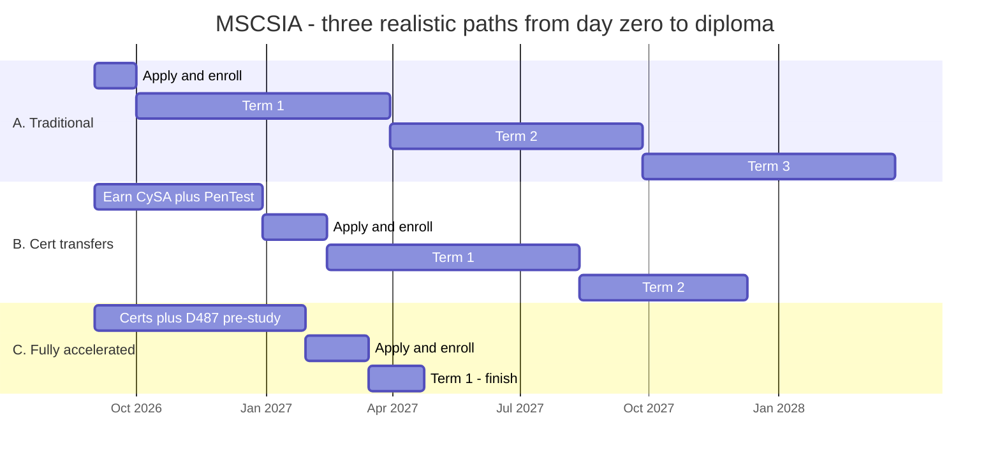

# The Complete WGU MSCSIA Field Guide

**M.S. Cybersecurity & Information Assurance — everything the community knows, everything WGU gives you, and every CEU you can squeeze out of it.**

*Community-sourced from r/WGU, r/WGUCyberSecurity, r/WGU_Accelerators, student writeups, and official WGU + cert-body documentation. Compiled August 2026.*

☕ **[Buy me a coffee](https://buymeacoffee.com/grand1llusion)** — this guide is free and always will be; coffee funds the updates when WGU changes the catalog again.

---

> ## ⚠️ Read this first — what this guide is, and what it isn't
>
> **This is an independent, privately created and maintained guide.** It is not produced, reviewed, endorsed, or authorized by Western Governors University in any way.
>
> A large portion of it is **community-derived** — real students' posts, course writeups, completion reports, and screenshots of their own degree plans — combined with publicly available official documentation. Community reports can be out of date, specific to one student's catalog version, or simply wrong. And WGU changes things *constantly*: this program's catalog changed in **August 2026**, tuition changes annually, and cert rosters shift with vendor relationships. WGU's own program-guide PDF shipped with at least one mapping error that students caught.
>
> **Treat everything here as a starting point for a better conversation with WGU — not as an authoritative answer.** Before you make any decision that costs money or time (enrolling, transferring a certification, sitting an exam, planning a term), confirm it directly with:
>
> - **WGU Admissions / your Enrollment Counselor** — [wgu.edu/admissions](https://www.wgu.edu/admissions.html) (use the contact options on that page) — for anything about admission, transfer credit, or cost.
> - **Your Program Mentor** — the authority on *your* degree plan, *your* catalog version, and which courses you personally need.
> - **The official program guide** — [MSCSIA program guide](https://www.wgu.edu/online-it-degrees/cybersecurity-information-assurance-masters-program/program-guide.html).
>
> Every section below links its sources so you can verify anything yourself. Where something is community-reported rather than officially confirmed, it's labeled as such. If you find something wrong, please say so — corrections make this better for everyone behind you.

---

> **⚠️ Catalog note:** WGU revised the MSCSIA in **August 2026**. The current version (Catalog 202610) is an **11-course, 36-CU** program that added three new E-series courses and dropped the ISC2 CC. Most community writeups you'll find cover the **2023–2025 version** (10 courses, 34 CUs, D481/D486 instead of E123/E122/E121). D-series course advice still applies — those carried over — but always check codes against **your** degree plan. Existing students choose whether to stay or migrate ([community thread with insider detail](https://old.reddit.com/r/WGUCyberSecurity/comments/1ve6htt/new_mscsia_program/)).
>
> Coming from the bachelor's side, or planning your path? Companion guides: **[BSCSIA Field Guide](./WGU-BSCSIA-Complete-Guide.md)** · **[BSIT Field Guide](./WGU-BSIT-Complete-Guide.md)**.

---

## Table of Contents

1. [TL;DR — The Ten Rules](#1-tldr--the-ten-rules)
2. [The Program at a Glance](#2-the-program-at-a-glance)
3. [Three Paths, Visualized](#3-three-paths-visualized)
4. [Before You Enroll — The Pre-Enrollment Playbook](#4-before-you-enroll--the-pre-enrollment-playbook)
5. [Your Day-One Mentor Roadmap (copy-paste)](#5-your-day-one-mentor-roadmap-copy-paste)
6. [How WGU Actually Works](#6-how-wgu-actually-works)
7. [Course-by-Course Playbook](#7-course-by-course-playbook)
8. [Acceleration Meta-Strategies](#8-acceleration-meta-strategies)
9. [Certs WGU Doesn't Pay For (But Your Coursework Covers)](#9-certs-wgu-doesnt-pay-for-but-your-coursework-covers)
10. [Use Everything WGU Gives You — The Linked Vault](#10-use-everything-wgu-gives-you--the-linked-vault)
11. [Managing Your Learning Platforms Without Drowning](#11-managing-your-learning-platforms-without-drowning)
12. [The CEU/CPE Maximizer](#12-the-ceucpe-maximizer)
13. [After Graduation](#13-after-graduation)
14. [Sources & Further Reading](#14-sources--further-reading)

---

## 1. TL;DR — The Ten Rules

1. **Transfer in certs before you enroll.** CySA+, PenTest+, and CISM clear the three hardest courses. Official mapping: [partners.wgu.edu](https://partners.wgu.edu/master-of-science-in-cyber-security-and-information-assurance). One student cleared 14 of 34 CUs this way and finished in 5 months; another finished the remaining coursework in **21 days**.
2. **Sophia and Study.com do NOT work here.** That's a bachelor's-only lever. If you came from the BSCSIA/BSIT playbook, [Section 4.3](#43-why-sophiastudycom-doesnt-apply--and-what-replaces-it) explains what replaces it.
3. **Pre-study D487 (Secure Software Design) before your start date.** It's an OA with a known book. The 33-day finisher read it cover to cover pre-enrollment and passed the PA *and* OA on day one.
4. **Write to the rubric. Literally.** Every PA failure story traces to a missed rubric bullet, not weak technical content. Print the rubric; answer each bullet explicitly; ignore suggested page counts.
5. **Take the pre-assessment on day one of every OA course, before studying.** Study only what you missed. Community-reported time savings: ~50%.
6. **Bring a written roadmap to your first mentor call.** [Section 5](#5-your-day-one-mentor-roadmap-copy-paste) has a copy-paste template. Mentors open courses one at a time; extra courses in a term cost **$0**.
7. **Don't rely on CertMaster for the CompTIA courses.** Community standard is Sybex (Chapple) + Jason Dion/PocketPrep. CertMaster's voucher gate (90% on the final assessment *and* a practice test) is widely disliked — plan for it.
8. **For the capstone, talk to your Course Instructor before you submit anything.** Task 1 needs their sign-off, and getting your topic approved early is one of the biggest time-savers in the whole program.
9. **The D485 Azure lab environment has a known session time limit and can be slow.** Do your practice labs beforehand and screenshot your progress as you go.
10. **Every course you finish is CEU/CPE fuel.** Each new CompTIA cert auto-renews your lower certs fee-free; each 3–4 CU course is worth 10 CompTIA CEUs, ~45 ISACA CPEs, 12 GIAC CPEs, and ISC2 Group A hours. See [Section 12](#12-the-ceucpe-maximizer).

---

## 2. The Program at a Glance

**Official pages:** [Program page](https://www.wgu.edu/online-it-degrees/cybersecurity-information-assurance-masters-program.html) · [Program guide](https://www.wgu.edu/online-it-degrees/cybersecurity-information-assurance-masters-program/program-guide.html) · [Program guide PDF (Catalog 202610)](https://www.wgu.edu/content/dam/wgu-65-assets/western-governors/documents/program-guides/information-technology/MSCSIA.pdf)

**The shape of it:** 11 courses, 36 competency units (CUs), 6-month flat-rate terms, competency-based (pass = demonstrated B-or-better mastery; no GPA). Recommended 4-term plan; on-time progress requires **8 CUs per term** (also the graduate full-time threshold for financial aid and VA benefits). **63% of graduates finish within 18 months** — and the acceleration community routinely does it in 1–2 terms.

**Cost:** **$4,925 tuition + $200 e-books/resource fee = $5,125 per 6-month term** (rates effective Jan 1, 2026; new rates announced effective Oct 1, 2026 — [check the current table](https://www.wgu.edu/financial-aid-tuition/tuition-it-degrees.html)). You pay per term, not per course: finishing faster literally costs less.

### Current course sequence (Catalog 202610, effective ~Aug 2026)

| # | Code | Course | CUs | Assessment | Cert |
|---|------|--------|-----|------------|------|
| 1 | E123 | Cybersecurity Fundamentals | 2 | PA (reported) | — |
| 2 | D482 | Secure Network Design | 3 | PA | — |
| 3 | D487 | Secure Software Design | 3 | OA | — |
| 4 | D483 | Security Operations | 4 | Cert exam | **CompTIA CySA+** (included) |
| 5 | D485 | Cloud Security | 4 | PA + Azure lab | — |
| 6 | D484 | Penetration Testing | 4 | Cert exam | **CompTIA PenTest+** (included) |
| 7 | D488 | Cybersecurity Architecture & Engineering | 4 | OA | CompTIA SecurityX (optional voucher) |
| 8 | E122 | Human-Centric Risk in Cybersecurity | 3 | TBD (new) | — |
| 9 | D489 | Cybersecurity Management | 4 | PA | ISACA CISM (optional voucher) |
| 10 | E121 | Governance, Risk & Compliance in the Age of AI | 2 | TBD (new) | ISACA AAISM (optional voucher) |
| 11 | D490 | Cybersecurity Graduate Capstone | 4 | 3-task PA | — |

**What changed in the Aug 2026 revision** (from the [community thread](https://old.reddit.com/r/WGUCyberSecurity/comments/1ve6htt/new_mscsia_program/) with WGU-insider participation, cross-checked against the PDF):

- **ISC2 CC is gone.** D481 Security Foundations (which carried the CC) was replaced by E123, a fundamentals course with no entry cert. Reported rationale: students without IT experience were getting stuck on CC failures and ISC2's mandatory retake waits. *(Separately: ISC2's free-CC program has since ended for everyone — see [Section 9](#9-certs-wgu-doesnt-pay-for-but-your-coursework-covers).)*
- **D486 GRC was replaced by E121 (GRC in the Age of AI)**, aligned to ISACA's new **AAISM** cert. Caution: AAISM is only *awarded* if you hold an active **CISM or CISSP** ([ISACA](https://www.isaca.org/credentialing/aaism)) — you can pass the exam, but the credential waits on the prerequisite.
- **E122 Human-Centric Risk** is entirely new. As of late August 2026 there is **zero community coverage** of E121/E122/E123 — if you're in the new catalog, your writeups will be the first. Post them.
- **Stricter sequencing.** The new catalog is reported to be a nearly linear one-course-at-a-time prerequisite chain, vs. the old version's partial flexibility.
- **Existing students choose**: stay on your catalog or migrate, via your Program Mentor.

**Certs summary:** included at no extra cost — CySA+, PenTest+ (each voucher covers the exam **twice**, per [WGU's cert page](https://www.wgu.edu/online-it-degrees/it-certifications.html)). Optional vouchers — SecurityX, CISM, AAISM (whether "optional voucher" means WGU-paid on opt-in isn't spelled out publicly; confirm with your mentor). Note ISACA/ISC2 may require separate *membership* fees for cert maintenance even when the exam is covered.

---

## 3. Three Paths, Visualized

Unlike the bachelor's programs, the master's has **no external-coursework shortcut**. The lever here is certifications you already hold and how much you pre-study before day one.



| Path | Who it fits | Pre-enrollment work | Terms paid | Wall-clock | Approx. tuition |
|---|---|---|---|---|---|
| **A. Traditional** | Working full-time, no transferable certs, learning as you go | None | ~3 | ~18 months | **≈$15,375** |
| **B. Cert transfers** | Willing to sit CySA+ and PenTest+ first (~$1,280 with academic pricing) | 4 months of cert study | ~2 | ~16 months | **≈$10,250** + certs |
| **C. Fully accelerated** | Experienced practitioner; holds or earns CySA+/PenTest+/CISM, pre-reads D487 | 5-month sprint | 1 | ~8 months | **≈$5,125** + certs |

**Documented real timelines** (community, not official): **21 days** (BSCSIA alum with heavy transfers), **33 days** (8-year practitioner, 4 transfers), **3.5 months**, **5 months** (half the CUs cleared), **15 months** (3 terms, full-time job, certs from scratch), **18 months** (no transfers, full-time job — [and still a win](https://old.reddit.com/r/WGUCyberSecurity/comments/1q8qjla/mscsia_completed/)).

**All of these people graduated.** Pick the pace that fits your life — and note the counterpoint from a 3.5-month finisher: don't rush past the learning, because burnout costs more time than it saves.

---

## 4. Before You Enroll — The Pre-Enrollment Playbook

### 4.1 Admission requirements

([Program page](https://www.wgu.edu/online-it-degrees/cybersecurity-information-assurance-masters-program.html)) You need ONE of:

- A bachelor's in a STEM field ([VA STEM list](https://benefits.va.gov/gibill/docs/fgib/STEM_Program_List.pdf)), or a business degree with quantitative focus (Accounting, Economics, Finance, Quantitative Analysis); **or**
- **Any** bachelor's degree **plus** a relevant, current IT certification **or** related IT coursework.

No GRE/GMAT. No résumé/experience waiver — transcripts are verified before admission. Community note: WGU can be strict when experience isn't cleanly documented ([DegreeForum thread](https://www.degreeforum.net/mybb/Thread-WGU-MSCSIA-Questions)).

### 4.2 The cert-transfer strategy (the single biggest lever)

Graduate transfer credit at WGU is limited — but the MSCSIA **does clear specific courses for specific certs you already hold**. The authoritative mapping: **[partners.wgu.edu — MSCSIA transfer pathways](https://partners.wgu.edu/master-of-science-in-cyber-security-and-information-assurance)** (a dynamic page — open it in a normal browser; the 33-day finisher called this link out by name as his planning tool).

Community-confirmed clears (verify current mappings on that page — the catalog just changed):

- **CySA+ → D483 Security Operations**
- **PenTest+ → D484 Penetration Testing**
- **CISM → D489 Cybersecurity Management** (the *only* transferable ISACA cert — AAISM does **not** transfer even though it's an optional program cert)
- Old catalog: CISSP/SSCP/Security+ cleared D481 Security Foundations; some students report SecurityX/CASP+ clearing D488, and one BSCSIA grad's provisional **CCSP** pass cleared her cloud requirement
- **CISSP does NOT clear D489** — a recurring sore point ([thread](https://old.reddit.com/r/WGUCyberSecurity/comments/1pr1xzu/cissp_and_the_mscsia/)); CGRC doesn't clear GRC either

Rules of the road: you can transfer at most **50% of program CUs**, and maxing out cert-clears reaches roughly 44% under the new catalog (community calculation in the [new-program thread](https://old.reddit.com/r/WGUCyberSecurity/comments/1ve6htt/new_mscsia_program/)). **Confirm the current cap with an enrollment counselor** — graduate transfer policy differs from the undergraduate 75% rule.

**Should you earn certs BEFORE enrolling?** The math one planner posted ([thread](https://old.reddit.com/r/WGUCyberSecurity/comments/1ndyjyc/planning_to_complete_wgu_masters_in_1_term/)): CompTIA academic-store bundles (voucher + retake + CertMaster) for Net+/Sec+/SecurityX/CySA+/PenTest+ cost him **$1,280** with academic pricing and a promo code, vs. ~$3,300 list. If pre-clearing those courses lets you finish in one term instead of two, you save $5,125 — the certs pay for themselves. Counterpoint: if you'd rather not front the cash, the program *gives* you CySA+/PenTest+ vouchers (two attempts each) inside tuition. Either way, **study the cert objectives before day one**. Academic pricing: [CompTIA Academic Store](https://academic-store.comptia.org/).

### 4.3 Why Sophia/Study.com doesn't apply — and what replaces it

If you've read the [BSCSIA](./WGU-BSCSIA-Complete-Guide.md) or [BSIT](./WGU-BSIT-Complete-Guide.md) guides — or you're a WGU bachelor's alum — you already know the single biggest accelerator at the undergraduate level: clear a pile of courses on **Sophia Learning** or **Study.com** for ~$99/month before you ever enroll.

**That does not work here.** Sophia and Study.com courses are ACE-evaluated at the **lower-division undergraduate** level. They cannot satisfy graduate-level requirements at WGU or anywhere else. Neither platform publishes a WGU graduate pathway, and WGU's own partner transfer tools are undergraduate-only. Don't buy a subscription expecting it to help with the MSCSIA.

**What actually replaces it at the graduate level:**

| Undergrad lever | Graduate equivalent |
|---|---|
| Sophia/Study.com course transfers | **Industry certifications** that map to courses ([Section 4.2](#42-the-cert-transfer-strategy-the-single-biggest-lever)) — CySA+, PenTest+, CISM |
| CLEP/DSST exams | Nothing equivalent — no graduate credit-by-exam |
| Cheap gen-ed clearing | **Pre-studying** during the free 1–3 month application-to-start window ([Section 4.4](#44-the-enrollment-timeline-work-backwards-from-your-start-date)) |
| 75% transfer cap | **~50% cap** (verify current policy with your counselor) |

The practical consequence: **your money is better spent on certification vouchers than on any subscription platform.** A $1,280 cert bundle that clears three courses is the graduate-level version of a $600 Sophia run that clears ten.

### 4.4 The enrollment timeline (work backwards from your start date)

Starts are the **1st of every month**. ([Admissions](https://www.wgu.edu/admissions.html) · [checklist](https://www.wgu.edu/admissions/enrollment.html))

| When | Do |
|------|-----|
| Anytime | Apply (get the fee waiver code from your counselor). Request transcripts — WGU offers a **free transcript-gathering service**. |
| ~90 days out | Scholarship window opens. Start pre-studying (D487 book; CySA+/PenTest+ objectives; or sit certs to transfer). |
| 1st of month before start | Transcripts (and military transcripts if using TA) must be in. |
| 15th of month before | All admission requirements met to keep your start date. |
| 22nd of month before | Payment/financial aid finalized. |
| Before start | "Commit to Start" docs → orientation course → first Program Mentor call ([bring your roadmap](#5-your-day-one-mentor-roadmap-copy-paste)). |

### 4.5 Money

- **Tuition:** $5,125/term all-in (see Section 2).
- **Application fee:** $65 — but Enrollment Counselors hand out waiver codes freely; just ask ([DegreeForum](https://www.degreeforum.net/mybb/Thread-WGU-Application-Fee-Waiver-Code)).
- **Scholarships** ([hub](https://www.wgu.edu/financial-aid-tuition/scholarships.html)): apply from 90 days before to 30 days after your start; generally one WGU-funded scholarship per program. The headliner for this degree is the **WGU Cybersecurity Scholarship — up to $6,000** ($1,500/term × 4), explicitly open to MSCSIA students ([details](https://www.wgu.edu/financial-aid-tuition/scholarships/general/cybersecurity.html)). Also relevant: Master Your Future ($3k), Alumni Master's (for WGU grads), University of You ($10k), and the military family (Military Appreciation $3k, Active Duty $3k, Spouse $4k, National Guard $4k). *Verify current amounts — scholarship offerings change.*
- **Federal aid:** FAFSA code **033394**. Graduate = Direct Unsubsidized loans; note **Grad PLUS was eliminated for new borrowers after July 1, 2026**. Full-time = 8 CUs/term; you must pass ≥3 CUs in term one to keep aid.
- **Military TA:** all branches cap at **$4,500/fiscal year** — TA alone won't cover ~$10,250/year, so stack the Active Duty Scholarship ($3k) on top. Transcripts (all colleges + JST) due by the 1st of the month before your start ([TA page](https://www.wgu.edu/student-experience/military/tuition-assistance.html)).
- **GI Bill:** Ch. 33 accepted; 8 CUs/term = full-time VA rate for grad students ([military hub](https://www.wgu.edu/student-experience/military.html)). Military Support: va@wgu.edu, 1-877-435-7948 x3127.
- **Employer reimbursement:** usable for any WGU degree; billing mechanics run through your Enrollment Counselor ([page](https://www.wgu.edu/financial-aid-tuition/corporate-reimbursement.html)).

---

## 5. Your Day-One Mentor Roadmap (copy-paste)

Your Program Mentor controls which courses get opened and how fast. In the new catalog — which is reported to be a near-linear prerequisite chain — that control matters *more* than it used to, because you can't route around a slow activation by working ahead on something else.

**Copy the block below, fill in the blanks, and email it to your mentor before your first call.** Then use it as the standing agenda for weekly check-ins.

```
WGU MSCSIA — Student Roadmap
Name:                          Student ID:
Program start date:            Target graduation:
Program Mentor:                Prepared:

────────────────────────────────────────────────
1. MY SITUATION
────────────────────────────────────────────────
Hours/week I can realistically commit:        hrs
Work schedule / constraints:
Years of security/IT experience:
Certifications I already hold (+ date earned):
Certs I transferred in:            CU of 36
Courses remaining:                 of 11

FIRST QUESTIONS FOR MY MENTOR:
1. Am I on Catalog 202610 (11 courses, E121/E122/E123)
   or the prior catalog (10 courses, D481/D486)?
2. If prior — should I migrate? What changes?
3. Is my plan a strict linear prerequisite chain, or can
   more than one course be open at a time?

────────────────────────────────────────────────
2. MY TARGET PACE
────────────────────────────────────────────────
I am aiming for the ______________ path:
  [ ] Traditional       — ~3 terms, steady
  [ ] Cert transfers    — ~2 terms
  [ ] Fully accelerated — 1 term (needs prior certs)

CUs I intend to complete this term:          CU
(Graduate full-time = 8 CU/term; must pass 3+ CU in
 term one to keep financial aid)

Courses I want opened THIS TERM, in order:
  1. ______________________  target complete: ____
  2. ______________________  target complete: ____
  3. ______________________  target complete: ____
  4. ______________________  target complete: ____

────────────────────────────────────────────────
3. WHAT I'M ASKING YOU FOR
────────────────────────────────────────────────
[ ] Open my next course the SAME DAY I pass the current
    one — added courses cost nothing extra, and in a
    linear chain any delay is pure lost time.
[ ] Confirm which optional vouchers I qualify for
    (SecurityX, CISM, AAISM), when I can claim them,
    and how long each voucher stays valid.
[ ] Connect me with the Course Instructor for D482 and
    D490 early — I want a pre-review before I submit.
[ ] Flag anything in my plan where the program guide or
    online writeups won't match my actual catalog.
[ ] Hold me accountable: if I miss two weekly targets in
    a row, tell me directly rather than letting it slide.

────────────────────────────────────────────────
4. WEEKLY CHECK-IN FORMAT (5 minutes)
────────────────────────────────────────────────
  • Last week's target:              Hit? Y / N
  • This week's target:
  • Blocked on:
  • Next course to open:
  • Exam / PA submission scheduled:

────────────────────────────────────────────────
5. CERT EXAM + PA CALENDAR
────────────────────────────────────────────────
  CySA+  (D483)          target date: ______
  PenTest+ (D484)        target date: ______
  SecurityX (optional)   target date: ______
  CISM (optional)        target date: ______
  AAISM (optional)       target date: ______
     ^ NOTE: AAISM is only AWARDED if I hold an active
       CISM or CISSP. Sequence CISM first.

  D490 Capstone Task 1 (topic approval): ______
  D490 Task 2:                           ______
  D490 Task 3:                           ______
     ^ NOTE: Task 1 needs instructor sign-off and can't
       fully clear until other courses are done. Start
       the topic conversation EARLY.

  NOTE: CompTIA enforces a 14-day wait after two failed
  attempts. Never schedule a first attempt in the final
  3 weeks of a term.

────────────────────────────────────────────────
6. RISKS I'M FLAGGING NOW
────────────────────────────────────────────────
Courses I expect to be hardest for me:
Weeks I'll be unavailable (travel, work crunch, family):
My capstone topic idea (run it by my instructor early):
My personal early-warning sign that I'm falling behind:
```

**Why this works:** it converts the mentor relationship from reactive ("how's it going?") to operational. The capstone line matters most — Task 1 requires instructor sign-off and is the single most common place MSCSIA students stall. Starting that conversation in week one, not month five, is worth weeks.

---

## 6. How WGU Actually Works

Skip this if you're a WGU alum; read it twice if you're new.

**Competency-based, flat-rate terms.** You pass courses by proving competency (equivalent to a B or better — transcripts show pass, no GPA). A term is 6 months, costs the same whether you finish 8 CUs or 36, and courses can be added free once you clear the scheduled ones. No lectures, no seat time, no set order within your unlocked courses (the new catalog is more linear — see Section 2).

**Three kinds of faculty:**

- **Program Mentor** — assigned at enrollment, with you to graduation. Weekly calls at first; they control your degree plan and course activation. See [Section 5](#5-your-day-one-mentor-roadmap-copy-paste).
- **Course Instructors** — subject-matter experts per course. They run **live cohorts and record them**, and those recordings plus each course's FAQ/task-guide documents are consistently the resource graduates recommend checking first — it's the legitimate, WGU-provided way to get clarity on what a task is actually asking for. They'll also pre-review PA drafts before you submit — one student's instructor caught a missing requirement before submission, saving a failed attempt ([thread](https://old.reddit.com/r/WGUCyberSecurity/comments/1rmdco2/my_mscsia_journey_has_begun/)). **Ask for a pre-review every time — it's free and it's sanctioned.**
- **Evaluators** — doctoral-level, anonymous, rubric-driven. Papers commonly come back in **under 9–24 hours**; capstone tasks can take the full ~2 business days ([thread](https://old.reddit.com/r/WGUCyberSecurity/comments/1nib4uk/task_3_submitted_d490_mscsia/)). Master's evaluators are stricter than bachelor's — expect revision requests and don't take them personally.

**Two kinds of assessment:**

- **OA (Objective Assessment)** — proctored online exam. Workflow: pre-assessment cold on day one → coaching report → study only weak domains → retake PA to comfortably passing → sit the OA within 24–48 hours. Retakes require instructor sign-off and a wait.
- **PA (Performance Assessment)** — papers/projects scored against a public rubric. Revise and resubmit until you pass; failed attempts cost time, not money. **The rubric is the assignment.** Two monitors: rubric on one, doc on the other. Answer every bullet explicitly, keep it short, cite as required, run the similarity/AI checker before submitting.

**Academic integrity — know exactly where the line is.** ([Policy](https://cm.wgu.edu/t5/WGU-Student-Policy-Handbook/Academic-Integrity/ta-p/128) · [Assessment security resource](https://w.taskstream.com/ts/four2/AssessmentSecurityandAcademicAuthenticityStudentResource.html))

- ✅ **Fine:** Sybex/Chapple books, Jason Dion, Professor Messer, PocketPrep, TryHackMe, YouTube walkthroughs, Anki decks built from *published vendor exam objectives*, using AI to quiz yourself on public objectives.
- ❌ **Violation:** using or sharing actual WGU assessment content — real PA task instructions, real OA questions, "answer keys." Includes Quizlet decks of real WGU items, Course Hero/Stuvia uploads, and the cluster of commercial sites marketing themselves as "WGU accelerator" answer services. Sanctions up to expulsion.

**Study materials, yes. Assessment materials, no.**

---

## 7. Course-by-Course Playbook

**A note on what's in this section:** in line with WGU's academic-integrity policy, this section deliberately does **not** describe the content of any WGU-authored assessment — no task prompts, no exam topics/questions, no rubric specifics, no task structure. What it does cover: whether a course is PA, OA, or a third-party cert exam (already in the Section 2 table), community-reported time ranges, and publicly available third-party prep resources (textbooks, practice-exam vendors, hands-on-lab platforms). For what a course actually covers, use WGU's own [program guide](https://www.wgu.edu/online-it-degrees/cybersecurity-information-assurance-masters-program/program-guide.html), and once you're enrolled, your Course Instructor's cohort sessions and FAQ docs — that's the legitimate, WGU-sanctioned way to get task-specific clarity. Time estimates are community reports from experienced practitioners — scale up if you're newer.

**Each entry below links the official catalog description** — the page in WGU's public [Institutional Catalog PDF (August 2026)](https://www.wgu.edu/content/dam/wgu-65-assets/western-governors/documents/institutional-catalog/2026/catalog-august-2026.pdf) where that course's real WGU-authored description lives (pp. 265–330 is the full course-description index, alphabetized by code). Catalogs reissue every few months and codes/pages shift — if the link or page number doesn't match what you see, WGU has published a newer edition; search [wgu.edu/about/institutional-catalog.html](https://www.wgu.edu/about/institutional-catalog.html) for the current one.

### E123 — Cybersecurity Fundamentals (2 CU, PA)
*Official course description: [WGU Institutional Catalog, p. 330](https://www.wgu.edu/content/dam/wgu-65-assets/western-governors/documents/institutional-catalog/2026/catalog-august-2026.pdf#page=330)*

Replaces D481. Brand new to the Aug 2026 catalog — no community writeups yet. Check the course's own announcements and cohort recordings once you're enrolled, and consider posting the first community writeup for the students behind you.

### D482 — Secure Network Design (3 CU, PA)
*Official course description: [WGU Institutional Catalog, p. 295](https://www.wgu.edu/content/dam/wgu-65-assets/western-governors/documents/institutional-catalog/2026/catalog-august-2026.pdf#page=295)*

**Time:** 3 days–2 weeks, community-reported. **General tips:** watch the course's cohort videos and use its FAQ doc; read the rubric line by line and answer every bullet explicitly rather than aiming for a page count; ask your Course Instructor for a pre-review before you submit. **Free Visio** comes with your [Azure for Students](https://azure.microsoft.com/en-us/free/students/) benefits if the course involves any network diagramming (Section 10).

### D487 — Secure Software Design (3 CU, OA)
*Official course description: [WGU Institutional Catalog, p. 295](https://www.wgu.edu/content/dam/wgu-65-assets/western-governors/documents/institutional-catalog/2026/catalog-august-2026.pdf#page=295)*

**Time:** 1–3 days with prep. This is the course most finishers pre-study before their start date, since it's OA-based and built around a known textbook — identify it early and read ahead if you can. **General tip:** use the course's own review-question set and pre-assessment as your diagnostic, and study only what you actually miss rather than re-reading everything.

### D483 — Security Operations (4 CU, cert exam — CompTIA CySA+)
*Official course description: [WGU Institutional Catalog, p. 295](https://www.wgu.edu/content/dam/wgu-65-assets/western-governors/documents/institutional-catalog/2026/catalog-august-2026.pdf#page=295)*

You pass this course by passing CompTIA's CySA+ (CS0-003) exam; WGU's voucher covers two attempts. This and D484 are the two courses experienced students most often clear via cert transfer, since the pass condition is a full external certification exam rather than a WGU-authored assessment — CompTIA publishes its own exam objectives, so studying for it isn't a gray area. **Community-recommended prep stack:** Sybex CySA+ Study Guide (Chapple/Seidl) + [Jason Dion](https://www.diontraining.com/) practice exams + [PocketPrep](https://www.pocketprep.com/) — most students use CertMaster only as much as needed to clear WGU's voucher-eligibility gate, not as primary instruction. Sequencing tip: many students study CySA+ and PenTest+ back-to-back since CompTIA's own objectives overlap.

### D485 — Cloud Security (4 CU, PA + hands-on lab)
*Official course description: [WGU Institutional Catalog, p. 295](https://www.wgu.edu/content/dam/wgu-65-assets/western-governors/documents/institutional-catalog/2026/catalog-august-2026.pdf#page=295)*

**Time:** 2–5 days with prior cloud experience, 1–2 weeks without. **General tips:** the hands-on Azure lab environment has a known session time limit and can be slow to work with — do any practice labs and [Microsoft Learn](https://learn.microsoft.com/) Azure walkthroughs beforehand so you're not learning the platform and the material at the same time, and screenshot your progress as you go. Use the course's own Task Guide and pacing guide for what's actually required.

### D484 — Penetration Testing (4 CU, cert exam — CompTIA PenTest+ + short PA)
*Official course description: [WGU Institutional Catalog, p. 295](https://www.wgu.edu/content/dam/wgu-65-assets/western-governors/documents/institutional-catalog/2026/catalog-august-2026.pdf#page=295)*

You pass the core of this course via CompTIA's PenTest+ exam, plus a shorter written component. **Time:** 2.5–6 weeks community-reported for students without prior pentesting background. **Prep stack:** Sybex PenTest+ (Chapple) + [Jason Dion](https://www.diontraining.com/) exams + [PocketPrep](https://www.pocketprep.com/), plus **[TryHackMe](https://tryhackme.com/)** for hands-on practice ([20% student discount](https://tryhackme.com/students)) — CompTIA's own published exam objectives are your authoritative reference. Ride any CySA+ momentum straight into this one; the fundamentals overlap.

### D488 — Cybersecurity Architecture & Engineering (4 CU, OA; optional SecurityX voucher)
*Official course description: [WGU Institutional Catalog, p. 295](https://www.wgu.edu/content/dam/wgu-65-assets/western-governors/documents/institutional-catalog/2026/catalog-august-2026.pdf#page=295)*

Passing this course banks an **optional** CompTIA SecurityX voucher (valid roughly a year) — several grads sit SecurityX after graduating rather than during the term. **Time:** 1–4 days community-reported if CySA+/PenTest+ material is still fresh. **General tip:** community consensus is to study from a CASP+/SecurityX guide rather than relying on CertMaster as primary instruction, since the OA is a WGU-authored exam, not the SecurityX exam itself.

### E122 — Human-Centric Risk in Cybersecurity (3 CU) 🆕
*Official course description: [WGU Institutional Catalog, p. 330](https://www.wgu.edu/content/dam/wgu-65-assets/western-governors/documents/institutional-catalog/2026/catalog-august-2026.pdf#page=330)*

Brand new to the Aug 2026 catalog — no community intel yet. Check the course's own announcements and cohorts, and post the first writeup.

### D489 — Cybersecurity Management (4 CU, PA; optional CISM voucher)
*Official course description: [WGU Institutional Catalog, p. 295](https://www.wgu.edu/content/dam/wgu-65-assets/western-governors/documents/institutional-catalog/2026/catalog-august-2026.pdf#page=295)*

**Time:** a couple of days community-reported for an experienced writer. **General tip:** this course leans on specific industry-standard publications that are required reading regardless of the assignment — write directly from those primary sources rather than from memory or outside summaries, and keep your answer format consistent across sections. Grads consistently rate this course the most job-relevant in the program. If you already hold CISM, the whole course transfers. **CISM prep:** ISACA Official Review Manual + QAE question database. **[ISACA student membership is $25/year and gives 30% off exam registration](https://www.isaca.org/membership/student-hub)** — worth setting up before you register for anything ISACA.

### E121 — GRC in the Age of AI (2 CU; optional AAISM voucher) 🆕
*Official course description: [WGU Institutional Catalog, p. 330](https://www.wgu.edu/content/dam/wgu-65-assets/western-governors/documents/institutional-catalog/2026/catalog-august-2026.pdf#page=330)*

Replaces D486. Aligned to ISACA's **AAISM** (Advanced in AI Security Management) — note that **AAISM is only awarded to active CISM or CISSP holders** ([ISACA](https://www.isaca.org/credentialing/aaism)), so sequence D489/CISM first if you want the credential to actually issue once you pass. Community coverage is thin since this is a new course — lean on the course's own materials and cohort recordings.

### D490 — Cybersecurity Graduate Capstone (4 CU, 3 tasks)
*Official course description: [WGU Institutional Catalog, p. 295](https://www.wgu.edu/content/dam/wgu-65-assets/western-governors/documents/institutional-catalog/2026/catalog-august-2026.pdf#page=295)*

Widely reported as the longest course in the program for most students, with a wide range of finish times depending largely on how quickly your topic gets instructor sign-off. **Talk to your Course Instructor before you write anything** — Task 1 requires their approval and generally can't fully clear until your other coursework is further along, so starting that conversation in week one, not month five, is one of the highest-leverage things you can do in this program. Browse the **[Model Capstone Archive](https://westerngovernorsuniversity.sharepoint.com/sites/capstonearchives/excellence/Pages/Home.aspx)** (via [WGU's blog](https://www.wgu.edu/blog/new-way-access-capstone-work-previous-grads1712.html)) for real passing examples before you pick a topic.

---

## 8. Acceleration Meta-Strategies

1. **Pre-clear the cert courses** ([Section 4.2](#42-the-cert-transfer-strategy-the-single-biggest-lever)). Every sub-3-month finish transferred in CySA+/PenTest+ at minimum.
2. **Pre-study before day one.** The application-to-start gap is 1–3 months of free runway: read the D487 book, drill cert objectives, sketch your capstone topic. One finisher knew his capstone topic before the program started.
3. **Order matters.** A battle-tested sequence for the old catalog: quick OA win first (D487) → D482 PA while fresh → cert courses as the core grind (CySA+ → PenTest+ back-to-back for overlap) → D488 immediately after (it builds on the CompTIA trio) → GRC + D489 papers back-to-back (their required source material overlaps) → capstone last. Map the same logic onto the new catalog's prereq chain.
4. **PA-first triage on every OA course.** Day one: pre-assessment cold → coaching report → study misses only → OA within 24–48h.
5. **Feed the mentor loop.** Bring [the roadmap](#5-your-day-one-mentor-roadmap-copy-paste), hit your first commitments, and course activations become same-day rubber stamps. Courses added mid-term are free.
6. **Papers: rubric literalism.** Suggested page counts are decoration — a shorter paper that answers every rubric bullet explicitly beats a long one that doesn't. Have the instructor pre-review anything you're unsure of — free insurance against a failed attempt.
7. **Batch your evenings.** The 21-day finisher pulled 12-hour days; the realistic version while working full-time is 40–50 minute sprints + flashcard apps in dead time + 1.5× cohort videos. Total time to degree for experienced folks: she counted **~80 hours** of actual work.
8. **Know the eval rhythm.** Papers back in <24h typically; submit before bed, revise at breakfast. Capstone ~2 days — pipeline Task 3 writing while Task 2 sits in the queue.
9. **Don't torch yourself.** Rhino's counterpoint after finishing in 3.5 months: don't rush past the learning — the knowledge is the point, and burnout costs more time than it saves ([thread](https://old.reddit.com/r/WGUCyberSecurity/comments/1ugqjgi/rhinos_mscsia_journey_is_finito/)).

---

## 9. Certs WGU Doesn't Pay For (But Your Coursework Covers)

The MSCSIA funds CySA+ and PenTest+ outright, plus optional vouchers for SecurityX, CISM, and AAISM. That's a strong roster — but there are meaningful gaps, and your coursework covers the material for several certs WGU won't buy.

> **⚠️ Verify prices before you pay.** Cert prices move and promos expire. Prices below link to their official sources; several could not be confirmed on the vendor's own page and are marked accordingly.

### First, the discount that changes the math

**[ISACA student membership is $25/year and gives 30% off exam registration](https://www.isaca.org/membership/student-hub)**, plus discounts on prep materials and access to ISACA's free fundamental certificates. If you're going anywhere near CISM, CISA, CRISC, or AAISM, set this up **before** you register for anything. On a $760 non-member CISA registration that's a meaningful saving on a single exam.

For ISC2: the **Candidate program** is free for year one, then $50/yr — but note it discounts *study materials, courses, and events*, and is **not confirmed to discount the exam fee itself**. Don't budget around an exam discount there.

### The big gap: CISSP

**WGU funds CISM but not CISSP** — and CISSP is the credential most commonly named in senior security job postings. The MSCSIA covers a large share of its domains, and the community path is well-trodden: several grads chained **D488 → SecurityX → CISSP within weeks of graduating**, while the material was still hot ([example](https://old.reddit.com/r/WGUCyberSecurity/comments/1v8hr0c/i_dont_have_anything_left_to_do/)).

**The experience workaround most people miss:** CISSP requires 5 years of relevant experience, but you can **sit and pass the exam first** and become an **Associate of ISC2** while you accumulate it — you're credentialed on your résumé immediately, at a **$50/year** maintenance fee. If you're career-changing into security via this degree, that's the move.

| Cert | Issuer | Cost | Why | Link |
|---|---|---|---|---|
| **CISSP** | ISC2 | ~$749 *(not vendor-confirmed — verify)* | The gap in WGU's roster; Associate-of-ISC2 path lets you pass before you have the experience | [isc2.org/certifications/cissp](https://www.isc2.org/certifications/cissp) |
| **CCSP** | ISC2 | ~$599 *(not vendor-confirmed)* | Pairs directly with D485 Cloud Security while it's fresh | [isc2.org/certifications/ccsp](https://www.isc2.org/certifications/ccsp) |
| **CISA** | ISACA | **$575 member / $760 non-member** | The audit-track counterpart to the CISM WGU funds — genuinely additive, not overlapping. Apply the $25 student membership first | [isaca.org/credentialing/cisa](https://www.isaca.org/credentialing/cisa) |
| **CRISC** | ISACA | *(not confirmed; expect the same $575/$760 pattern)* | Risk/GRC counterpart — pairs with E121/E122 | [isaca.org/credentialing/crisc](https://www.isaca.org/credentialing/crisc) |
| **GIAC GFACT / GISF** | GIAC/SANS | **$399 / $499** standalone | The affordable entry to the GIAC ladder — most GIAC certs are $999 standalone | [giac.org/pricing](https://www.giac.org/pricing) |

### Cheap adjacent wins

| Your course | Adjacent cert | Cost | Why | Link |
|---|---|---|---|---|
| E121 / E122 (AI + GRC) | **AWS Certified AI Practitioner** | $100, or **~$50** with an AWS 50%-off voucher | Directly tests generative-AI, responsible-AI, and prompt-engineering concepts your new AI-focused courses cover | [aws.amazon.com](https://aws.amazon.com/certification/certified-ai-practitioner/) |
| D485 Cloud Security | **AWS Certified Cloud Practitioner** | $100 | MSCSIA does **not** include any AWS cert (that's the BSIT program) — a genuine gap you can close cheaply | [aws.amazon.com](https://aws.amazon.com/certification/certified-cloud-practitioner/) |
| D485 Cloud Security | **Microsoft AZ-900 / SC-900** | ~$99 each *(verify)* | D485's lab is Azure-based — you're already learning the platform. [Free AZ-900 study guide](https://aka.ms/AZ900-StudyGuide) · [free SC-900 guide](https://aka.ms/sc900-StudyGuide) | [learn.microsoft.com](https://learn.microsoft.com/) |
| D482 / D483 | **Fortinet NSE 1–3 / FCF** | **Free** — training *and* certificate | Costs nothing but an afternoon | [fortinet.com/training-certification](https://www.fortinet.com/training-certification) |

**The AWS mechanics worth knowing:** pass **any** AWS certification and you unlock a **50%-off voucher toward your next AWS exam** ([official benefits page](https://aws.amazon.com/certification/benefits)). So two AWS foundational certs run ~$150 total, not $200.

There's also a **live promo** — AWS/Pearson VUE's **AIF2CLOUD**: register for AI Practitioner at 50% off (~$50), pass by **Sept 30, 2026**, and receive a **complimentary Cloud Practitioner attempt** (pass by Nov 30, 2026). ([promo page](https://www.pearsonvue.com/us/en/aws/aif2cloud.html)) That's **two AWS certs for ~$50** — and since MSCSIA includes no AWS cert at all, it's the single best value on this page. **Check whether it's still live before planning around it**; if expired, fall back to the permanent 50%-off benefit.

> **❌ Correction to a tip you'll still see repeated:** ISC2's "One Million Certified in Cybersecurity" program gave a **free** CC exam and training. It **closed to new enrollments on May 20, 2026** ([official announcement](https://www.isc2.org/Insights/2026/04/one-million-certified-cyber-conclusion)). Existing code holders can test through Dec 31, 2026. New candidates now pay **$199 + $50/yr**. Guides and Reddit posts still calling it free are out of date.

### Smart stacking order

1. **Set up ISACA student membership ($25)** before any ISACA exam — it pays for itself instantly.
2. **Fortinet NSE 1–3** — free, do it whenever.
3. **AWS AI Practitioner → Cloud Practitioner** via the promo *if still live* — time-limited, closes the program's biggest cert gap for ~$50.
4. **CISM during D489** (WGU voucher) — then **AAISM** afterward, since AAISM requires an active CISM.
5. **SecurityX from the D488 voucher**, banked and sat while the material is fresh.
6. **CISSP immediately after graduating** — the community-proven chain is SecurityX → CISSP within weeks. Use the Associate-of-ISC2 path if you lack the 5 years.
7. **CISA or CCSP later**, depending on whether you're heading audit/GRC or cloud.
8. **GIAC GFACT/GISF** only if you have budget and a SANS-aligned target — start at the $399–499 tier, not $999.

---

## 10. Use Everything WGU Gives You — The Linked Vault

You're paying $5,125 a term. Every link below is direct — no searching required. ([Student resources hub](https://www.wgu.edu/student-experience/student-resources.html))

### 10.1 Included with tuition

| Resource | What it is | Link |
|---|---|---|
| **Udemy Business** | Full catalog while enrolled — **gone at graduation**, so binge accordingly. Jason Dion's practice exams often live here | Via your WGU student portal |
| **LinkedIn Learning**, **Skillsoft Percipio**, **MindEdge** | Included | Via your WGU student portal |
| **CompTIA CertMaster** Learn/Labs/Practice | Embedded in the cert courses (with the 90% voucher gate — see D483) | [Product overview](https://www.comptia.org/en-us/resources/certmaster-training/) |
| **WGU Library** | Databases, journals, **24/7 Ask-a-Librarian**, 1:1 research appointments — capstone citations without paywalls | [Student resources](https://www.wgu.edu/student-experience/student-resources.html) |
| **Writing Center / Academic Coaching** | APA 7 help, live events, 24/7 chat — cheap insurance for a PA-heavy program | Via student portal |
| **WellConnect** | Free confidential 24/7 counseling, plus **legal and financial consultations** | Via student portal — **use it, you already paid for it** |
| **Handshake + Career Services for Life** | Jobs, advisors by college, résumé/interview prep, virtual career fairs — continues post-graduation (careers@wgu.edu) | [wgu.edu careers](https://www.wgu.edu/student-experience/career-services.html) |

**The quiet gold:** every course hides its best materials in plain sight — **cohort recordings, task guides, FAQ docs, and pacing guides** posted by course instructors. Graduates repeatedly credit these over the official textbooks. Check the course announcements/community tab first, every course.

### 10.2 Your @wgu.edu email is a discount engine

| Program | What you get | Eligibility | Direct link |
|---|---|---|---|
| **Microsoft Azure for Students** | **$100 credit**, no credit card required, 12mo free services + 65 always-free, dev licenses **including Visio** (which D482 wants) and Windows Education | Student email verification | **[azure.microsoft.com/free/students](https://azure.microsoft.com/en-us/free/students/)** |
| **GitHub Student Developer Pack** | JetBrains all-products (free/yr), GitHub Pro + Copilot, **1Password 1yr free**, Datadog Pro 2yr, Namecheap domain + SSL, DigitalOcean credit, Azure $100 | School email **or** dated proof of enrollment | **[education.github.com/pack](https://education.github.com/pack)** |
| **Microsoft 365 Education (A1)** | Free web versions of Word/Excel/PowerPoint/Outlook/OneNote. *(Desktop apps need paid A3/A5 — A1 is web-only.)* | Verified education email; can take weeks | **[microsoft.com/education/products/office](https://www.microsoft.com/en-us/education/products/office)** |
| **AWS Educate** | Free training, labs, digital badges, job board. **⚠️ No AWS credits** — common misconception | Any email, 13+ | **[aws.amazon.com/education/awseducate](https://aws.amazon.com/education/awseducate/)** |
| **AWS Skill Builder** | 600+ free courses incl. cert prep | Free tier: none | **[skillbuilder.aws](https://skillbuilder.aws/)** |
| **Google Cloud for Students** | **200 Skills Boost credits**, 1-year expiry | Application-based | **[cloud.google.com/edu/students](https://cloud.google.com/edu/students)** |
| **TryHackMe student** | **20% off annual Premium** — directly useful for D484 | Set Occupation = Student in account settings | **[tryhackme.com/students](https://tryhackme.com/students)** · [how-to](https://help.tryhackme.com/en/articles/6494960-student-discount) |
| **Hack The Box Academy student** | Discounted Academy subscription (price shown after verification) | Institutional email or student ID upload | **[HTB student sub guide](https://help.hackthebox.com/en/articles/13465244-getting-the-student-subscription)** |
| **LetsDefend** | **50% off VIP with a .edu email** (~$8.50/mo effective) | .edu registration | **[letsdefend.io](https://letsdefend.io/)** |
| **CompTIA Academic Store** | Student pricing on vouchers/bundles via SheerID — **this is how the 1-term planner got 5 cert bundles for $1,280 instead of $3,300** | SheerID verification | **[academic-store.comptia.org](https://academic-store.comptia.org/)** |
| **ISACA student membership** | **$25/yr → 30% off exam registration** — set up before any CISM/CISA/CRISC/AAISM exam | Student verification | **[isaca.org/membership/student-hub](https://www.isaca.org/membership/student-hub)** |

### 10.3 Free training worth bookmarking

| Resource | What | Link |
|---|---|---|
| **Microsoft Learn** | Free Azure paths — genuinely useful prep for D485's Azure lab. [AZ-900](https://learn.microsoft.com/en-us/credentials/certifications/azure-fundamentals/) · [SC-900](https://learn.microsoft.com/en-us/credentials/certifications/security-compliance-and-identity-fundamentals/). ⚠️ **AI-900 was renamed AI-901 in April 2026** | [learn.microsoft.com](https://learn.microsoft.com/) |
| **Splunk free courses** | Free self-paced SIEM training — good context for D483/CySA+ | [splunk.com/training/free-courses](https://www.splunk.com/en_us/training/free-courses/overview.html) |
| **Blue Team Labs Online** | Free tier: security challenges + downloadable PCAPs, memory dumps, phishing samples | [blueteamlabs.online](https://blueteamlabs.online/) |
| **CyLab Security Academy** | ⚠️ **picoCTF rebranded here in May 2026.** 500+ free CTF challenges | [learn.cylabacademy.org/challenge-library](https://learn.cylabacademy.org/challenge-library) |
| **OverTheWire** | Free SSH wargames, no signup | [overthewire.org/wargames](https://overthewire.org/wargames/) |
| **Professor Messer** | Free courses for the CompTIA ladder, if you're shoring up fundamentals: [Security+ SY0-701](https://www.professormesser.com/security-plus/sy0-701/sy0-701-video/sy0-701-comptia-security-plus-course/) | [professormesser.com](https://www.professormesser.com/) |

### 10.4 Community & competition

- **WGU Cybersecurity Club** — 7,000+ members, CCDC team, **National Cyber League** squads, CTFs, TryHackMe nights, HackTheBox Saturdays; Discord/Teams + members-only LinkedIn job board ([outreach page](https://www.wgu.edu/online-it-degrees/cyber-education-center/community-outreach.html), [YouTube](https://www.youtube.com/c/WGUCybersecurityClub)). NCL is a résumé line item you can earn *while* studying for D484.
- **WiCyS student chapter**, alumni cyber club, and unofficial program Discords (ask in r/WGUCyberSecurity).

### 10.5 Community wikis and aggregators

| Resource | What's in it | Link |
|---|---|---|
| **Paul Jerimy's Security Certification Roadmap** | The canonical visual map of every security cert by specialization and level — the single best free tool for planning what comes after the MSCSIA | **[pauljerimy.com/security-certification-roadmap](https://pauljerimy.com/security-certification-roadmap/)** |
| **AWS Certifications Wiki** | Community-maintained: pathways, **vouchers & discounts**, programs, study resources, badges | **[awscertifications.github.io/AWSCertificationsWiki](https://awscertifications.github.io/AWSCertificationsWiki/)** |
| **r/WGUCyberSecurity wiki** | Program-specific community knowledge base | [old.reddit.com/r/WGUCyberSecurity/wiki/index](https://old.reddit.com/r/WGUCyberSecurity/wiki/index) |
| **r/WGU wiki** | University-wide | [old.reddit.com/r/WGU/wiki/index](https://old.reddit.com/r/WGU/wiki/index) |
| **Subreddits** | [r/WGU](https://old.reddit.com/r/WGU/) · [r/WGUCyberSecurity](https://old.reddit.com/r/WGUCyberSecurity/) · [r/WGUIT](https://old.reddit.com/r/WGUIT/) · [r/WGU_Accelerators](https://old.reddit.com/r/WGU_Accelerators/) | — |
| **Redditor Creations** | PenTest+ and CySA+ Study Guids - Don't overlook these! actually very well done! | https://jzesbaugh.github.io/pentest-plus-study-tool/ - https://github.com/UGL13RTH4NU/CySA-004 |

> ⚠️ **Avoid commercial "WGU accelerator" answer sites.** Several sites market themselves as WGU course "solutions." They sell assessment content, which is an academic-integrity violation that can get you expelled.

### 10.6 Study aids

| Tool | Cost | Link |
|---|---|---|
| **PocketPrep** | Freemium; premium ~$15–20/mo. Covers CySA+, PenTest+, SecurityX and more | [pocketprep.com](https://www.pocketprep.com/) |
| **Anki** | Free desktop + Android; **paid one-time on iOS** | [apps.ankiweb.net](https://apps.ankiweb.net/) · [shared decks](https://ankiweb.net/shared/decks/) |
| **Jason Dion** | Prices fluctuate | [Udemy profile](https://www.udemy.com/user/jason-dion/) · [Dion Training](https://www.diontraining.com/) (also sells discounted CompTIA vouchers) |

### 10.7 Military students
Dedicated Military Support office (va@wgu.edu, 1-877-435-7948 x3127), [virtual veterans resource center](https://www.wgu.edu/student-experience/military/virtual-veterans-resources.html), part-time pacing options, 14× Military Friendly School.

---

## 11. Managing Your Learning Platforms Without Drowning

Between Udemy, LinkedIn Learning, Skillsoft, CertMaster, Jason Dion, PocketPrep, TryHackMe, Hack The Box, Microsoft Learn, ISACA's QAE database, Anki, and YouTube, you have access to more high-quality training than you could finish in a decade. **Variety is genuinely valuable — different platforms teach differently, and hands-on labs cement what video can't. But unmanaged variety is just a very sophisticated form of procrastination.**

The failure mode is specific: you start a CySA+ course, hit a hard domain, and instead of pushing through you "supplement" with a different course, then a YouTube playlist, then a TryHackMe room. Four platforms, four partial completions, one unpassed exam. It *feels* like studying. It isn't progress.

### The rule: one platform per job, not one platform per topic

For each course you're taking, assign exactly **one** resource to each of these five roles, write them down, and don't add a sixth:

| Role | What it does | Pick exactly one |
|---|---|---|
| **1. Primary instruction** | Teaches the material start to finish | The Sybex book, a Dion course, or the WGU course material |
| **2. Question bank** | Tells you what you don't know | PocketPrep, Dion practice exams, or (for CISM) ISACA's QAE database |
| **3. Hands-on** | Makes it stick | TryHackMe, HTB Academy, or your Azure for Students sandbox |
| **4. Spaced repetition** | Retains it | Anki (built from published exam objectives only) |
| **5. Authoritative reference** | Settles disputes | The vendor's official exam objectives PDF, or the NIST publication the course is built on |

Five slots. Fill them before you start the course. If a resource isn't in a slot, you don't open it until the course is passed.

### Sequencing beats stacking

```
Week 1      Primary instruction, first pass, 1.5x speed, no notes
Week 1 end  Question bank COLD -> find your weak domains
Week 2      Re-study ONLY weak domains + hands-on labs for those
Week 2      Anki deck built from your actual misses
Week 3      Question bank again -> target 85%+ consistently
Week 3      Schedule the exam. Then sit it.
```

The most important line is "question bank cold." Most people study everything evenly and waste 60% of their hours on material they already knew. WGU's pre-assessment does the same job for OA courses — take it day one, before studying, always.

### Match the platform to the assessment type

This program is unusually lopsided, so this matters more here than in the bachelor's:

- **Cert exam courses** (D483 CySA+, D484 PenTest+): video course + question bank + labs. This is where TryHackMe and PocketPrep earn their money. **Skip CertMaster as your primary** — the community is near-unanimous.
- **WGU OA courses** (D487, D488): the WGU course material + pre-assessment loop, plus one targeted outside text if you find a specific gap (a broader CASP+/SecurityX guide, or the course's own textbook). External platforms help less because the OA is written to WGU's own material, not a public exam blueprint.
- **PA courses** (D482, D485, D489, E121, E122, D490 — **six of eleven courses**): **no external platform helps much here.** The rubric, your Course Instructor's cohort recording, and whatever source documents the course itself points you to are the real toolkit. Do not go looking for a video course to watch instead. This is the biggest single difference between the MSCSIA and a certification-track program: **more than half your degree is writing, and the skill that carries you is rubric literalism, not video hours.**

### Three practical guardrails

1. **Cancel subscriptions you're not using this month.** TryHackMe and PocketPrep are month-to-month. During a PA-heavy stretch — which for this program is most of it — a paused subscription is free money back. Calendar a monthly review.
2. **Timebox exploration to one hour, once, per course.** Pick your five slots, then stop shopping.
3. **Put it in the mentor check-in.** [Section 5](#5-your-day-one-mentor-roadmap-copy-paste)'s template has a "this week's target" slot. Naming the *platform* and the *chapter* — not just "study CySA+" — is what makes the weekly check-in functional.

---

## 12. The CEU/CPE Maximizer

This degree is a continuing-education goldmine for certs you *already hold*. Two engines run simultaneously: **courses** you complete and **new certs** you earn inside the program.

> **Golden habit:** the day you pass any WGU course, save three things to a folder: (1) your **unofficial transcript** showing the course + completion date, (2) the **course description/syllabus**, (3) the **completion date**. That one bundle satisfies the documentation rules of CompTIA, ISC2, ISACA, GIAC, and EC-Council simultaneously.
>
> **Golden rule:** an activity only counts toward the renewal cycle that's **open when you complete it**. Time big-ticket items (a 45-CPE course, a new cert) to land in the cycle that needs them.

### 12.1 CompTIA CE (A+, Network+, Security+, CySA+, PenTest+, SecurityX)

**Portal:** [login.comptia.org](https://login.comptia.org) → Manage Certifications → Continuing Education → **Add CEUs**. **[Submission how-to](https://www.comptia.org/en-us/resources/ce/submit/)** (each activity is a separate submission; max 5 files/1MB per upload). Submissions auto-accept but are randomly audited.

**Requirements (per 3-year cycle):** A+ 20 · Network+ 30 · Security+ 50 · CySA+ 60 · PenTest+ 60 · SecurityX 75. CE fees: $150/3yr for Network+ and above, $75/3yr for A+ — **you only pay for your highest cert**; the rest renew free with it ([fees page](https://www.comptia.org/en-us/resources/ce/learn/continuing-education-renewal-fees/)).

**Engine 1 — the auto-renew chain (zero paperwork, zero fees):** earning a higher CompTIA cert automatically renews everything below it ([renewal options](https://help.comptia.org/hc/en-us/articles/13923424735892-What-Are-My-Renewal-Options)):

- **CySA+ (D483)** or **PenTest+ (D484)** → renews Security+, Network+, A+ (they do *not* renew each other)
- **SecurityX (D488 voucher)** → renews CySA+, PenTest+, Security+, Linux+, Cloud+, Network+, A+ — the whole stack, fee-free

So simply progressing through the MSCSIA resets your entire CompTIA stack at least twice, free.

**Engine 2 — courses as CEUs:** each completed college course counts for **10 CEUs** (3–4 credit hours; ≥50% of content must map to the target cert's objectives). Upload the transcript + course description ([higher-education page](https://www.comptia.org/en-us/resources/ce/choose/renewing-with-multiple-activities/training-and-higher-education/)). Eleven MSCSIA courses ≈ 100+ CEUs of raw material — more than enough to renew SecurityX (75) even without Engine 1.

**Engine 3 — non-CompTIA certs as CEUs:** a **CISM earned in D489** is on the pre-approved list for full renewal of Security+ (50/50 CEUs) and counts heavily for others; same for CISSP ([pre-approved lists](https://www.comptia.org/en-us/resources/ce/choose/renewing-with-multiple-activities/additional-it-industry-certifications/)). Cert must be earned/renewed within your open cycle; upload the cert or badge link (score reports don't count). CE fees still apply on this path.

### 12.2 ISC2 (CISSP, SSCP, CCSP, CC)

**Portal:** [cpe.isc2.org](https://cpe.isc2.org). **Requirements (3-year cycle):** CISSP 120 (min 60 Group A) · SSCP 60 · CCSP 90 · CC 45. AMF $135/yr (covers all your ISC2 certs; $50 for CC-only). ([CPE Handbook](https://www.crowdstrike.com/content/dam/crowdstrike/marketing/en-us/images/events/falcon-2025/ISC2-CPE-Handbook.pdf))

**How WGU work counts:** graduate cybersecurity coursework is a **Group A education activity at 1 CPE per hour** of work, in 0.25 increments, **max 40 CPEs per single activity**. There's no fixed per-degree formula — submit **each course as its own activity** with the hours you actually spent (a 4-CU course legitimately runs 30–40+ hours even accelerated). Eleven courses submitted separately can plausibly cover an entire CISSP cycle's Group A minimum and then some.
**Steps:** Submit CPE → Group A → pick the relevant domain (required or it sits in draft) → describe the course, date, hours. Keep evidence 12 months past cycle end for audit.
**Bonus:** Group A hours earned in your cycle's last 6 months can roll over. ISC2 magazine quizzes (2 CPEs each) and auto-posting webinars fill any gaps.

### 12.3 ISACA (CISM, CISA, CRISC — and AAISM)

**Portal:** [isaca.org/myisaca](https://www.isaca.org/myisaca) → Certifications & CPE Management → **Report and Manage CPE**. **Requirements:** 20 CPE/year minimum + 120 per 3-year cycle; maintenance $45/yr member, $85 non-member ([maintain CISM](https://www.isaca.org/credentialing/cism/maintain-cism-certification)).

**The headline rate: university courses earn 15 CPE per semester credit hour** ([CPE policy](https://www.isaca.org/credentialing/-/media/204a258e93f54cf4814460f6bf5ef85e.ashx)). A single 3-CU WGU course ≈ **45 CPE**; a 4-CU course ≈ 60. **One relevant MSCSIA course can cover an entire year's minimum twice over**, and university coursework has **no category cap**. This is the most generous coursework rate of any body — if you hold CISM/CISA/CRISC, the MSCSIA basically retires your CPE problem for a full cycle.
**Also:** passing any related professional exam = **2 CPE per exam hour** (a 165-minute CompTIA exam ≈ 5–6 CPE, uncapped category).
**Process:** self-report each course (name, provider = WGU, date, hours, which cert it applies to). Nothing uploads unless you're audited — keep the transcript+syllabus bundle 12 months past cycle end.

### 12.4 GIAC

**Portal:** your [giac.org account](https://www.giac.org/account) → "Log My CPEs." **Requirement:** 36 CPEs per 4-year cycle per cert ([renewal KB](https://www.giac.org/knowledge-base/renewal), [pricing](https://www.giac.org/pricing)).

**How WGU work counts:** **each graduate course (3–5 credit hours) = 12 CPEs**, under Career Development (category cap 36, applicable to up to 3 GIAC certs). Documentation: syllabus + transcript ([post-graduate KB](https://www.giac.org/knowledge-base/post-graduate)).
**Translation: three WGU courses = a complete GIAC renewal.** The MSCSIA contains eleven.

### 12.5 EC-Council ECE (CEH)

**Portal:** [aspen.eccouncil.org](https://aspen.eccouncil.org). **Requirement:** 120 ECE credits/3 years + $80/yr membership ([ECE policy](https://cert.eccouncil.org/ece-policy.html)).
**How WGU work counts:** higher education = **15 credits per semester course**; **passing any non-EC-Council cert = 40 credits** — so CySA+ + PenTest+ + CISM earned in-program = a full 120-credit cycle by themselves.

### 12.6 The full harvest, one table

| You hold | The program gives you | Effort beyond transcripts |
|----------|----------------------|----------------------------------------|
| Security+/Network+/A+ | Auto-renewed (twice) by CySA+/PenTest+, again by SecurityX — fee-free | None — automatic |
| CySA+ or PenTest+ (prior) | Auto-renewed by SecurityX; or 10 CEUs/course + CISM as CEUs | Minutes per submission |
| SecurityX (prior) | 10 CEUs per qualifying course (75 needed) + CISM pre-approved CEUs | Upload transcript + syllabus per course |
| CISSP/SSCP/CCSP/CC | Each course = Group A CPEs at 1/hr (≤40 each); 11 courses ≈ a full cycle | Log hours at cpe.isc2.org |
| CISM/CISA/CRISC | **45–60 CPEs per course** (15/credit-hour); exams at 2 CPE/hr | Self-report at myisaca |
| Any GIAC cert | 12 CPEs per course, 36 caps a renewal → 3 courses = done | Log at giac.org/account |
| CEH | 15 credits/course + 40 per new cert → one term ≈ full cycle | Log at Aspen |

---

## 13. After Graduation

- **Alumni benefits** ([hub](https://www.wgu.edu/alumni/alumni-support/benefits.html)): Career Services for Life, the **Alumni Master's Scholarship** toward another WGU graduate degree, up to 60% off select WGU certificates, alumni library subset, partner discounts (Dell, AT&T, BenefitHub), and the alumni cyber community.
- **You lose**: Udemy, the full library, and the learning platforms — download/finish what you need *before* your term ends. Your voucher clock keeps ticking too: if you banked the SecurityX voucher from D488, schedule it.
- **Cash the degree in for CPEs one last time**: the completed degree/final courses count toward whatever renewal cycles are open at completion ([Section 12](#12-the-ceucpe-maximizer)).
- **The chain the community actually runs:** **SecurityX → CISSP within weeks** while knowledge is hot ([example](https://old.reddit.com/r/WGUCyberSecurity/comments/1v8hr0c/i_dont_have_anything_left_to_do/)). If you don't yet have 5 years of experience, sit CISSP anyway and take the **Associate of ISC2** designation while you accrue it ([Section 9](#9-certs-wgu-doesnt-pay-for-but-your-coursework-covers)).
- **Other next steps:** the WGU MBA IT on the alumni scholarship; or Georgia Tech's OMS Cybersecurity for a research-flavored second act ([reputation discussion](https://www.degreeforum.net/mybb/Thread-WGU-MSCSIA-Questions)).
- **Plan your next cert with the map:** [Paul Jerimy's roadmap](https://pauljerimy.com/security-certification-roadmap/).
- **Pay it forward**: the E-series courses have no community coverage yet. Write the writeup you wish you'd had, and post it to r/WGUCyberSecurity.

---

## 14. Sources & Further Reading

### Official WGU
[Program page](https://www.wgu.edu/online-it-degrees/cybersecurity-information-assurance-masters-program.html) · [Program guide PDF](https://www.wgu.edu/content/dam/wgu-65-assets/western-governors/documents/program-guides/information-technology/MSCSIA.pdf) · [Cert-transfer mapping](https://partners.wgu.edu/master-of-science-in-cyber-security-and-information-assurance) · [IT tuition](https://www.wgu.edu/financial-aid-tuition/tuition-it-degrees.html) · [Included certifications](https://www.wgu.edu/online-it-degrees/it-certifications.html) · [Admissions](https://www.wgu.edu/admissions.html) · [Enrollment checklist](https://www.wgu.edu/admissions/enrollment.html) · [Transfers](https://www.wgu.edu/admissions/transfers.html) · [Scholarships](https://www.wgu.edu/financial-aid-tuition/scholarships.html) · [Cybersecurity Scholarship](https://www.wgu.edu/financial-aid-tuition/scholarships/general/cybersecurity.html) · [Military](https://www.wgu.edu/student-experience/military.html) · [Tuition Assistance](https://www.wgu.edu/student-experience/military/tuition-assistance.html) · [Student resources](https://www.wgu.edu/student-experience/student-resources.html) · [Cyber community/clubs](https://www.wgu.edu/online-it-degrees/cyber-education-center/community-outreach.html) · [Alumni benefits](https://www.wgu.edu/alumni/alumni-support/benefits.html) · [PA tips blog](https://www.wgu.edu/blog/dos-and-donts-passing-tough-performance-assessment1712.html) · [Capstone archive announcement](https://www.wgu.edu/blog/new-way-access-capstone-work-previous-grads1712.html) · [Academic Integrity policy](https://cm.wgu.edu/t5/WGU-Student-Policy-Handbook/Academic-Integrity/ta-p/128) · [Assessment security resource](https://w.taskstream.com/ts/four2/AssessmentSecurityandAcademicAuthenticityStudentResource.html)

### Community threads (r/WGUCyberSecurity unless noted)
[MSCSIA completed — 18 months, no transfers](https://old.reddit.com/r/WGUCyberSecurity/comments/1q8qjla/mscsia_completed/) · [21 days after BSCSIA transfers](https://old.reddit.com/r/WGUCyberSecurity/comments/1oemows/i_got_my_confetti_in_21_days_after_transferring/) · [33 days, full playbook](https://old.reddit.com/r/WGUCyberSecurity/comments/1up7gaf/completed_masters_program_in_33_days/) · [New MSCSIA program (Aug 2026 changes)](https://old.reddit.com/r/WGUCyberSecurity/comments/1ve6htt/new_mscsia_program/) · [Rhino's 3.5-month finish](https://old.reddit.com/r/WGUCyberSecurity/comments/1ugqjgi/rhinos_mscsia_journey_is_finito/) · [Journey begun — instructor pre-review tip](https://old.reddit.com/r/WGUCyberSecurity/comments/1rmdco2/my_mscsia_journey_has_begun/) · [Excellence Award grad](https://old.reddit.com/r/WGUCyberSecurity/comments/1rykxx9/finally_graduated_and_i_got_an_excellence_award/) · [MSCSIA→SecurityX→CISSP in one month](https://old.reddit.com/r/WGUCyberSecurity/comments/1v8hr0c/i_dont_have_anything_left_to_do/) · [D482 tips](https://old.reddit.com/r/WGUCyberSecurity/comments/1p1vtow/d482_success_tips/) · [D485 tips](https://old.reddit.com/r/WGUCyberSecurity/comments/1pjbdbj/d485_success_tips/) · [D486 tips](https://old.reddit.com/r/WGUCyberSecurity/comments/1pa4cfu/d486_success_tips/) · [D489 tips](https://old.reddit.com/r/WGUCyberSecurity/comments/1pehxvb/d489_success_tips/) · [CySA+ CertMaster gate](https://old.reddit.com/r/WGUCyberSecurity/comments/1sragr2/cysa_am_i_dumb_or_are_the_certmaster_practice/) · [Capstone: struggling to start](https://old.reddit.com/r/WGUCyberSecurity/comments/1q9fbsh/mscsiacapstone_struggling_to_start/) · [Capstone venting 1](https://old.reddit.com/r/WGUCyberSecurity/comments/1n1wo2e/mscsia_capstone_venting/) · [2](https://old.reddit.com/r/WGUCyberSecurity/comments/1n5yj0o/more_mscsia_capstone_venting_starting_to_take_it/) · [Eval turnaround](https://old.reddit.com/r/WGUCyberSecurity/comments/1nib4uk/task_3_submitted_d490_mscsia/) · [1-term plan + cert bundle pricing](https://old.reddit.com/r/WGUCyberSecurity/comments/1ndyjyc/planning_to_complete_wgu_masters_in_1_term/) · [CISSP ≠ D489 clear](https://old.reddit.com/r/WGUCyberSecurity/comments/1pr1xzu/cissp_and_the_mscsia/) · [First-term structure](https://old.reddit.com/r/WGUCyberSecurity/comments/1vttphn/mscsia_start_date_91/) · [WGU courses as CompTIA CEUs (r/WGU)](https://old.reddit.com/r/WGU/comments/kyp7mw/using_courses_for_comptia_ceus/)

### Long-form writeups & guides
[My Cyber Journey — per-course MSCSIA series](https://mycyberjourney.weebly.com/the-journey) (D482–D490 + 2-week finish) · [MeetCyber 3-term roadmap](https://meetcyber.net/wgu-cybersecurity-masters-degree-roadmap-my-3-term-journey-f19b218572cc) · [Purple Van — 2023 program review](https://purplevan.substack.com/p/review-the-updated-wgu-mscsia-2023) · [happycamper84 — 5-month TA/military finish](https://happycamper84.medium.com/wgu-review-3cd8d64e72a5) · [Cole Warren — general WGU acceleration](https://medium.com/@colewarren_42794/how-to-finish-a-wgu-degree-as-fast-as-possible-d76f6ea21c6f) · [DegreeForum — MSCSIA Q&A](https://www.degreeforum.net/mybb/Thread-WGU-MSCSIA-Questions)

### Cert bodies & CEU/CPE references
[CompTIA CE FAQ](https://www.comptia.org/en-us/resources/ce/learn/comptia-continuing-education-program-faq/) · [CompTIA higher-ed CEUs](https://www.comptia.org/en-us/resources/ce/choose/renewing-with-multiple-activities/training-and-higher-education/) · [CompTIA renewal fees](https://www.comptia.org/en-us/resources/ce/learn/continuing-education-renewal-fees/) · [CompTIA Academic Store](https://academic-store.comptia.org/) · [ISC2 CPE Handbook (PDF)](https://www.crowdstrike.com/content/dam/crowdstrike/marketing/en-us/images/events/falcon-2025/ISC2-CPE-Handbook.pdf) · [ISC2 CISSP](https://www.isc2.org/certifications/cissp) · [ISC2 "One Million" program conclusion](https://www.isc2.org/Insights/2026/04/one-million-certified-cyber-conclusion) · [ISACA Student Hub ($25/yr, 30% off exams)](https://www.isaca.org/membership/student-hub) · [ISACA CPE policy (PDF)](https://www.isaca.org/credentialing/-/media/204a258e93f54cf4814460f6bf5ef85e.ashx) · [Maintain CISM](https://www.isaca.org/credentialing/cism/maintain-cism-certification) · [ISACA AAISM](https://www.isaca.org/credentialing/aaism) · [ISACA CISA](https://www.isaca.org/credentialing/cisa) · [GIAC pricing](https://www.giac.org/pricing) · [GIAC CPE info](https://www.giac.org/renewal/cpe-information) · [GIAC grad-coursework rule](https://www.giac.org/knowledge-base/post-graduate) · [EC-Council ECE policy](https://cert.eccouncil.org/ece-policy.html) · [AWS Certification benefits](https://aws.amazon.com/certification/benefits) · [AWS AIF2CLOUD promo](https://www.pearsonvue.com/us/en/aws/aif2cloud.html) · [Fortinet training](https://www.fortinet.com/training-certification)

---

*Built by and for the WGU cyber community. Companion guides: [BSCSIA Field Guide](./WGU-BSCSIA-Complete-Guide.md) · [BSIT Field Guide](./WGU-BSIT-Complete-Guide.md).*

**Reminder: this guide is independent and unofficial.** It is not affiliated with, endorsed by, or reviewed by Western Governors University. Community-derived information can be outdated or wrong, and WGU changes catalogs, tuition, transfer rules, and cert rosters regularly — this program's catalog changed in August 2026 alone. **Always confirm with WGU Admissions, your Enrollment Counselor, or your Program Mentor before making a decision that costs money or time.** Corrections and new-catalog (E121/E122/E123) intel are genuinely welcome — the first writeups of the new courses will help hundreds behind you.

*Found this useful? ☕ [Buy me a coffee](https://buymeacoffee.com/grand1llusion) — it funds the updates when WGU changes the catalog again.*
